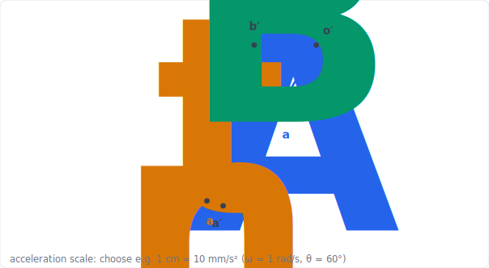
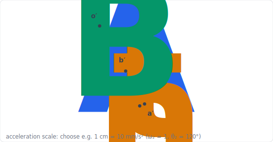
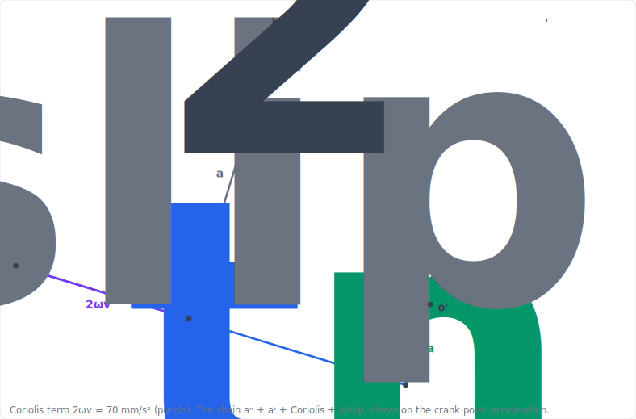

import PlanarMechanicsComments from '../../../../components/planar-mechanics/PlanarMechanicsComments.astro';
import TawkWidget from '../../../../components/TawkWidget.astro';
import UniversalContentContributors from '../../../../components/UniversalContentContributors.astro';
import InArticleAd from '../../../../components/InArticleAd.astro';
import Copyright from '../../../../components/Copyright.astro';
import BionicText from '../../../../components/BionicText.astro';
import TailwindWrapper from '../../../../components/TailwindWrapper.jsx';
import { Tabs, TabItem } from '@astrojs/starlight/components';
import { Card, CardGrid, Badge, Steps, LinkButton, FileTree } from '@astrojs/starlight/components';

<UniversalContentContributors 
  contributors={frontmatter.contributors}
/>

Velocity tells you how fast a part moves; acceleration tells you how hard its motion is changing, and that is what creates force. A piston at 6000 rpm reverses direction a hundred times a second, and the force to turn its motion around comes straight from the engine structure, which is why a poorly balanced engine shakes itself apart. Acceleration analysis is one more differentiation of the loop you already have, and then Newton's second law turns those accelerations into the inertia forces that size bearings and the shaking forces that engineers spend so much effort balancing. In this lesson you build acceleration polygons and convert them into dynamic forces. #AccelerationAnalysis #InertiaForces #EngineBalancing

## Learning Objectives

By the end of this lesson, you will be able to:

1. **Differentiate** the velocity loop to find accelerations, splitting each into normal and tangential parts
2. **Construct** acceleration polygons for the slider-crank and four-bar
3. **Convert** accelerations into inertia and shaking forces with d'Alembert's principle
4. **Predict** the primary and secondary shaking forces that drive engine balancing, and verify each result in a simulator

## Real-World System Problem: The Forces That Shake an Engine

<InArticleAd />

An engine, compressor, or pump runs steadily, yet its piston never moves at a steady speed. It accelerates hardest at the top of the stroke, where it reverses, and the force to reverse it is large: at high speed the inertia force on a piston can exceed the gas pressure force. That force is reacted through the connecting rod, the crank, the bearings, and finally the engine mounts, where it appears as vibration. Designers must predict these accelerations to size the bearings, choose the connecting-rod ratio, and add the counterweights and balance shafts that keep the machine smooth.

### The Acceleration Problem

> **Engineering Question:** Given the input speed, what is the acceleration of every part, and what inertia forces do those accelerations create?

For the slider-crank the headline result is the piston acceleration and the shaking force it produces. For the four-bar it is the angular accelerations of the coupler and follower, which set the inertia torques. For the scissor lift it is the platform acceleration that the actuator must overcome.

### Why Acceleration Analysis Matters

<CardGrid>
  <Card title="Inertia forces" icon="warning">
  Every acceleration demands a force, $F = ma$. At speed these inertia forces dominate the loads on pins and bearings.
  </Card>
  <Card title="Vibration and balancing" icon="setting">
  Unbalanced inertia forces shake the machine. Predicting them is the first step to counterweights and balance shafts.
  </Card>
  <Card title="Smoothness and jerk" icon="puzzle">
  The rate of change of acceleration (jerk) governs how harsh a motion feels and how much a structure rings.
  </Card>
  <Card title="Actuator sizing" icon="rocket">
  An actuator must supply both the static load and the inertia load. The acceleration sets the dynamic part.
  </Card>
</CardGrid>

## Fundamental Theory: Acceleration by Differentiating the Loop

<InArticleAd />

### One More Derivative

Acceleration analysis differentiates the velocity loop exactly as velocity analysis differentiated the position loop. Each link's acceleration splits into two parts:

<Card title="Normal and Tangential Components" icon="document">
A point on a link rotating at angular velocity $\omega$ and angular acceleration $\alpha$, a distance $r$ from the pivot, has acceleration with two parts:

$$a^n = \omega^2 r \quad (\text{normal, toward the pivot}), \qquad a^t = \alpha r \quad (\text{tangential, perpendicular to the link})$$

The **normal** (centripetal) part exists whenever the link rotates, even at constant speed. The **tangential** part exists only when the link speeds up or slows down. Their vector sum is the link's acceleration.
</Card>

<Card title="The Relative-Acceleration Equation" icon="document">
For two points on the same rigid link,

$$\vec a_B = \vec a_A + \vec a_{B/A}^{\,n} + \vec a_{B/A}^{\,t}$$

where $a_{B/A}^{n} = \omega^2 L_{AB}$ points from $B$ to $A$, and $a_{B/A}^{t} = \alpha L_{AB}$ is perpendicular to $AB$. This is the equation the acceleration polygon draws.
</Card>

:::note[A note on Coriolis]
When a block slides along a link that is itself rotating, a third term appears: the **Coriolis acceleration** $a^{c} = 2\,\omega v_{\text{slip}}$, perpendicular to the slip velocity. None of the four mechanisms in this course has a block sliding on a rotating link (the slider-crank's piston slides on the fixed frame, so its Coriolis term is zero), but the term matters for quick-return and Geneva mechanisms, noted at the end.
:::

### The Acceleration Polygon

Acceleration uses the same [methods](./position-analysis-planar-linkages#methods-of-kinematic-analysis) in the same **draw, solve, simulate** rhythm as position and velocity: the graphical acceleration polygon and the analytical acceleration loop are the two core routes, and the simulator confirms them. (There is no instantaneous-center shortcut for acceleration; that helper is velocity-only.)

The **acceleration polygon** is built with the drawing set exactly like the velocity polygon, on the same page and to a chosen acceleration scale (e.g. 1 cm = 10 mm/s²), but each relative-acceleration vector now has *two* parts laid down in sequence: first the **normal** part (known from the velocity analysis, since $a^n = \omega^2 L$, directed along the link toward the centre it turns about), then the **tangential** part (unknown magnitude, but known direction, perpendicular to the link). Where the tangential construction lines cross closes the polygon, and you **measure** the unknown tangential accelerations and the output acceleration off it.

:::note[The Coriolis component: when a part slides along a turning link]
Normal and tangential parts describe a point fixed on a rigid link. When instead a point **slides along a link that is itself turning** (a block moving in a rotating slot, as in the quick-return shaper), its acceleration gains a **third** part, the **Coriolis** component:

$$a^{c} = 2\,\omega\,v_\text{slip}$$

where $\omega$ is the angular velocity of the slotted link and $v_\text{slip}$ the sliding speed along it. Its **direction** is the slip-velocity vector turned $90\degree$ in the sense of $\omega$ (that is, **perpendicular to the slot**). The Coriolis part appears only at a sliding-and-turning joint: the plain slider-crank, four-bar, scissor lift, and toggle clamp have none, which is why it first shows up in the quick-return application below.
:::

### From Acceleration to Force: d'Alembert

<Card title="Inertia Force and d'Alembert's Principle" icon="document">
Newton's second law says $\sum \vec F = m\vec a$. d'Alembert rewrites this as a statics problem by adding an **inertia force** $-m\vec a$ (and an inertia torque $-I\alpha$) to each link, so that the link is treated as if in equilibrium:

$$\sum \vec F + (-m\vec a) = 0$$

The inertia force acts opposite to the acceleration, through the centre of mass. Once the accelerations are known, the dynamic bearing loads follow from a static force balance with these inertia forces included (the [force analysis](./force-analysis-mechanism-synthesis) carries this through to the joint reactions).
</Card>

## Application 1: Piston Acceleration of the Slider-Crank

<InArticleAd />

This is the central worked example. We build the acceleration polygon on top of the velocity polygon, then confirm with the closed-form acceleration and the simulator.

<Card title="Simulator and hands-on lab" icon="rocket">

  <LinkButton href="/product-development/crank-slider-mechanism-simulator/" target="_blank" variant="primary" icon="rocket" iconPlacement="start">Open the Crank-Slider Simulator</LinkButton>

**Hands-on lab:** Continue in the [Crank-Slider Experiments](/education/mechanism-design-simulation/crank-slider-experiments/) lab ([siwit.co/CSM](https://siwit.co/CSM)). The acceleration chart there plots the profile derived below.
</Card>

:::note[System Problem Statement]
- **Configuration:** In-line slider-crank, offset $e = 0$
- **Task:** Find the piston acceleration over a full rotation and locate its peak
- **Geometry:** crank $r = 50$ mm, connecting rod $l = 150$ mm ($l/r = 3$)
- **Input:** constant crank speed $\omega$ (so the crank has no angular acceleration)

**Key Question:** Where is the piston acceleration largest, and how does the connecting rod split it into two harmonics?
:::

### Step 1: Build the Acceleration Polygon

Construct it on the velocity polygon from the [velocity analysis](./velocity-analysis-instantaneous-centers), at the same instant $\theta = 60\degree$.

**Click to reveal the acceleration-polygon construction**

<Steps>

1. **Crank-pin acceleration.** With the crank at constant speed, the crank pin $A$ has only a normal (centripetal) acceleration $a_A = \omega^2 r$, directed from $A$ toward the centre $O$. From the pole $o'$ draw $o'a' = a_A$. ✅

2. **Normal part of the rod.** The connecting rod's relative-acceleration normal part is $a_{B/A}^{\,n} = \omega_3^2\,l$, directed from $B$ toward $A$, using $\omega_3$ from the velocity analysis. Add it from $a'$. It is small here because the rod turns slowly. ✅

3. **Tangential part and closure.** From the end of the normal part, draw the tangential direction (perpendicular to the rod). The piston acceleration $a_B$ is horizontal (the piston slides), so draw the horizontal through $o'$. Their intersection is $b'$. ✅

4. **Measure.** $o'b' = a_B$ is the piston acceleration. At $\theta = 60\degree$ it reads about $0.33\,r\omega^2$ in magnitude, matching Step 2. ✅

</Steps>

  <TailwindWrapper>
	
  </TailwindWrapper>

### Step 2: Confirm by Differentiation

**Click to reveal the closed-form piston acceleration**

<Steps>

1. **Differentiate the piston velocity** (constant $\omega$). The standard result, accurate to about two percent for $l/r = 3$, is:

   $$a_P = -r\omega^2\left(\cos\theta + \frac{r}{l}\cos 2\theta\right)$$ ✅

   The first term is the **primary** acceleration (once per revolution); the second is the **secondary** (twice per revolution) from the connecting rod.

2. **Tabulate** $a_P/(r\omega^2)$ for $l/r = 3$: ✅

   | Crank $\theta$ | $a_P/(r\omega^2)$ |
   |:---:|:---:|
   | 0&#176; (TDC) | **-1.333** (peak) |
   | 30&#176; | -1.033 |
   | 60&#176; | -0.333 |
   | 90&#176; | +0.333 |
   | 120&#176; | +0.667 |
   | 180&#176; (BDC) | +0.667 |

3. **Read the peaks.** The largest acceleration is at **top-dead-centre**, $a_P = (1 + r/l)\,r\omega^2 = 1.33\,r\omega^2$, and at bottom-dead-centre it is $(1 - r/l)\,r\omega^2 = 0.67\,r\omega^2$. The two ends differ because the secondary term adds at TDC and subtracts at BDC. At $\theta = 60\degree$, $a_P = -0.33\,r\omega^2$, matching the polygon. ✅

</Steps>

### Step 3: Verify in the Simulator

**Click to reveal the simulator check**

<Steps>

1. **Open the simulator** ([siwit.co/CSM](https://siwit.co/CSM)), set $r = 50$, $l = 150$, $e = 0$, and read the acceleration chart. ✅

2. **Confirm** the peak-to-peak split: the TDC peak is about twice the BDC peak ($1.33$ versus $0.67$ times $r\omega^2$), the signature of the secondary harmonic. ✅

3. **Lengthen the rod.** Increasing $l/r$ shrinks the secondary term, bringing the two peaks closer together and smoothing the motion. ✅

</Steps>

:::note[Engineering Insight]
The connecting rod splits the piston acceleration into a primary and a secondary harmonic, and the secondary makes the top-dead-centre acceleration larger than the bottom. This asymmetry is the root of engine vibration and is taken up as a force in Application 4.
:::

## Application 2: Angular Accelerations of the Four-Bar

<InArticleAd />

For the four-bar we differentiate the velocity loop once more and build the acceleration polygon to find the coupler and follower angular accelerations.

<Card title="Simulator and hands-on lab" icon="rocket">

  <LinkButton href="/product-development/four-bar-linkage-simulator/" target="_blank" variant="primary" icon="rocket" iconPlacement="start">Open the Four-Bar Linkage Simulator</LinkButton>

**Hands-on lab:** Continue in the [Four-Bar Linkage Experiments](/education/mechanism-design-simulation/four-bar-linkage-experiments/) lab ([siwit.co/FBL](https://siwit.co/FBL)). Experiment 7 covers the angular accelerations and inertia forces.
</Card>

:::note[System Problem Statement]
- **Configuration:** Crank-rocker four-bar (the standard four-bar geometry), constant crank speed
- **Task:** Find the coupler and follower angular accelerations $\alpha_3$, $\alpha_4$
- **Link lengths:** $a = 40$, $b = 120$, $c = 80$, $d = 100$ mm
- **Input:** $\theta_2 = 120\degree$, with $\omega_3/\omega_2 = 0.139$, $\omega_4/\omega_2 = 0.514$ from the velocity analysis
:::

### Step 1: Build the Acceleration Polygon

**Click to reveal the acceleration-polygon construction**

<Steps>

1. **Crank pin.** At constant crank speed, $a_A = \omega_2^2\,a$ directed from $A$ to $O_2$. Draw $o'a'$. ✅

2. **Coupler normal.** Add $a_{B/A}^{\,n} = \omega_3^2\,b$ from $a'$, directed $B$ to $A$. ✅

3. **Follower normal.** From the pole, the follower contributes $a_B^{\,n} = \omega_4^2\,c$ directed $B$ to $O_4$. ✅

4. **Tangentials close it.** The two tangential directions (perpendicular to coupler and to follower) intersect at $b'$. Their measured lengths give $\alpha_3 b$ and $\alpha_4 c$. ✅

</Steps>

  <TailwindWrapper>
	
  </TailwindWrapper>

### Step 2: Confirm by the Acceleration Loop

**Click to reveal the closed-form angular accelerations**

<Steps>

1. **Differentiate the velocity loop** (with $\alpha_2 = 0$). The two equations are linear in $\alpha_3$ and $\alpha_4$:

   $$-b\,\alpha_3\sin\theta_3 + c\,\alpha_4\sin\theta_4 = a\omega_2^2\cos\theta_2 + b\omega_3^2\cos\theta_3 - c\omega_4^2\cos\theta_4$$
   $$b\,\alpha_3\cos\theta_3 - c\,\alpha_4\cos\theta_4 = a\omega_2^2\sin\theta_2 + b\omega_3^2\sin\theta_3 - c\omega_4^2\sin\theta_4$$ ✅

2. **Solve** at $\theta_2 = 120\degree$ ($\omega_2 = 1$ rad/s):

   $$\alpha_3 = +0.139 \text{ rad/s}^2, \qquad \alpha_4 = -0.117 \text{ rad/s}^2$$ ✅

   The follower is decelerating ($\alpha_4 < 0$) at this instant even though it is still driving the output forward, which the simulator's angular-acceleration trace confirms.

</Steps>

### Step 3: Verify in the Simulator

**Click to reveal the simulator check**

<Steps>

1. **Open the simulator** ([siwit.co/FBL](https://siwit.co/FBL)), set the standard four-bar link lengths, and read the angular-acceleration values at $\theta_2 = 120\degree$. ✅

2. **Confirm** $\alpha_3 \approx +0.14$ and $\alpha_4 \approx -0.12$ rad/s² (per unit crank speed), matching the loop solution. ✅

</Steps>

:::note[Engineering Insight]
Each angular acceleration multiplied by a link's mass moment of inertia is an inertia torque, and each link's mass times its centre-of-mass acceleration is an inertia force. The acceleration polygon is therefore the direct input to the [dynamic force analysis](./force-analysis-mechanism-synthesis).
:::

## Application 3: Platform Acceleration of the Scissor Lift

<InArticleAd />

The scissor lift shows that a constant actuator rate does not give a constant platform motion: a centripetal-type term appears from the geometry.

<Card title="Simulator and hands-on lab" icon="rocket">

  <LinkButton href="/product-development/scissor-lift-mechanism-simulator/" target="_blank" variant="primary" icon="rocket" iconPlacement="start">Open the Scissor Lift Simulator</LinkButton>

**Hands-on lab:** Continue in the [Scissor Lift Experiments](/education/mechanism-design-simulation/scissor-lift-experiments/) lab ([siwit.co/SLM](https://siwit.co/SLM)). The acceleration and power charts plot the relation below.
</Card>

:::note[System Problem Statement]
- **Configuration:** Single-stage scissor lift, arm $L = 300$ mm, $n = 1$
- **Task:** Relate platform acceleration to the scissor angular rate and its rate of change
:::

### Step 1: Differentiate the Velocity Twice

**Click to reveal the platform acceleration**

<Steps>

1. **From the platform velocity** $v = nL\cos\theta\,\dot\theta$, differentiate again:

   $$a_\text{platform} = nL\left(\cos\theta\,\ddot\theta - \sin\theta\,\dot\theta^2\right)$$ ✅

2. **Read the two terms.** The first, $nL\cos\theta\,\ddot\theta$, is the tangential part, present only when the scissor angle is speeding up. The second, $-nL\sin\theta\,\dot\theta^2$, is a centripetal-type term present **even at a constant angular rate** ($\ddot\theta = 0$), and it always acts downward. So a lift raised at a steady angular rate still decelerates as it nears full height. ✅

3. **Actuator consequence.** The actuator must supply the platform weight plus the inertia force $m\,a_\text{platform}$. Near the flat position, where the mechanical advantage is poor ([force analysis](./force-analysis-mechanism-synthesis)), this dynamic term adds appreciably to the actuator load. ✅

</Steps>

The scissor closes on the single scalar relation $h = nL\sin\theta$, so its acceleration is that one line differentiated twice rather than a polygon: the scaled space diagram below is the geometric reference the two derivatives rest on.

  <TailwindWrapper>
	
  </TailwindWrapper>

### Step 2: Verify in the Simulator

**Click to reveal the simulator check**

<Steps>

1. **Open the simulator** ([siwit.co/SLM](https://siwit.co/SLM)) and run it at a fixed actuator speed. ✅

2. **Confirm** that the platform acceleration is non-zero even where the angular rate is steady, and that the power trace rises where acceleration and velocity are both large. ✅

</Steps>

:::note[Engineering Insight]
The $-\sin\theta\,\dot\theta^2$ term is the same kind of centripetal acceleration the normal component captures in the polygons: a consequence of rotation that exists without any speeding up. It is why even smooth, constant-rate machines still impose inertia loads.
:::

## Application 4: Inertia and Shaking Forces

<InArticleAd />

Acceleration becomes force through $F = ma$. For the slider-crank this produces the shaking force that engine balancing is designed to cancel.

<Card title="Simulator and hands-on lab" icon="rocket">

  <LinkButton href="/product-development/crank-slider-mechanism-simulator/" target="_blank" variant="primary" icon="rocket" iconPlacement="start">Open the Crank-Slider Simulator</LinkButton>

**Hands-on lab:** Continue in the [Crank-Slider Experiments](/education/mechanism-design-simulation/crank-slider-experiments/) lab ([siwit.co/CSM](https://siwit.co/CSM)). Experiment 6 (force analysis and motor sizing) builds on the inertia forces below.
</Card>

:::note[System Problem Statement]
- **Configuration:** Slider-crank with reciprocating mass $m$ at the piston, constant crank speed
- **Task:** Find the shaking force along the cylinder axis and its two harmonics
:::

### Step 1: From Acceleration to Shaking Force

**Click to reveal the shaking-force harmonics**

<Steps>

1. **Apply** $F = ma$ to the reciprocating mass using the piston acceleration from Application 1:

   $$F_\text{shake} = m\,a_P = m r\omega^2\left(\cos\theta + \frac{r}{l}\cos 2\theta\right)$$ ✅

2. **Split into harmonics:**

   $$F_\text{primary} = m r\omega^2\cos\theta \quad (\text{once per rev}), \qquad F_\text{secondary} = m r\omega^2\frac{r}{l}\cos 2\theta \quad (\text{twice per rev})$$ ✅

3. **Balancing.** The **primary** force can be largely cancelled by a counterweight on the crank. The **secondary** force runs at twice engine speed and cannot be cancelled by a simple counterweight; it is why inline-four engines use **balance shafts** spinning at twice crank speed. The secondary is smaller by the factor $r/l$, so a longer rod also reduces it. ✅

</Steps>

### Step 2: Verify in the Simulator

**Click to reveal the simulator check**

<Steps>

1. **Open the simulator** ([siwit.co/CSM](https://siwit.co/CSM)) and read the force and crank-torque charts. ✅

2. **Confirm** that the force trace peaks at top-dead-centre (where acceleration peaks) and that its shape is the primary cosine plus a smaller twice-frequency ripple. ✅

</Steps>

:::note[Engineering Insight]
The shaking force is the inertia force of Application 1 seen from the engine block. Its primary part sets the size of the crank counterweights; its secondary part, at twice the running frequency, is the reason high-refinement engines carry balance shafts. Every number traces back to the piston acceleration you drew in the polygon.
:::

## Application 5: Coriolis Acceleration of the Quick-Return Shaper

<InArticleAd />

The shaper of the [velocity analysis](./velocity-analysis-instantaneous-centers#application-5-ram-velocity-of-the-quick-return-shaper) is the one mechanism in this course whose acceleration is *wrong* if you use only normal and tangential parts. Its crank pin is a **block sliding inside a turning slot**, and that joint adds the **Coriolis** component defined in the theory above. This application is where that term earns its place.

<Card title="Hands-on lab" icon="rocket">

  <LinkButton href="/product-development/crank-slider-mechanism-simulator/" target="_blank" variant="primary" icon="rocket" iconPlacement="start">Open the Crank-Slider Simulator</LinkButton>

**Hands-on lab:** This inversion has no simulator of its own; the drawing and the calculation confirm each other. The related pin-in-slot Coriolis effect also drives the Geneva indexing motion noted below.
</Card>

:::note[System Problem Statement]
- **Configuration:** Crank-and-slotted-lever quick-return (shaper ram drive)
- **Task:** Find the ram-drive acceleration at the instant drawn, showing the Coriolis contribution
- **Geometry:** crank $r = 120$ mm, $AC = 300$ mm, $AP = 450$ mm
- **Input:** constant crank speed $\omega_2 = 1$ rad/s ($\alpha_2 = 0$); from the velocity analysis $\omega_\text{lever} = 0.399$ rad/s and slip $v_\text{slip} = 87.8$ mm/s
:::

### Step 1: Build the Acceleration Polygon with the Coriolis Term

The block's acceleration on the crank splits, on the lever side, into four parts laid head to tail from the pole $o'$: the lever point's **normal** and **tangential** parts, the **Coriolis** part, and the **slip** part. Together they must close on the crank-pin acceleration.

**Click to reveal the acceleration-polygon construction**

<Steps>

1. **Crank-pin acceleration (the target).** With constant crank speed the block on the crank has only a normal acceleration $a_{B_2} = \omega_2^2\,r = 1^2 \times 120 = 120$ mm/s², directed from $B$ toward $C$. The construction must reproduce this vector. ✅

2. **Normal part of the lever point.** $a_{B_3}^{\,n} = \omega_\text{lever}^2 \times AB = 0.399^2 \times 205 \approx 32.6$ mm/s², directed from $B$ toward the fulcrum $A$. Lay it from $o'$. ✅

3. **Coriolis part.** $a^{c} = 2\,\omega_\text{lever}\,v_\text{slip} = 2 \times 0.399 \times 87.8 \approx 70$ mm/s², directed **perpendicular to the slot** (the slip velocity turned $90\degree$ in the sense of $\omega_\text{lever}$). This is the part a plain slider-crank never has. ✅

4. **Close with the two unknown directions.** The lever's **tangential** part is **perpendicular to the lever** (unknown magnitude); the **slip** acceleration is **parallel to the slot** (unknown magnitude). Drawing those two directions to close the polygon onto $a_{B_2}$ fixes both. Measuring gives the tangential part $a_{B_3}^{\,t} \approx 158$ mm/s² and the slip acceleration $\approx 114$ mm/s². ✅

5. **Lever angular acceleration.** $\alpha_\text{lever} = \dfrac{a_{B_3}^{\,t}}{AB} = \dfrac{158}{205} \approx 0.77$ rad/s². ✅

</Steps>

  <TailwindWrapper>
	
  </TailwindWrapper>

### Step 2: Ram Acceleration and Analytical Check

**Click to reveal the ram acceleration and confirmation**

<Steps>

1. **Ram-drive acceleration.** The driving point $P$ on the lever has a normal part $\omega_\text{lever}^2\,AP$ (toward $A$) and a tangential part $\alpha_\text{lever}\,AP$ (perpendicular to the lever):

   $$a_P = AP\sqrt{\omega_\text{lever}^4 + \alpha_\text{lever}^2} = 450\sqrt{0.399^4 + 0.77^2} \approx 354 \text{ mm/s}^2$$ ✅

2. **The Coriolis term is not optional.** At $70$ mm/s² it is a large share of the closing polygon; drop it and the tangential part, and hence $\alpha_\text{lever}$ and the ram acceleration, come out wrong. Any mechanism with a block sliding in a moving slot (this shaper, a Whitworth drive, a Geneva index) must carry it. ✅

3. **Analytical confirmation.** Writing the loop $\vec r_{AB} = \vec r_{AC} + \vec r_{CB}$ and differentiating twice, with the block distance $AB$ as a changing length, produces the same four terms: the second derivative of $AB$ is the slip acceleration, and the cross term $2\,\dot{(AB)}\,\omega_\text{lever}$ is exactly the Coriolis part. The numbers match the polygon. ✅

</Steps>

:::note[Engineering Insight]
The Coriolis component is the signature of a part that both slides and turns. Here it is a real contributor to the ram-drive acceleration, so the inertia forces on the shaper's slotted lever and ram cannot be found without it. The same term returns wherever a pin slides in a moving slot, which is why the [Geneva indexer](#a-note-on-intermittent-motion-mechanisms) below, and the quick-return itself, are the acceleration problems that most reward drawing the full polygon rather than reaching for a formula.
:::

## A Note on Intermittent-Motion Mechanisms

<InArticleAd />

:::note[Geneva mechanisms and high acceleration]
Not every mechanism runs smoothly. A **Geneva mechanism** converts continuous rotation into a step-and-dwell indexing motion, and during each index the driven wheel accelerates and decelerates sharply. Because the motion starts and stops, the acceleration peaks (and the jerk) are high, and they involve a Coriolis term as the drive pin slides in the slot. The same acceleration-then-force method applies: the sharp accelerations create large inertia torques that the indexing drive and its bearings must withstand, which is why high-speed indexers move to modified Geneva profiles or servo-driven cams. The four canonical mechanisms of this course carry the methods; the Geneva is where they are pushed hardest.
:::

## Design Guidelines for Acceleration and Dynamic Forces

<InArticleAd />

<CardGrid>
  <Card title="Differentiate, don't restart" icon="rocket">
  The acceleration loop is the differentiated velocity loop. Reuse the positions and velocities; only the tangential accelerations are new unknowns.
  </Card>
  <Card title="Size for the peak" icon="warning">
  Inertia loads peak where acceleration peaks (top-dead-centre for the slider-crank). Size pins, rods, and bearings for that worst case.
  </Card>
  <Card title="Mind the second harmonic" icon="setting">
  The secondary term scales with $r/l$ and runs at twice speed. A longer connecting rod or a balance shaft tames it.
  </Card>
  <Card title="Constant rate is not constant motion" icon="puzzle">
  Centripetal and normal terms create acceleration even at steady input speed. Never assume a smoothly driven machine is inertia-free.
  </Card>
</CardGrid>

## Summary and Next Steps

<InArticleAd />

:::tip[Instrument it]
Shaking forces are just $F = ma$ acting on the frame, and they reach you as vibration you can measure. Bolt a MEMS accelerometer to the machine frame near the bearings, an ADXL345 for a first look or the wider-band ADXL1002 to resolve the secondary harmonic, and add a shaft encoder or a Hall sensor for the crank angle so every spike lines up with a position. An [ESP32 or STM32](/education/sensor-actuator-interfacing-stm32/) samples both, and once the primary and secondary peaks are tagged it can [flag a balance problem on siliconwit.io](https://siliconwit.io) before the mounts crack.
:::

### Key Concepts Mastered

1. **Acceleration loop:** one more derivative of the velocity loop, with normal ($\omega^2 r$) and tangential ($\alpha r$) components.
2. **Acceleration polygon:** the normal parts are known from the velocity analysis; the tangential parts close the polygon.
3. **Piston acceleration:** $a_P = -r\omega^2(\cos\theta + \tfrac{r}{l}\cos 2\theta)$, peaking at top-dead-centre at $(1 + r/l)\,r\omega^2$.
4. **Inertia and shaking forces:** $F = ma$ turns accelerations into the loads that vibrate machines, split into a primary and a balance-shaft-requiring secondary harmonic.

### Acceleration Results at a Glance

| Mechanism | What you solve for | Key relation | Simulator |
|-----------|--------------------|--------------|-----------|
| Slider-crank | piston acceleration | $a_P = -r\omega^2(\cos\theta + \tfrac{r}{l}\cos 2\theta)$ | [siwit.co/CSM](https://siwit.co/CSM) |
| Four-bar | $\alpha_3$, $\alpha_4$ | acceleration loop (linear) | [siwit.co/FBL](https://siwit.co/FBL) |
| Scissor lift | platform acceleration | $a = nL(\cos\theta\,\ddot\theta - \sin\theta\,\dot\theta^2)$ | [siwit.co/SLM](https://siwit.co/SLM) |
| Slider-crank | shaking force | primary $+$ secondary harmonics | [siwit.co/CSM](https://siwit.co/CSM) |
| Quick-return (shaper) | Coriolis, ram acceleration | $a^{c} = 2\,\omega\,v_\text{slip}$ | drawing $+$ calc |

### A Note on Tools

Every acceleration here was drawn as a polygon, confirmed by hand calculation, and reproduced with a few lines of Python (NumPy). The simulators confirm the same profiles. No specialised dynamics software is needed; the method is one derivative beyond velocity.

Next, [Cam-Follower Systems and Motion Programming](./cam-follower-systems-motion-programming) inverts the problem: instead of analysing a given linkage, you specify the motion you want (its displacement, velocity, acceleration, and jerk) and design the cam surface that produces it.

<InArticleAd />
<PlanarMechanicsComments />
<TawkWidget />
<Copyright />