import PlanarMechanicsComments from '../../../../components/planar-mechanics/PlanarMechanicsComments.astro';
import TawkWidget from '../../../../components/TawkWidget.astro';
import UniversalContentContributors from '../../../../components/UniversalContentContributors.astro';
import InArticleAd from '../../../../components/InArticleAd.astro';
import Copyright from '../../../../components/Copyright.astro';
import BionicText from '../../../../components/BionicText.astro';
import TailwindWrapper from '../../../../components/TailwindWrapper.jsx';
import { Tabs, TabItem } from '@astrojs/starlight/components';
import { Card, CardGrid, Badge, Steps, LinkButton, FileTree } from '@astrojs/starlight/components';

<UniversalContentContributors 
  contributors={frontmatter.contributors}
/>

Velocity tells you how fast a part moves; acceleration tells you how hard its motion is changing, and that is what creates force. A piston at 6000 rpm reverses direction a hundred times a second, and the force to turn its motion around comes straight from the engine structure, which is why a poorly balanced engine shakes itself apart. Acceleration analysis is one more differentiation of the loop you already have, and then Newton's second law turns those accelerations into the inertia forces that size bearings and the shaking forces that engineers spend so much effort balancing. In this lesson you build acceleration polygons and convert them into dynamic forces. #AccelerationAnalysis #InertiaForces #EngineBalancing

## Learning Objectives

By the end of this lesson, you will be able to:

1. **Differentiate** the velocity loop to find accelerations, splitting each into normal and tangential parts
2. **Construct** acceleration polygons for the slider-crank and four-bar
3. **Convert** accelerations into inertia and shaking forces with d'Alembert's principle
4. **Predict** the primary and secondary shaking forces that drive engine balancing, and verify each result in a simulator

## Real-World System Problem: The Forces That Shake an Engine

<InArticleAd />

An engine, compressor, or pump runs steadily, yet its piston never moves at a steady speed. It accelerates hardest at the top of the stroke, where it reverses, and the force to reverse it is large: at high speed the inertia force on a piston can exceed the gas pressure force. That force is reacted through the connecting rod, the crank, the bearings, and finally the engine mounts, where it appears as vibration. Designers must predict these accelerations to size the bearings, choose the connecting-rod ratio, and add the counterweights and balance shafts that keep the machine smooth.

### The Acceleration Problem

> **Engineering Question:** Given the input speed, what is the acceleration of every part, and what inertia forces do those accelerations create?

For the slider-crank the headline result is the piston acceleration and the shaking force it produces. For the four-bar it is the angular accelerations of the coupler and follower, which set the inertia torques. For the scissor lift it is the platform acceleration that the actuator must overcome.

### Why Acceleration Analysis Matters

<CardGrid>
  <Card title="Inertia forces" icon="warning">
  Every acceleration demands a force, $F = ma$. At speed these inertia forces dominate the loads on pins and bearings.
  </Card>
  <Card title="Vibration and balancing" icon="setting">
  Unbalanced inertia forces shake the machine. Predicting them is the first step to counterweights and balance shafts.
  </Card>
  <Card title="Smoothness and jerk" icon="puzzle">
  The rate of change of acceleration (jerk) governs how harsh a motion feels and how much a structure rings.
  </Card>
  <Card title="Actuator sizing" icon="rocket">
  An actuator must supply both the static load and the inertia load. The acceleration sets the dynamic part.
  </Card>
</CardGrid>

## Fundamental Theory: Acceleration by Differentiating the Loop

<InArticleAd />

### One More Derivative

Acceleration analysis differentiates the velocity loop exactly as velocity analysis differentiated the position loop. Each link's acceleration splits into two parts:

<Card title="Normal and Tangential Components" icon="document">
A point on a link rotating at angular velocity $\omega$ and angular acceleration $\alpha$, a distance $r$ from the pivot, has acceleration with two parts:

$$a^n = \omega^2 r \quad (\text{normal, toward the pivot}), \qquad a^t = \alpha r \quad (\text{tangential, perpendicular to the link})$$

The **normal** (centripetal) part exists whenever the link rotates, even at constant speed. The **tangential** part exists only when the link speeds up or slows down. Their vector sum is the link's acceleration.
</Card>

The two parts are easiest to keep straight by where they point rather than by their formulas. The normal part always aims back down the link at the pivot; the tangential part always lies across it. Whatever the mechanism, those two directions are at right angles, so the resultant is the diagonal of a rectangle:

  <TailwindWrapper>
	
  </TailwindWrapper>

The figure shows both parts because the link drawn is both turning and speeding up. That is the general case, not a rule: the two conditions are independent, so a part of a mechanism may carry both, one, or neither.

One misreading is worth heading off before the applications. When a problem says **constant crank speed**, that sets $\alpha_2 = 0$ for the crank **and for nothing else**. The coupler and follower are dragged through a changing geometry, so their own angular speeds rise and fall through the cycle and their tangential parts are very much alive. In the slider-crank at $\theta = 60\degree$, with the crank held at a rigidly constant speed, the rod's tangential part is nearly **ten times** its normal part.

| Part of the mechanism | Turning? | Its own $\omega$ constant? | $a^n = \omega^2 r$ | $a^t = \alpha r$ |
|---|:---:|:---:|:---:|:---:|
| Crank, driven at constant speed | yes | yes, by assumption | yes | no |
| Coupler, rod or follower | yes | no, it is dragged | yes | yes |
| Piston or slider | no, it translates | not applicable | no | no |

The piston row is the one people forget: a part that only slides has no $\omega$ and no $\alpha$, so it has neither component. Its acceleration is a single vector along the slide, which is why the polygon closes on a plain horizontal line.

Nor is either part permanent for a link that does turn. The rod's **normal** part vanishes at $\theta = 90\degree$ and $270\degree$, where $\omega_3$ passes through zero and the rod is momentarily translating rather than turning; its **tangential** part vanishes at top and bottom dead centre, where $\omega_3$ is at a maximum and so is instantaneously not changing. The two never vanish at the same instant, which is why the polygon never collapses.

<Card title="The Relative-Acceleration Equation" icon="document">
For two points on the same rigid link,

$$\vec a_B = \vec a_A + \vec a_{B/A}^{\,n} + \vec a_{B/A}^{\,t}$$

where $a_{B/A}^{n} = \omega^2 L_{AB}$ points from $B$ to $A$, and $a_{B/A}^{t} = \alpha L_{AB}$ is perpendicular to $AB$. This is the equation the acceleration polygon draws.
</Card>

That last sentence is the one worth dwelling on, because the equation and the drawing look like separate objects and are not. Each term on the right is one vector; laying those same vectors head to tail from a pole *is* the polygon, and the side that closes it back to the pole is $\vec a_B$. The figure below draws both from one set of numbers, so you can read across:

  <TailwindWrapper>
	
  </TailwindWrapper>

Read the right-hand panel term by term against the equation: $\vec a_A$ from the pole $o'$, then $\vec a_{B/A}^{\,n}$ head to tail from there, then $\vec a_{B/A}^{\,t}$, arriving at $b'$. The line $o'b'$ you have not drawn is $\vec a_B$, and it is the answer. Every acceleration polygon in this lesson is that same figure with one or two magnitudes unknown.

:::note[A note on Coriolis]
When a block slides along a link that is itself rotating, a third term appears: the **Coriolis acceleration** $a^{c} = 2\,\omega v_{\text{slip}}$, perpendicular to the slip velocity. The **four canonical mechanisms of this course have no Coriolis term**: the slider-crank's piston slides on the fixed frame, and the four-bar, scissor lift and toggle clamp have no sliding-on-a-turning-link joint at all. The **quick-return shaper, introduced later as a fifth mechanism precisely for this purpose, does**. That is not a contradiction between the theory and Application 5; it is why the fifth mechanism is in the course.
:::

### The Acceleration Polygon

Acceleration uses the same [methods](/education/planar-mechanics/position-analysis-planar-linkages#methods-of-kinematic-analysis) in the same **draw, solve, simulate** rhythm as position and velocity: the graphical acceleration polygon and the analytical acceleration loop are the two core routes, and the simulator confirms them. (There is no instantaneous-center shortcut for acceleration; that helper is velocity-only.)

The **acceleration polygon** is built with the drawing set exactly like the velocity polygon, on the same page and to a chosen acceleration scale (e.g. 1 cm = 10 mm/s²), but each relative-acceleration vector now has up to *two* parts laid down in sequence: first the **normal** part (known from the velocity analysis, since $a^n = \omega^2 L$, directed along the link toward the centre it turns about), then the **tangential** part (unknown magnitude, but known direction, perpendicular to the link). Which of the two are present follows the table above, so a constant-speed crank contributes only a normal part while the links it drives contribute both. Where the tangential construction lines cross closes the polygon, and you **measure** the unknown tangential accelerations and the output acceleration off it.

:::note[The Coriolis component: when a part slides along a turning link]
Normal and tangential parts describe a point fixed on a rigid link. When instead a point **slides along a link that is itself turning** (a block moving in a rotating slot, as in the quick-return shaper), its acceleration gains a **third** part, the **Coriolis** component:

$$a^{c} = 2\,\omega\,v_\text{slip}$$

where $\omega$ is the angular velocity of the slotted link and $v_\text{slip}$ the sliding speed along it. Its **direction** is the slip-velocity vector turned $90\degree$ in the sense of $\omega$ (that is, **perpendicular to the slot**). The Coriolis part appears only at a sliding-and-turning joint: the plain slider-crank, four-bar, scissor lift, and toggle clamp have none, which is why it first shows up in the quick-return application below.
:::

#### Where the Factor of 2 Comes From

Almost everyone memorises the $2$ and then cannot decide, in an unfamiliar mechanism, whether the term applies at all. It is worth six lines to see it appear, because once you have watched it arise you can always reconstruct it.

Let a point sit at distance $s$ along a link that is turning at $\omega$. Put $\hat u$ along the link and $\hat n$ perpendicular to it. Because these directions rotate with the link:

$$\dot{\hat u} = \omega\,\hat n, \qquad \dot{\hat n} = -\omega\,\hat u$$

The position is $\vec r = s\,\hat u$. Differentiate once, using the product rule:

$$\vec v = \dot s\,\hat u + s\,\dot{\hat u} = \underbrace{\dot s\,\hat u}_{\text{slip}} + \underbrace{s\omega\,\hat n}_{\text{transport}}$$

Differentiate again, applying the product rule to **both** of those terms:

$$\vec a = \ddot s\,\hat u + \dot s\,\dot{\hat u} + \dot s\omega\,\hat n + s\dot\omega\,\hat n + s\omega\,\dot{\hat n} = \ddot s\,\hat u + \dot s\omega\,\hat n + \dot s\omega\,\hat n + s\alpha\,\hat n - s\omega^2\,\hat u$$

Collecting gives the four-term acceleration of a point that both slides and turns:

$$\vec a = \underbrace{-s\omega^2\,\hat u}_{\text{normal}} + \underbrace{s\alpha\,\hat n}_{\text{tangential}} + \underbrace{2\dot s\omega\,\hat n}_{\text{Coriolis}} + \underbrace{\ddot s\,\hat u}_{\text{slip}}$$

:::tip[The answer to "why 2?"]
The term $\dot s\omega\,\hat n$ appeared **twice**, from two different places in the product rule:

- once from differentiating the **slip** term $\dot s\,\hat u$, because the direction $\hat u$ is itself turning;
- once from differentiating the **transport** term $s\omega\,\hat n$, because the distance $s$ is itself changing.

Two independent physical effects, of equal size, pointing the same way. That, and nothing else, is where the $2$ comes from. It also tells you exactly when the term exists: you need $\dot s \ne 0$ (something is sliding) **and** $\omega \ne 0$ (the thing it slides on is turning). Kill either and the term vanishes, which is the test to apply to any unfamiliar mechanism.
:::

| Situation | Coriolis present? |
|---|:---:|
| Piston sliding on a fixed cylinder (slider-crank) | No: the frame does not rotate |
| Pin joint between two rotating links (four-bar) | No: nothing slides |
| Scissor lift, toggle clamp | No |
| Block sliding in a rotating slot (quick-return shaper) | **Yes** |
| Pin sliding in a moving slot (Geneva mechanism) | **Yes** |

### From Acceleration to Force: d'Alembert

<Card title="Inertia Force and d'Alembert's Principle" icon="document">
Newton's second law says $\sum \vec F = m\vec a$. d'Alembert rewrites this as a statics problem by adding an **inertia force** $-m\vec a$ (and an inertia torque $-I\alpha$) to each link, so that the link is treated as if in equilibrium:

$$\sum \vec F + (-m\vec a) = 0$$

The inertia force acts opposite to the acceleration, through the centre of mass. Once the accelerations are known, the dynamic bearing loads follow from a static force balance with these inertia forces included (the [force analysis](/education/planar-mechanics/force-analysis-mechanism-synthesis) carries this through to the joint reactions).
</Card>

## Application 1: Piston Acceleration of the Slider-Crank

<InArticleAd />

This is the central worked example. We build the acceleration polygon on top of the velocity polygon, then confirm with the closed-form acceleration and the simulator.

<Card title="Simulator and hands-on lab" icon="rocket">

  <LinkButton href="/product-development/crank-slider-mechanism-simulator/" target="_blank" variant="primary" icon="rocket" iconPlacement="start">Open the Crank-Slider Simulator</LinkButton>

**Hands-on lab:** Continue in the [Crank-Slider Experiments](/education/mechanism-design-simulation/crank-slider-experiments/) lab ([siwit.co/CSM](https://siwit.co/CSM)). The acceleration chart there plots the profile derived below.
</Card>

:::note[System Problem Statement]
- **Configuration:** In-line slider-crank, offset $e = 0$
- **Task:** Find the piston acceleration over a full rotation and locate its peak
- **Geometry:** crank $r = 50$ mm, connecting rod $l = 150$ mm ($l/r = 3$)
- **Input:** constant crank speed $\omega$ (so the crank has no angular acceleration)

**Key Question:** Where is the piston acceleration largest, and how does the connecting rod split it into two harmonics?
:::

### Step 1: Redraw the Space Diagram and the Velocity Polygon

An acceleration polygon cannot be started from a blank page. Its normal components are $\omega^2 L$, so every one of them needs an angular velocity that only the velocity polygon can give, and the velocity polygon in turn needs the link directions that only the space diagram can give. The three drawings are one chain, and this is the instant where it pays to have all three side by side on the same sheet.

**Click to reveal the two drawings the acceleration polygon is built on**

<Steps>

1. **Space diagram.** Choose and mark a length scale, say 1 cm = 20 mm. Draw the crank $OA = r = 50$ mm at $\theta = 60\degree$, then strike an arc of $l = 150$ mm from $A$ to cut the centre-line at the piston $B$. Measure the rod angle: $\phi = 16.8\degree$ below the centre-line. ✅

   

     <TailwindWrapper>
   	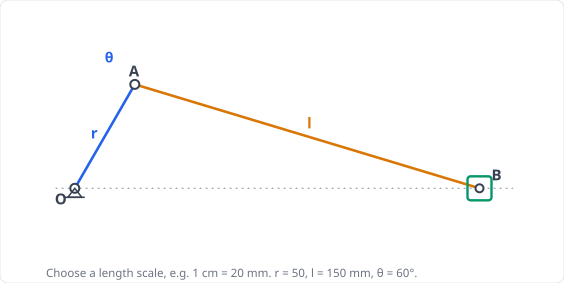
     </TailwindWrapper>
   

2. **Velocity polygon.** On a chosen velocity scale, say 1 cm = 10 mm/s, draw $oa = v_A = r\omega = 50$ mm/s perpendicular to the crank. From $a$ draw the direction perpendicular to the rod, and through $o$ the horizontal the piston must move along. They meet at $b$. ✅

   

     <TailwindWrapper>
   	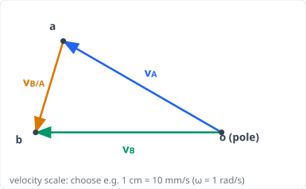
     </TailwindWrapper>
   

3. **Take the one number the next drawing needs.** Measuring the polygon gives $v_B = 50.8$ mm/s and $v_{B/A} = 26.1$ mm/s. That last one is the whole reason for this step, because it fixes the rod's angular velocity: ✅

   $$\omega_3 = \frac{v_{B/A}}{l} = \frac{26.1}{150} = 0.174 \text{ rad/s}$$

   The rod turns slowly compared with the crank, which is why its normal acceleration will come out small in Step 2. ✅

</Steps>

### Step 2: Build the Acceleration Polygon

Construct it beside the velocity polygon from Step 1, at the same instant $\theta = 60\degree$, on a chosen acceleration scale (say 1 cm = 10 mm/s²).

**Click to reveal the acceleration-polygon construction**

<Steps>

1. **Crank-pin acceleration.** With the crank at constant speed, the crank pin $A$ has only a normal (centripetal) acceleration $a_A = \omega^2 r = 50$ mm/s², directed from $A$ toward the centre $O$. From the pole $o'$ draw $o'a' = a_A$. ✅

2. **Normal part of the rod.** This is where Step 1 is spent. The rod's relative-acceleration normal part is $a_{B/A}^{\,n} = \omega_3^2\,l$, directed from $B$ toward $A$, and $\omega_3$ came off the velocity polygon: ✅

   $$a_{B/A}^{\,n} = (0.174)^2 \times 150 = 4.5 \text{ mm/s}^2$$

   Add it from $a'$. At about a **tenth** of $a_A$ it is nearly invisible on the drawing, because the rod turns slowly. Small is not the same as ignorable: it is what tips the polygon off the crank line. ✅

3. **Tangential part and closure.** From the end of the normal part, draw the tangential direction (perpendicular to the rod). Its magnitude $\alpha_3 l$ is unknown, so this is a construction line, not a measured length. The piston acceleration $a_B$ is horizontal (the piston slides), so draw the horizontal through $o'$. Their intersection is $b'$, and it fixes both unknowns at once. ✅

4. **Measure.** $o'b' = a_B$ is the piston acceleration, reading about $16.7$ mm/s² toward the crank, or $0.33\,r\omega^2$ in magnitude. Step 3 gets the same number from the formula. ✅

</Steps>

  <TailwindWrapper>
	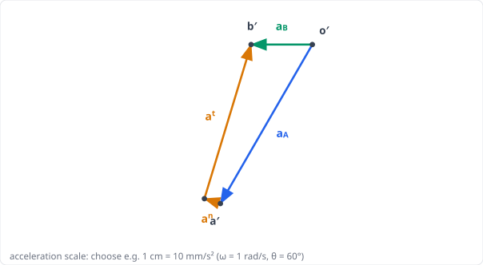
  </TailwindWrapper>

### Step 3: Confirm by Differentiation

**Click to reveal the closed-form piston acceleration**

<Steps>

1. **Start from the exact piston position.** Project the loop onto the centre-line. The crank contributes $r\cos\theta$ and the rod contributes the remaining horizontal reach: ✅

   $$x = r\cos\theta + \sqrt{l^2 - r^2\sin^2\theta}$$

2. **Make the square root differentiable by hand.** Since $r/l$ is small, $\sqrt{l^2 - r^2\sin^2\theta} = l\sqrt{1 - (r/l)^2\sin^2\theta} \approx l - \dfrac{r^2}{2l}\sin^2\theta$, keeping the first two terms of the binomial expansion. Then use $\sin^2\theta = \tfrac{1}{2}(1 - \cos 2\theta)$, which is what makes the second harmonic appear: ✅

   $$x \approx r\cos\theta + l - \frac{r^2}{4l}\left(1 - \cos 2\theta\right)$$

3. **Differentiate twice with respect to $\theta$**, then multiply by $\omega^2$. Because $\omega$ is constant, $\dfrac{d}{dt} = \omega\dfrac{d}{d\theta}$, so no extra terms appear: ✅

   $$\frac{dx}{d\theta} = -r\sin\theta - \frac{r^2}{2l}\sin 2\theta, \qquad \frac{d^2x}{d\theta^2} = -r\cos\theta - \frac{r^2}{l}\cos 2\theta$$

   $$a_P = \omega^2\frac{d^2x}{d\theta^2} = -r\omega^2\left(\cos\theta + \frac{r}{l}\cos 2\theta\right)$$ ✅

   The first term is the **primary** acceleration (once per revolution); the second is the **secondary** (twice per revolution), and it exists only because the rod has finite length. Let $l \to \infty$ and it vanishes.

   :::note[How good is the approximation?]
   Only the square root was approximated, and only for $l/r = 3$. Across a full revolution the result stays within about **1.5% of the peak acceleration**, and at top and bottom dead centre it is exact, which is why the peaks below can be quoted as exact expressions.

   The one place to expect a visible gap is near $\theta = 90\degree$, where the exact value is $0.354\,r\omega^2$ against the $0.333\,r\omega^2$ tabulated here. The simulator solves the exact form, so if you compare there and see $0.35$, the simulator is not wrong and neither is the table.
   :::

2. **Tabulate** $a_P/(r\omega^2)$ for $l/r = 3$: ✅

   | Crank $\theta$ | $a_P/(r\omega^2)$ |
   |:---:|:---:|
   | 0&#176; (TDC) | **-1.333** (peak) |
   | 30&#176; | -1.033 |
   | 60&#176; | -0.333 |
   | 90&#176; | +0.333 |
   | 120&#176; | +0.667 |
   | 180&#176; (BDC) | +0.667 |

3. **Read the peaks.** The largest acceleration is at **top-dead-centre**, $a_P = (1 + r/l)\,r\omega^2 = 1.33\,r\omega^2$, and at bottom-dead-centre it is $(1 - r/l)\,r\omega^2 = 0.67\,r\omega^2$. The two ends differ because the secondary term adds at TDC and subtracts at BDC. At $\theta = 60\degree$, $a_P = -0.33\,r\omega^2$, matching the polygon. ✅

</Steps>

### Step 4: Verify in the Simulator

Everything above is in units of $r\omega^2$, because that keeps the result true for any speed. The simulator plots raw mm/s². Converting between the two is one multiplication, and doing it once makes the whole chart readable.

**Click to reveal the simulator check**

<Steps>

1. **Set it up and fix a speed.** Open the simulator ([siwit.co/CSM](https://siwit.co/CSM)) and set $r = 50$, $l = 150$, $e = 0$ and $60$ RPM. A speed must be chosen before any absolute number exists: ✅

   $$\omega = \frac{2\pi (60)}{60} = 6.283 \text{ rad/s}, \qquad r\omega^2 = 50 (6.283)^2 = 1974 \text{ mm/s}^2$$

   That single number converts every result in this Application into what the chart shows. ✅

2. **Predict before you look.** Multiply the values already found by $1974$: ✅

   | Where | This lesson | The chart should read |
   |---|---|---|
   | TDC ($\theta = 0\degree$) | $-1.333\,r\omega^2$ | $-2632$ mm/s² |
   | BDC ($\theta = 180\degree$) | $+0.667\,r\omega^2$ | $+1316$ mm/s² |
   | $\theta = 60\degree$ | $-0.333\,r\omega^2$ | $-659$ mm/s² |

3. **Mind what the readouts are called.** This is where most people go wrong. The panel reports **Maximum Acceleration** and **Minimum Acceleration**, and because the top-dead-centre value is *negative*, the biggest acceleration in the machine appears under **Minimum**: ✅

   $$\text{Minimum Acceleration} = -2632 \text{ mm/s}^2 \quad (\text{this is the TDC peak, the one that sizes the parts})$$

   $$\text{Maximum Acceleration} = +1377 \text{ mm/s}^2 \quad (\text{a hump at } 138\degree, \textbf{not} \text{ the BDC value})$$

   **Peak-to-Peak** then reads about $4009$ mm/s², the distance between them. ✅

4. **Read the sign as a direction.** Negative means the acceleration points back toward the crank centre. At top-dead-centre the piston is being hauled to a stop and reversed, which is why the number is both negative and the largest. ✅

5. **Find the twin humps.** The positive side has two peaks with a shallow dip between them at bottom-dead-centre, not a single peak. Differentiating the two-harmonic result gives $\sin\theta\,(1 + \tfrac{4}{3}\cos\theta) = 0$, so besides the dead centres there are turning points at $\cos\theta = -3/4$, that is $138.6\degree$ and $221.4\degree$. This is the feature students most often mistake for an error in the simulator. ✅

</Steps>

The chart you should be looking at, with the same three landmarks named:

  <TailwindWrapper>
	
  </TailwindWrapper>

<Steps>

6. **Lengthen the rod.** Increasing $l/r$ shrinks the secondary term, bringing the two peaks closer together and smoothing the motion. Watch **Peak-to-Peak** fall as you do it. ✅

</Steps>

:::note[Engineering Insight]
The connecting rod splits the piston acceleration into a primary and a secondary harmonic, and the secondary makes the top-dead-centre acceleration larger than the bottom. This asymmetry is the root of engine vibration and is taken up as a force in Application 4.
:::

## Application 2: Angular Accelerations of the Four-Bar

<InArticleAd />

For the four-bar we differentiate the velocity loop once more and build the acceleration polygon to find the coupler and follower angular accelerations.

<Card title="Simulator and hands-on lab" icon="rocket">

  <LinkButton href="/product-development/four-bar-linkage-simulator/" target="_blank" variant="primary" icon="rocket" iconPlacement="start">Open the Four-Bar Linkage Simulator</LinkButton>

**Hands-on lab:** Continue in the [Four-Bar Linkage Experiments](/education/mechanism-design-simulation/four-bar-linkage-experiments/) lab ([siwit.co/FBL](https://siwit.co/FBL)). Experiment 7 covers the angular accelerations and inertia forces.
</Card>

:::note[System Problem Statement]
- **Configuration:** Crank-rocker four-bar (the standard four-bar geometry), constant crank speed
- **Task:** Find the coupler and follower angular accelerations $\alpha_3$, $\alpha_4$
- **Link lengths:** $a = 40$, $b = 120$, $c = 80$, $d = 100$ mm
- **Input:** $\theta_2 = 120\degree$, with $\omega_3/\omega_2 = 0.139$, $\omega_4/\omega_2 = 0.514$ from the velocity analysis
:::

### Step 1: Redraw the Space Diagram and the Velocity Polygon

The four-bar needs this step more than the slider-crank did, because here **two** angular velocities feed the acceleration polygon rather than one, and they enter squared.

**Click to reveal the two drawings the acceleration polygon is built on**

<Steps>

1. **Space diagram.** Choose and mark a length scale, say 1 cm = 20 mm. Draw the ground $O_2O_4 = 100$ mm, the crank $O_2A = 40$ mm at $\theta_2 = 120\degree$, then intersect an arc of $b = 120$ mm from $A$ with an arc of $c = 80$ mm from $O_4$. The upper intersection is $B$. Measure $\theta_3 = 22.0\degree$ and $\theta_4 = 96.3\degree$. ✅

   

     <TailwindWrapper>
   	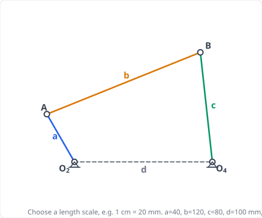
     </TailwindWrapper>
   

2. **Velocity polygon.** Draw $oa = v_A = a\omega_2 = 40$ mm/s perpendicular to the crank. From $a$ draw perpendicular to the coupler, from $o$ draw perpendicular to the follower, and mark $b$ where they cross. ✅

   

     <TailwindWrapper>
   	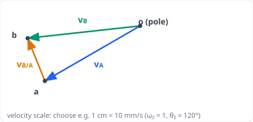
     </TailwindWrapper>
   

3. **Take the two numbers the next drawing needs.** Measuring gives $v_{B/A} = 16.7$ mm/s and $v_B = 41.1$ mm/s, so ✅

   $$\omega_3 = \frac{v_{B/A}}{b} = \frac{16.7}{120} = 0.139 \text{ rad/s}, \qquad \omega_4 = \frac{v_B}{c} = \frac{41.1}{80} = 0.514 \text{ rad/s}$$

   Note how different these are. Squared, they make the follower's normal component nearly ten times the coupler's, which is what gives the acceleration polygon its lopsided shape. ✅

</Steps>

### Step 2: Build the Acceleration Polygon

**Click to reveal the acceleration-polygon construction**

<Steps>

1. **Crank pin.** At constant crank speed, $a_A = \omega_2^2\,a = 40$ mm/s² directed from $A$ to $O_2$. Draw $o'a'$. ✅

2. **Coupler normal.** Add $a_{B/A}^{\,n} = \omega_3^2\,b = (0.139)^2 \times 120 = 2.3$ mm/s² from $a'$, directed $B$ to $A$. ✅

3. **Follower normal.** From the pole, the follower contributes $a_B^{\,n} = \omega_4^2\,c = (0.514)^2 \times 80 = 21.2$ mm/s², directed $B$ to $O_4$. ✅

4. **Tangentials close it.** Two unknown magnitudes remain, and two construction lines supply them: the direction perpendicular to the coupler drawn from the end of the coupler normal, and the direction perpendicular to the follower drawn from the end of the follower normal. They intersect at $b'$. ✅

5. **Measure and convert.** The two tangential lengths read $a_{B/A}^{\,t} = 16.7$ and $a_{B}^{\,t} = 9.3$ mm/s². Divide each by its link length to get an angular acceleration: ✅

   $$\alpha_3 = \frac{16.7}{120} = 0.139 \text{ rad/s}^2, \qquad \alpha_4 = \frac{9.3}{80} = 0.117 \text{ rad/s}^2$$

   The drawing gives magnitudes; the **sense** comes from which way each tangential vector points on it. Here the follower's points opposite to $\omega_4$, so $\alpha_4$ is negative, which Step 3 confirms and the callout there explains. ✅

</Steps>

  <TailwindWrapper>
	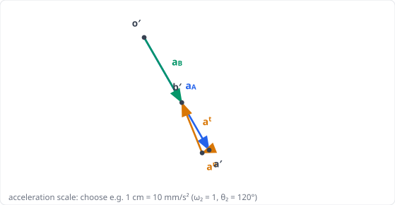
  </TailwindWrapper>

### Step 3: Confirm by the Acceleration Loop

**Click to reveal the closed-form angular accelerations**

<Steps>

1. **Start from the loop you already closed.** In complex form the four-bar loop is one line, and every equation below is a derivative of it: ✅

   $$a\,e^{i\theta_2} + b\,e^{i\theta_3} = d + c\,e^{i\theta_4}$$

2. **Differentiate once** for velocity. Each $\theta$ depends on time, so the chain rule brings down $i\dot\theta = i\omega$: ✅

   $$i\,a\omega_2 e^{i\theta_2} + i\,b\omega_3 e^{i\theta_3} = i\,c\omega_4 e^{i\theta_4}$$

3. **Differentiate again** for acceleration, applying the product rule to each term. Every term produces two: one from differentiating $\omega$ (giving $\alpha$) and one from differentiating $e^{i\theta}$ again (giving $-\omega^2$, since $i \times i = -1$). With $\alpha_2 = 0$ the crank keeps only its $-\omega^2$ term: ✅

   $$\underbrace{-a\omega_2^2 e^{i\theta_2}}_{\text{crank, normal only}} + \underbrace{i\,b\alpha_3 e^{i\theta_3} - b\omega_3^2 e^{i\theta_3}}_{\text{coupler: tangential} + \text{normal}} = \underbrace{i\,c\alpha_4 e^{i\theta_4} - c\omega_4^2 e^{i\theta_4}}_{\text{follower: tangential} + \text{normal}}$$

   Those six terms are exactly the six vectors in the polygon of Step 2. The $-\omega^2$ terms are the normals you could draw straight away; the $i\alpha$ terms are the tangentials you had to close the figure to find.

4. **Split into real and imaginary parts** using $e^{i\theta} = \cos\theta + i\sin\theta$, and collect the two unknowns on the left. Note that multiplying by $i$ swaps sine and cosine, which is why the $\alpha$ terms carry the opposite trig function to the $\omega^2$ terms: ✅

   $$-b\,\alpha_3\sin\theta_3 + c\,\alpha_4\sin\theta_4 = a\omega_2^2\cos\theta_2 + b\omega_3^2\cos\theta_3 - c\omega_4^2\cos\theta_4$$
   $$b\,\alpha_3\cos\theta_3 - c\,\alpha_4\cos\theta_4 = a\omega_2^2\sin\theta_2 + b\omega_3^2\sin\theta_3 - c\omega_4^2\sin\theta_4$$

   Everything on the right is already known, so this is just two linear equations in two unknowns: the same $2 \times 2$ solve as the velocity analysis, with a different right-hand side. ✅

5. **Solve** at $\theta_2 = 120\degree$ ($\omega_2 = 1$ rad/s), substituting $\theta_3 = 21.96\degree$, $\theta_4 = 96.25\degree$, $\omega_3 = 0.139$, $\omega_4 = 0.514$:

   $$\alpha_3 = +0.139 \text{ rad/s}^2, \qquad \alpha_4 = -0.117 \text{ rad/s}^2$$ ✅

   These match the $16.7$ and $9.3$ mm/s² measured off the polygon, divided by $b$ and $c$. Drawing and algebra agree, which is the point of doing both. ✅

   :::tip[A positive ω₄ with a negative α₄ is not an error]
   From the velocity analysis, $\omega_4 = +0.514$ rad/s: the follower is turning **counterclockwise**. Here $\alpha_4 = -0.117$ rad/s²: its angular acceleration points **clockwise**. Both are correct at once, and the combination is worth pausing on because it looks wrong to most students the first time.

   Velocity says which way it is going. Acceleration says how that is changing. Opposite signs simply mean the follower is still turning counterclockwise but is **slowing down**, exactly as a car moving forward with the brakes on has positive velocity and negative acceleration. Had both been positive, the follower would be speeding up.

   The rule: **same sign means speeding up, opposite signs mean slowing down.** Nothing about the two signs disagreeing indicates a mistake.
   :::

   So the follower is decelerating at this instant even though it is still driving the output forward, which the simulator's angular-acceleration trace confirms.

</Steps>

### Step 4: Verify in the Simulator

**Click to reveal the simulator check**

<Steps>

1. **Set it up and fix a speed.** Open the simulator ([siwit.co/FBL](https://siwit.co/FBL)), set $a = 40$, $b = 120$, $c = 80$, $d = 100$, the assembly to **open**, and $60$ RPM, so $\omega_2 = 6.283$ rad/s and $\omega_2^2 = 39.48$. Everything solved above was per unit crank speed, and these two factors convert it to what the simulator reports. The assembly setting matters as much as the link lengths: the crossed circuit is a different linkage with different angles and a different $\alpha_4$, so check it before comparing anything. ✅

2. **Check the velocities on screen first.** The $\omega_3$ and $\omega_4$ charts are tabs in the simulator. At $\theta_2 = 120\degree$ they should read about ✅

   $$\omega_3 = 0.876 \text{ rad/s}, \qquad \omega_4 = 3.231 \text{ rad/s}$$

   Divide each by $\omega_2 = 6.283$ and you recover the $0.139$ and $0.514$ of Step 1. ✅

3. **Open the angular-acceleration tabs.** Alongside $\theta_3$, $\theta_4$, $\omega_3$ and $\omega_4$ the simulator plots $\alpha_3$ and $\alpha_4$ against crank angle. Select the $\alpha_3$ tab, then $\alpha_4$. (The same values are in the downloadable CSV as `Alpha3 (rad/s2)` and `Alpha4 (rad/s2)` if you would rather read exact numbers than measure off a curve.) ✅

4. **Read the value at 120 degrees.** Expect ✅

   $$\alpha_3 \approx +5.50 \text{ rad/s}^2, \qquad \alpha_4 \approx -4.61 \text{ rad/s}^2$$

   Divide by $\omega_2^2 = 39.48$ to get $+0.139$ and $-0.117$ rad/s², matching the loop solution exactly. The signs survive the conversion, so the follower is still decelerating while turning forward. ✅

   Angular acceleration scales with the **square** of crank speed, so doubling the RPM quadruples every one of these numbers while leaving the per-unit values untouched. That is why the working above is done per unit crank speed. ✅

</Steps>

:::note[Engineering Insight]
Each angular acceleration multiplied by a link's mass moment of inertia is an inertia torque, and each link's mass times its centre-of-mass acceleration is an inertia force. The acceleration polygon is therefore the direct input to the [dynamic force analysis](/education/planar-mechanics/force-analysis-mechanism-synthesis).
:::

## Application 3: Platform Acceleration of the Scissor Lift

<InArticleAd />

The scissor lift shows that a constant actuator rate does not give a constant platform motion: a centripetal-type term appears from the geometry.

<Card title="Simulator and hands-on lab" icon="rocket">

  <LinkButton href="/product-development/scissor-lift-mechanism-simulator/" target="_blank" variant="primary" icon="rocket" iconPlacement="start">Open the Scissor Lift Simulator</LinkButton>

**Hands-on lab:** Continue in the [Scissor Lift Experiments](/education/mechanism-design-simulation/scissor-lift-experiments/) lab ([siwit.co/SLM](https://siwit.co/SLM)). The acceleration and power charts plot the relation below.
</Card>

:::note[System Problem Statement]
- **Configuration:** Single-stage scissor lift, arm $L = 300$ mm, $n = 1$
- **Task:** Relate platform acceleration to the scissor angular rate and its rate of change
:::

### Step 1: Differentiate the Velocity Twice

**Click to reveal the platform acceleration**

<Steps>

1. **From the platform velocity** $v = nL\cos\theta\,\dot\theta$, differentiate again:

   $$a_\text{platform} = nL\left(\cos\theta\,\ddot\theta - \sin\theta\,\dot\theta^2\right)$$ ✅

2. **Read the two terms.** The first, $nL\cos\theta\,\ddot\theta$, is the tangential part, present only when the scissor angle is speeding up. The second, $-nL\sin\theta\,\dot\theta^2$, is a centripetal-type term present **even at a constant angular rate** ($\ddot\theta = 0$), and it always acts downward. So a lift raised at a steady angular rate still decelerates as it nears full height. ✅

3. **Actuator consequence.** The actuator must supply the platform weight plus the inertia force $m\,a_\text{platform}$. Near the flat position, where the mechanical advantage is poor ([force analysis](/education/planar-mechanics/force-analysis-mechanism-synthesis)), this dynamic term adds appreciably to the actuator load. ✅

</Steps>

The scissor closes on the single scalar relation $h = nL\sin\theta$, so its acceleration is that one line differentiated twice rather than a polygon: the scaled space diagram below is the geometric reference the two derivatives rest on.

  <TailwindWrapper>
	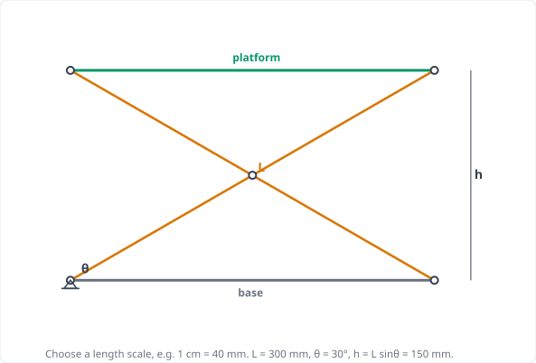
  </TailwindWrapper>

### Step 2: Verify in the Simulator

**Click to reveal the simulator check**

<Steps>

1. **Open the simulator** ([siwit.co/SLM](https://siwit.co/SLM)) and run it at a fixed actuator speed. ✅

2. **Confirm** that the platform acceleration is non-zero even where the angular rate is steady, and that the power trace rises where acceleration and velocity are both large. ✅

</Steps>

:::note[Engineering Insight]
The $-\sin\theta\,\dot\theta^2$ term is the same kind of centripetal acceleration the normal component captures in the polygons: a consequence of rotation that exists without any speeding up. It is why even smooth, constant-rate machines still impose inertia loads.
:::

## Application 4: Inertia and Shaking Forces

<InArticleAd />

Acceleration becomes force through $F = ma$. For the slider-crank this produces the shaking force that engine balancing is designed to cancel.

<Card title="Simulator and hands-on lab" icon="rocket">

  <LinkButton href="/product-development/crank-slider-mechanism-simulator/" target="_blank" variant="primary" icon="rocket" iconPlacement="start">Open the Crank-Slider Simulator</LinkButton>

**Hands-on lab:** Continue in the [Crank-Slider Experiments](/education/mechanism-design-simulation/crank-slider-experiments/) lab ([siwit.co/CSM](https://siwit.co/CSM)). Experiment 6 (force analysis and motor sizing) builds on the inertia forces below.
</Card>

:::note[System Problem Statement]
- **Configuration:** Slider-crank with reciprocating mass $m$ at the piston, constant crank speed
- **Task:** Find the shaking force along the cylinder axis and its two harmonics
:::

### Step 1: From Acceleration to Shaking Force

**Click to reveal the shaking-force harmonics**

<Steps>

1. **Apply d'Alembert** to the reciprocating mass, using the piston acceleration from Application 1. The force the *rod* must apply to the piston to accelerate it is $m\,a_P$; the shaking force is the equal and opposite reaction the piston applies back to the engine, which is the inertia force $-m\,a_P$: ✅

   $$F_\text{shake} = -m\,a_P = m r\omega^2\left(\cos\theta + \frac{r}{l}\cos 2\theta\right)$$

   The minus sign is not bookkeeping. At top-dead-centre $a_P$ is at its most negative, so $F_\text{shake}$ is at its **positive** peak: the piston is being hauled downward hardest exactly when it yanks the engine upward hardest. That is the force felt at the mounts. ✅

2. **Split into harmonics:**

   $$F_\text{primary} = m r\omega^2\cos\theta \quad (\text{once per rev}), \qquad F_\text{secondary} = m r\omega^2\frac{r}{l}\cos 2\theta \quad (\text{twice per rev})$$ ✅

3. **Balancing.** The **primary** force can be largely cancelled by a counterweight on the crank. The **secondary** force runs at twice engine speed and cannot be cancelled by a simple counterweight; it is why inline-four engines use **balance shafts** spinning at twice crank speed. The secondary is smaller by the factor $r/l$, so a longer rod also reduces it. ✅

</Steps>

Plotted over one revolution, the balancing argument becomes obvious. The blue primary curve rises and falls once, so anything turning with the crank can be arranged to oppose it. The green secondary curve completes two full cycles in the same revolution, so no counterweight on the crank can follow it, and only a shaft geared to twice crank speed can:

  <TailwindWrapper>
	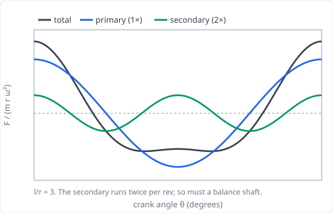
  </TailwindWrapper>

The asymmetry of the black total curve is the same one Application 1 found in the acceleration: it reaches $1.33\,mr\omega^2$ at top-dead-centre ($\theta = 0\degree$ and $360\degree$) but only $0.67\,mr\omega^2$ at bottom-dead-centre ($\theta = 180\degree$), because the secondary adds at one end and subtracts at the other.

### Step 2: Verify in the Simulator

**Click to reveal the simulator check**

<Steps>

1. **Open the simulator** ([siwit.co/CSM](https://siwit.co/CSM)) and read the force and crank-torque charts. ✅

2. **Confirm** that the force trace peaks at top-dead-centre (where acceleration peaks) and that its shape is the primary cosine plus a smaller twice-frequency ripple. ✅

</Steps>

:::note[Engineering Insight]
The shaking force is the inertia force of Application 1 seen from the engine block. Its primary part sets the size of the crank counterweights; its secondary part, at twice the running frequency, is the reason high-refinement engines carry balance shafts. Every number traces back to the piston acceleration you drew in the polygon.
:::

## Application 5: Coriolis Acceleration of the Quick-Return Shaper

<InArticleAd />

The shaper of the [velocity analysis](/education/planar-mechanics/velocity-analysis-instantaneous-centers#application-5-ram-velocity-of-the-quick-return-shaper) is the one mechanism in this course whose acceleration is *wrong* if you use only normal and tangential parts. Its crank pin is a **block sliding inside a turning slot**, and that joint adds the **Coriolis** component defined in the theory above. This application is where that term earns its place.

<Card title="Hands-on lab" icon="rocket">

  <LinkButton href="/product-development/crank-slider-mechanism-simulator/" target="_blank" variant="primary" icon="rocket" iconPlacement="start">Open the Crank-Slider Simulator</LinkButton>

**Hands-on lab:** This inversion has no simulator of its own; the drawing and the calculation confirm each other. The related pin-in-slot Coriolis effect also drives the Geneva indexing motion noted below.
</Card>

:::note[System Problem Statement]
- **Configuration:** Crank-and-slotted-lever quick-return (shaper ram drive)
- **Task:** Find the ram-drive acceleration at the instant drawn, showing the Coriolis contribution
- **Geometry:** crank $r = 120$ mm, $AC = 300$ mm, $AP = 450$ mm
- **Input:** constant crank speed $\omega_2 = 1$ rad/s ($\alpha_2 = 0$); from the velocity analysis $\omega_\text{lever} = 0.399$ rad/s and slip $v_\text{slip} = 87.8$ mm/s
:::

### Step 1: Redraw the Space Diagram and the Velocity Polygon

Here the earlier drawings are not merely convenient, they are indispensable: the Coriolis term is $2\,\omega\,v_\text{slip}$, and **both** of those numbers come off the velocity polygon. There is no way to write down this acceleration without having drawn the velocity first.

**Click to reveal the two drawings the acceleration polygon is built on**

<Steps>

1. **Space diagram.** Choose and mark a length scale, say 1 cm = 40 mm. Set out the fixed centres $A$ and $C$ with $AC = 300$ mm, draw the crank $CB = 120$ mm to the given angle, and run the lever from $A$ through the block $B$ out to the driving point $P$ at $AP = 450$ mm. Measure $AB = 205$ mm. ✅

   

     <TailwindWrapper>
   	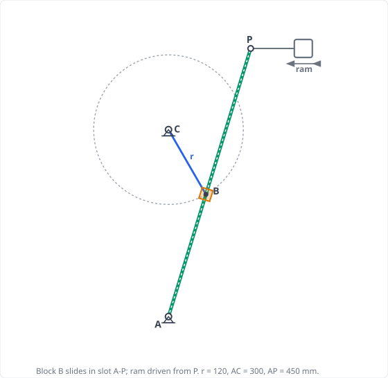
     </TailwindWrapper>
   

2. **Velocity polygon.** Draw $ob_2 = r\omega_2 = 120$ mm/s perpendicular to the crank. Through $o$ draw the direction perpendicular to the lever (where $B_3$, the coincident point *on the lever*, must lie); through $b_2$ draw the direction parallel to the slot (where the block slides). They cross at $b_3$. ✅

   

     <TailwindWrapper>
   	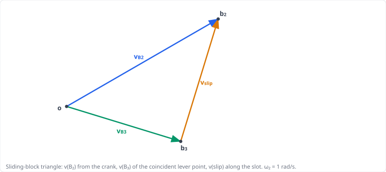
     </TailwindWrapper>
   

3. **Take the two numbers the Coriolis term needs.** Measuring gives $v_{B_3} = 81.8$ mm/s and $v_\text{slip} = 87.8$ mm/s, so $\omega_\text{lever} = 81.8/205 = 0.399$ rad/s. ✅

   A useful check before going on: those two are perpendicular (one across the lever, one along it), so they must satisfy $\sqrt{81.8^2 + 87.8^2} = 120$ mm/s, the crank-pin speed. They do, to the last digit. If your polygon fails this, the error is in the drawing, not in what follows. ✅

</Steps>

### Step 2: Build the Acceleration Polygon with the Coriolis Term

The block's acceleration on the crank splits, on the lever side, into four parts laid head to tail from the pole $o'$: the lever point's **normal** and **tangential** parts, the **Coriolis** part, and the **slip** part. Together they must close on the crank-pin acceleration.

**Click to reveal the acceleration-polygon construction**

<Steps>

1. **Crank-pin acceleration (the target).** With constant crank speed the block on the crank has only a normal acceleration $a_{B_2} = \omega_2^2\,r = 1^2 \times 120 = 120$ mm/s², directed from $B$ toward $C$. The construction must reproduce this vector. ✅

2. **Normal part of the lever point.** $a_{B_3}^{\,n} = \omega_\text{lever}^2 \times AB = 0.399^2 \times 205 \approx 32.6$ mm/s², directed from $B$ toward the fulcrum $A$. Lay it from $o'$. ✅

3. **Coriolis part.** $a^{c} = 2\,\omega_\text{lever}\,v_\text{slip} = 2 \times 0.399 \times 87.8 \approx 70$ mm/s², directed **perpendicular to the slot** (the slip velocity turned $90\degree$ in the sense of $\omega_\text{lever}$). This is the part a plain slider-crank never has. ✅

4. **Close with the two unknown directions.** The lever's **tangential** part is **perpendicular to the lever** (unknown magnitude); the **slip** acceleration is **parallel to the slot** (unknown magnitude). Drawing those two directions to close the polygon onto $a_{B_2}$ fixes both. Measuring gives the tangential part $a_{B_3}^{\,t} \approx 158$ mm/s² and the slip acceleration $\approx 114$ mm/s². ✅

5. **Lever angular acceleration.** $\alpha_\text{lever} = \dfrac{a_{B_3}^{\,t}}{AB} = \dfrac{158}{205} \approx 0.77$ rad/s². ✅

</Steps>

  <TailwindWrapper>
	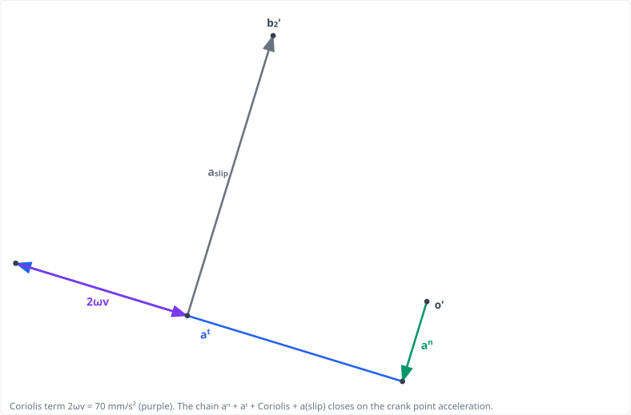
  </TailwindWrapper>

### Step 3: Ram Acceleration and Analytical Check

**Click to reveal the ram acceleration and confirmation**

<Steps>

1. **Ram-drive acceleration.** The driving point $P$ on the lever has a normal part $\omega_\text{lever}^2\,AP$ (toward $A$) and a tangential part $\alpha_\text{lever}\,AP$ (perpendicular to the lever):

   $$a_P = AP\sqrt{\omega_\text{lever}^4 + \alpha_\text{lever}^2} = 450\sqrt{0.399^4 + 0.77^2} \approx 354 \text{ mm/s}^2$$ ✅

2. **The Coriolis term is not optional.** At $70$ mm/s² it is a large share of the closing polygon; drop it and the tangential part, and hence $\alpha_\text{lever}$ and the ram acceleration, come out wrong. Any mechanism with a block sliding in a moving slot (this shaper, a Whitworth drive, a Geneva index) must carry it. ✅

3. **Analytical confirmation.** Writing the loop $\vec r_{AB} = \vec r_{AC} + \vec r_{CB}$ and differentiating twice, with the block distance $AB$ as a changing length, produces the same four terms: the second derivative of $AB$ is the slip acceleration, and the cross term $2\,\dot{(AB)}\,\omega_\text{lever}$ is exactly the Coriolis part. The numbers match the polygon. ✅

</Steps>

:::note[Engineering Insight]
The Coriolis component is the signature of a part that both slides and turns. Here it is a real contributor to the ram-drive acceleration, so the inertia forces on the shaper's slotted lever and ram cannot be found without it. The same term returns wherever a pin slides in a moving slot, which is why the [Geneva indexer](#a-note-on-intermittent-motion-mechanisms) below, and the quick-return itself, are the acceleration problems that most reward drawing the full polygon rather than reaching for a formula.
:::

## A Note on Intermittent-Motion Mechanisms

<InArticleAd />

:::note[Geneva mechanisms and high acceleration]
Not every mechanism runs smoothly. A **Geneva mechanism** converts continuous rotation into a step-and-dwell indexing motion, and during each index the driven wheel accelerates and decelerates sharply. Because the motion starts and stops, the acceleration peaks (and the jerk) are high, and they involve a Coriolis term as the drive pin slides in the slot. The same acceleration-then-force method applies: the sharp accelerations create large inertia torques that the indexing drive and its bearings must withstand, which is why high-speed indexers move to modified Geneva profiles or servo-driven cams. The four canonical mechanisms of this course carry the methods; the Geneva is where they are pushed hardest.
:::

## Design Guidelines for Acceleration and Dynamic Forces

<InArticleAd />

<CardGrid>
  <Card title="Differentiate, don't restart" icon="rocket">
  The acceleration loop is the differentiated velocity loop. Reuse the positions and velocities; only the tangential accelerations are new unknowns.
  </Card>
  <Card title="Size for the peak" icon="warning">
  Inertia loads peak where acceleration peaks (top-dead-centre for the slider-crank). Size pins, rods, and bearings for that worst case.
  </Card>
  <Card title="Mind the second harmonic" icon="setting">
  The secondary term scales with $r/l$ and runs at twice speed. A longer connecting rod or a balance shaft tames it.
  </Card>
  <Card title="Constant rate is not constant motion" icon="puzzle">
  Centripetal and normal terms create acceleration even at steady input speed. Never assume a smoothly driven machine is inertia-free.
  </Card>
</CardGrid>

## Summary and Next Steps

<InArticleAd />

:::tip[Instrument it]
Shaking forces are just $F = ma$ acting on the frame, and they reach you as vibration you can measure. Bolt a MEMS accelerometer to the machine frame near the bearings, an ADXL345 for a first look or the wider-band ADXL1002 to resolve the secondary harmonic, and add a shaft encoder or a Hall sensor for the crank angle so every spike lines up with a position. An [ESP32 or STM32](/education/sensor-actuator-interfacing-stm32/) samples both, and once the primary and secondary peaks are tagged it can [flag a balance problem on siliconwit.io](https://siliconwit.io) before the mounts crack.
:::

### Key Concepts Mastered

1. **Acceleration loop:** one more derivative of the velocity loop, with normal ($\omega^2 r$) and tangential ($\alpha r$) components.
2. **Acceleration polygon:** the normal parts are known from the velocity analysis; the tangential parts close the polygon.
3. **Piston acceleration:** $a_P = -r\omega^2(\cos\theta + \tfrac{r}{l}\cos 2\theta)$, peaking at top-dead-centre at $(1 + r/l)\,r\omega^2$.
4. **Inertia and shaking forces:** $F = ma$ turns accelerations into the loads that vibrate machines, split into a primary and a balance-shaft-requiring secondary harmonic.

### Acceleration Results at a Glance

| Mechanism | What you solve for | Key relation | Simulator |
|-----------|--------------------|--------------|-----------|
| Slider-crank | piston acceleration | $a_P = -r\omega^2(\cos\theta + \tfrac{r}{l}\cos 2\theta)$ | [siwit.co/CSM](https://siwit.co/CSM) |
| Four-bar | $\alpha_3$, $\alpha_4$ | acceleration loop (linear) | [siwit.co/FBL](https://siwit.co/FBL) |
| Scissor lift | platform acceleration | $a = nL(\cos\theta\,\ddot\theta - \sin\theta\,\dot\theta^2)$ | [siwit.co/SLM](https://siwit.co/SLM) |
| Slider-crank | shaking force | primary $+$ secondary harmonics | [siwit.co/CSM](https://siwit.co/CSM) |
| Quick-return (shaper) | Coriolis, ram acceleration | $a^{c} = 2\,\omega\,v_\text{slip}$ | drawing $+$ calc |

### A Note on Tools

Every acceleration here was drawn as a polygon, confirmed by hand calculation, and reproduced with a few lines of Python (NumPy). The simulators confirm the same profiles. No specialised dynamics software is needed; the method is one derivative beyond velocity.

Next, [Cam-Follower Systems and Motion Programming](/education/planar-mechanics/cam-follower-systems-motion-programming) inverts the problem: instead of analysing a given linkage, you specify the motion you want (its displacement, velocity, acceleration, and jerk) and design the cam surface that produces it.

<InArticleAd />
<PlanarMechanicsComments />
<TawkWidget />
<Copyright />
