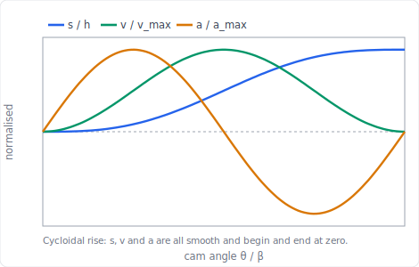
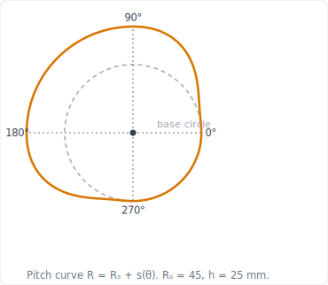
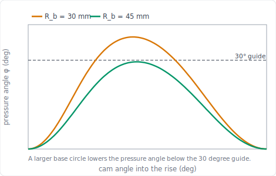

import PlanarMechanicsComments from '../../../../components/planar-mechanics/PlanarMechanicsComments.astro';
import TawkWidget from '../../../../components/TawkWidget.astro';
import UniversalContentContributors from '../../../../components/UniversalContentContributors.astro';
import InArticleAd from '../../../../components/InArticleAd.astro';
import Copyright from '../../../../components/Copyright.astro';
import BionicText from '../../../../components/BionicText.astro';
import TailwindWrapper from '../../../../components/TailwindWrapper.jsx';
import { Tabs, TabItem } from '@astrojs/starlight/components';
import { Card, CardGrid, Badge, Steps, LinkButton, FileTree } from '@astrojs/starlight/components';

<UniversalContentContributors 
  contributors={frontmatter.contributors}
/>

Every mechanism so far was a linkage you were handed and then analysed. The cam inverts the problem: you decide the exact motion the follower must make, its rise, its dwell, its return, and then you design the curved surface that delivers it. The danger is in the curve. Choose a motion law whose acceleration jumps, and the follower receives an infinite jerk at that instant: a hammer blow that wears the contact, makes noise, and shakes the machine at high speed. The whole craft of cam design is shaping the motion so that nothing jumps. In this lesson you program the motion with SVAJ diagrams, lay out the cam profile by hand, and size the base circle from the pressure angle. #CamDesign #MotionProgramming #Cycloidal

## Learning Objectives

By the end of this lesson, you will be able to:

1. **Program** a follower motion with the SVAJ diagrams (displacement, velocity, acceleration, jerk)
2. **Compare** motion laws and explain why cycloidal motion is smooth where harmonic motion is not
3. **Lay out** the cam profile graphically by the inversion method
4. **Size** the base circle from the pressure angle

## Real-World System Problem: A Motion You Cannot Make from a Linkage

<InArticleAd />

An engine valve must snap open, stay fully open while gas flows, then close, all in a fixed fraction of a crank revolution, and repeat without fail millions of times. A packaging machine must advance a film, pause precisely while a print head fires, then advance again. These are **dwell** motions: the output must hold still for part of the cycle and move on a programmed schedule for the rest. A linkage cannot dwell cleanly, but a cam can: its profile is a stored motion program that the follower reads off as the cam turns.

The cam-follower contact is the **higher pair** from the [joint classification](./kinematic-joints-constraint-analysis): line contact that both rolls and slides, removing only one degree of freedom. That single contact is where all the force passes, so the shape of the cam decides both the motion and whether the follower is driven smoothly or hammered.

  <TailwindWrapper>
	
  </TailwindWrapper>

### The Cam Design Problem

> **Engineering Question:** Given the motion the follower must make (its rises, dwells, and returns), what surface produces it, and is that motion smooth enough to run at speed?

### Why Cam-Follower Systems Matter

<CardGrid>
  <Card title="Programmed motion" icon="rocket">
  A cam stores an arbitrary motion law, including dwells, that no simple linkage can reproduce.
  </Card>
  <Card title="Smoothness sets the speed limit" icon="warning">
  An acceleration jump is an infinite jerk: impact, noise, and wear. The motion law caps how fast a cam can run.
  </Card>
  <Card title="Force transmission" icon="setting">
  The pressure angle decides how much of the contact force does useful work. Too large and the follower jams.
  </Card>
  <Card title="A higher pair" icon="puzzle">
  The single rolling-sliding contact carries all the load, so its geometry and the base-circle size govern stress and life.
  </Card>
</CardGrid>

## Fundamental Theory: SVAJ and Motion Laws

<InArticleAd />

### The Displacement Diagram and the SVAJ Family

<Card title="S, V, A, J" icon="document">
A cam motion is described by four diagrams against cam angle $\theta$:

- **S**, displacement $s(\theta)$, the follower position;
- **V**, velocity $v = ds/d\theta$ (multiply by $\omega$ for time rate);
- **A**, acceleration $a = d^2s/d\theta^2$ (multiply by $\omega^2$);
- **J**, jerk $j = d^3s/d\theta^3$ (multiply by $\omega^3$), the rate of change of acceleration.

The **fundamental law of cam design**: for a cam to run at speed, the displacement and its first two derivatives ($s$, $v$, $a$) must be **continuous** across the whole cycle, including the joins to the dwells. A discontinuity in acceleration means an infinite jerk and an impulsive contact force.
</Card>

### Comparing the Motion Laws

<Card title="Four Motion Laws for a Rise of Height h over Angle β" icon="document">
| Motion law | Peak acceleration | Acceleration at the ends | Suitability |
|------------|:-----------------:|--------------------------|-------------|
| Uniform (constant velocity) | zero (infinite at ends) | infinite velocity jump | only with rounded ends |
| Parabolic (constant accel) | $4h/\beta^2$ | jumps (finite, but step) | low speed |
| Simple harmonic (SHM) | $\dfrac{\pi^2 h}{2\beta^2} \approx 4.93\,h/\beta^2$ | jumps from zero at a dwell | moderate speed |
| Cycloidal | $\dfrac{2\pi h}{\beta^2} \approx 6.28\,h/\beta^2$ | zero at both ends | high speed, smoothest |

Cycloidal motion has the **highest peak acceleration** of the four, yet it is the best for high speed because its acceleration **starts and ends at zero**, so it joins a dwell with no jump and no infinite jerk. Simple harmonic motion looks smooth but its acceleration is a cosine that is at full value at the ends, so where a rise meets a dwell the acceleration steps from a maximum to zero, an infinite jerk.
</Card>

### Pressure Angle and the Base Circle

<Card title="Pressure Angle" icon="document">
For a radial translating follower (no offset), the **pressure angle** $\phi$ between the contact normal and the follower motion is:

$$\tan\phi = \frac{ds/d\theta}{R_b + s}$$

where $R_b$ is the **base-circle** radius (the smallest radius of the cam). A large pressure angle means most of the contact force pushes sideways on the follower stem rather than driving it, which causes jamming and wear. The standard guide is to keep $\phi \le 30\degree$ for a translating follower. The denominator shows the fix: **a larger base circle lowers the pressure angle**, at the cost of a bigger cam.
</Card>

## Application 1: Program the Motion and Draw the SVAJ Diagram

<InArticleAd />

This is the central worked example. We program a rise and draw its displacement, velocity, and acceleration to scale, the graphical heart of cam design.

<Card title="Simulator and hands-on lab" icon="rocket">

  <LinkButton href="/product-development/cam-follower-mechanism-simulator/" target="_blank" variant="primary" icon="rocket" iconPlacement="start">Open the Cam and Follower Simulator</LinkButton>

**Hands-on lab:** Continue in the [Cam and Follower Experiments](/education/mechanism-design-simulation/cam-follower-experiments/) lab ([siwit.co/CFM](https://siwit.co/CFM)), which plots this SVAJ chain and compares the motion laws. Build the cam as a part in the [Cam and Follower Mechanism](/education/parametric-mechanical-cad-freecad/cam-and-follower-mechanism/) CAD lesson; for pure simple-harmonic follower motion, see the [Scotch-Yoke Mechanism](/education/parametric-mechanical-cad-freecad/scotch-yoke-mechanism/).
</Card>

:::note[System Problem Statement]
- **Configuration:** Radial translating follower, rise-dwell-fall-dwell cam
- **Task:** Program a cycloidal rise and draw its S, V, A diagrams
- **Specification:** rise $h = 25$ mm over $\beta = 90\degree$, then dwell $90\degree$, cycloidal fall $90\degree$, dwell $90\degree$
- **Input:** constant cam speed $\omega$

**Key Question:** What motion law gives the rise with no acceleration jump at the dwells, and what are its peak velocity and acceleration?
:::

### Step 1: Draw the Displacement Diagram (S, V, A)

Plot the three curves to scale against cam angle. Choose a vertical scale for each (for example 1 cm = 5 mm of lift for $s$); the shapes are what matter.

**Click to reveal the cycloidal motion equations and diagram**

<Steps>

1. **Displacement** of the cycloidal rise:

   $$s = h\left[\frac{\theta}{\beta} - \frac{1}{2\pi}\sin\frac{2\pi\theta}{\beta}\right]$$ ✅

2. **Velocity and acceleration** (per unit cam angle):

   $$v = \frac{h}{\beta}\left[1 - \cos\frac{2\pi\theta}{\beta}\right], \qquad a = \frac{2\pi h}{\beta^2}\sin\frac{2\pi\theta}{\beta}$$ ✅

3. **Read the diagram.** Plotted against $\theta/\beta$, displacement runs smoothly from 0 to $h$, velocity is a bell that starts and ends at zero, and acceleration is a full sine that **also starts and ends at zero**. Because the acceleration is zero at both ends, the rise joins the neighbouring dwells with no jump. ✅

</Steps>

  <TailwindWrapper>
	
  </TailwindWrapper>

### Step 2: Find the Peak Velocity and Acceleration

**Click to reveal the peaks and the comparison with SHM**

<Steps>

1. **Peak velocity** at mid-rise ($\theta = \beta/2$):

   $$v_\text{max} = \frac{2h}{\beta} = \frac{2(25)}{\pi/2} = 31.8 \text{ mm/rad} \quad (\times\omega \text{ for mm/s})$$ ✅

2. **Peak acceleration** at the quarter points:

   $$a_\text{max} = \frac{2\pi h}{\beta^2} = \frac{2\pi(25)}{(\pi/2)^2} = 63.7 \text{ mm/rad}^2 \quad (\times\omega^2)$$ ✅

3. **Compare with simple harmonic motion.** SHM over the same rise peaks at $a_\text{max} = \pi^2 h/(2\beta^2) = 50.0$ mm/rad², lower than cycloidal. Yet SHM acceleration is a cosine at full value at the start of the rise: where it meets the preceding dwell it jumps from 0 to 50, an infinite jerk. The cycloidal law trades a slightly higher peak acceleration for zero jumps, which is the right trade for a high-speed cam. ✅

</Steps>

### Step 3: Verify in the Simulator

**Click to reveal the simulator check**

<Steps>

1. **Open the simulator** ([siwit.co/CFM](https://siwit.co/CFM)), set a cycloidal rise of $h = 25$ mm over $\beta = 90\degree$ with a knife-edge follower, and read the velocity and acceleration charts. ✅

2. **Read the peaks.** Velocity peaks at about $31.8$ mm/rad at mid-rise and acceleration at about $63.7$ mm/rad², matching the hand calculation. The acceleration starts and ends the rise at zero, so the summary reports the fundamental law as obeyed. ✅

3. **Break the law.** Switch the rise to simple harmonic: the peak acceleration drops to about $50$ mm/rad², but the acceleration now steps where the rise meets the dwell and the summary flags the fundamental-law violation. ✅

</Steps>

:::note[Engineering Insight]
The motion law is chosen before any cam shape is drawn, because the law sets the dynamics. Cycloidal motion is the workhorse for high-speed cams precisely because its acceleration vanishes at the ends, so the jerk stays finite. The scotch-yoke linked above is the mechanism that produces pure SHM, useful to feel the difference: smooth in the middle, but with that acceleration step at the extremes.
:::

## Application 2: Lay Out the Cam Profile

<InArticleAd />

With the motion programmed, the cam profile is laid out graphically by **inversion**: imagine the cam fixed and the follower walking around it. At each cam angle the follower sits a distance $s(\theta)$ beyond the base circle, and the locus of those points is the cam profile.

<Card title="Build it and explore" icon="rocket">
The [Cam and Follower Simulator](/product-development/cam-follower-mechanism-simulator/) draws this pitch curve and cam profile live as you set the program, so you can check your hand layout against it. Then reproduce the profile in CAD with the [Cam and Follower Mechanism](/education/parametric-mechanical-cad-freecad/cam-and-follower-mechanism/) lesson, which generates the same profile from the same motion program.
</Card>

:::note[System Problem Statement]
- **Configuration:** Radial translating follower, the rise-dwell-fall-dwell program from Application 1
- **Task:** Lay out the cam pitch profile by inversion
- **Geometry:** base circle $R_b = 45$ mm, rise $h = 25$ mm
:::

### Step 1: Lay Out the Pitch Curve by Inversion

**Click to reveal the inversion construction**

<Steps>

1. **Draw the base circle** of radius $R_b = 45$ mm and mark the cam centre. Choose a length scale and mark it (for example 1 cm = 20 mm). ✅

2. **Divide the cam angle** into convenient steps (every $30\degree$, say), measured **opposite** to the cam's rotation, because by inversion the follower travels backward around a fixed cam. ✅

3. **Step off the displacement.** At each angle, read $s(\theta)$ from the displacement diagram of Application 1 and mark a point that distance radially beyond the base circle. During the rise the radius grows from $R_b$ to $R_b + h$; during the dwell it holds; during the fall it returns. ✅

4. **Join the points** with a smooth curve. This is the **pitch curve**, the path of the follower centre. For a roller follower, the actual cam surface is offset inward from the pitch curve by the roller radius. ✅

</Steps>

  <TailwindWrapper>
	
  </TailwindWrapper>

### Step 2: Read the Profile

**Click to reveal what the profile shows**

<Steps>

1. **Pitch radius.** The profile radius at any angle is $R = R_b + s(\theta)$, so it is $R_b = 45$ mm through the low dwell and $R_b + h = 70$ mm through the high dwell. ✅

2. **The dwells are circular arcs.** Where the follower holds still, the profile is a constant-radius arc (concentric with the base circle). The rise and fall are the shaped transitions between them. ✅

3. **Roller offset.** Drawing the pitch curve first and offsetting by the roller radius is the standard route, and it is exactly what the CAD model does when you sweep the roller around the program. ✅

</Steps>

:::note[Engineering Insight]
The cam profile is just the displacement diagram wrapped around a circle. Every feature of the motion (the smooth rise, the flat dwell, the return) appears directly as a feature of the shape, which is why laying it out by hand builds the intuition that makes the CAD model meaningful rather than magic.
:::

## Application 3: Size the Base Circle from the Pressure Angle

<InArticleAd />

The base circle is not free: too small and the pressure angle grows until the follower jams. This is where the cam's size is actually decided.

:::note[System Problem Statement]
- **Configuration:** Radial translating follower, cycloidal rise $h = 25$ mm over $\beta = 90\degree$
- **Task:** Check the pressure angle and choose a base circle that keeps it within the guide
:::

### Step 1: Plot the Pressure Angle and Iterate

**Click to reveal the pressure-angle check**

<Steps>

1. **Compute** $\tan\phi = (ds/d\theta)/(R_b + s)$ across the rise. With a first guess $R_b = 30$ mm, the pressure angle peaks at $\phi_\text{max} = 37.8\degree$, well above the $30\degree$ guide. The follower would jam. ✅

2. **Increase the base circle.** Raising $R_b$ enlarges the denominator. At $R_b = 45$ mm the peak falls to $\phi_\text{max} = 29.4\degree$, just inside the guide. ✅

3. **Read the trade-off** from the plot below: the larger base circle lowers the whole pressure-angle curve under the $30\degree$ line, at the cost of a physically larger cam. This is why Application 2 used $R_b = 45$ mm. ✅

</Steps>

  <TailwindWrapper>
	
  </TailwindWrapper>

### Step 2: Verify in the Simulator

**Click to reveal the pressure-angle check**

<Steps>

1. **Open the simulator** ([siwit.co/CFM](https://siwit.co/CFM)) with the cycloidal rise and a knife-edge follower, set the base radius to $30$ mm, and read the pressure-angle chart: the peak is about $37.8\degree$, above the $30\degree$ guide line. ✅

2. **Enlarge the base circle.** Raise the base radius to $45$ mm and the peak pressure angle falls to about $29.4\degree$, just under the guide, matching the hand iteration. ✅

</Steps>

:::note[Engineering Insight]
The pressure angle ties the motion program to the cam's physical size. A faster rise (smaller $\beta$) or a taller lift (larger $h$) steepens the profile and raises the pressure angle, forcing a larger base circle. Cam design is the balance between a compact cam and a transmissible pressure angle, settled on exactly the kind of plot above.
:::

## Design Guidelines for Cam Design

<InArticleAd />

<CardGrid>
  <Card title="Program first, shape second" icon="rocket">
  Choose the motion law and draw the SVAJ diagrams before laying out any profile. The law sets the dynamics.
  </Card>
  <Card title="No acceleration jumps" icon="warning">
  Keep displacement, velocity, and acceleration continuous across the dwells. Cycloidal motion does this; uniform and plain parabolic do not.
  </Card>
  <Card title="Size from the pressure angle" icon="setting">
  Pick the base circle so the peak pressure angle stays within the guide (about $30\degree$ for a translating follower).
  </Card>
  <Card title="Pitch curve then roller offset" icon="puzzle">
  Lay out the pitch curve from the program, then offset by the roller radius for the cutting profile.
  </Card>
</CardGrid>

## Summary and Next Steps

<InArticleAd />

### Key Concepts Mastered

1. **SVAJ diagrams:** a cam motion is its displacement and the first three derivatives; for high speed, $s$, $v$, and $a$ must be continuous.
2. **Motion laws:** cycloidal motion is smoothest because its acceleration starts and ends at zero, unlike simple harmonic motion which steps at the dwells.
3. **Cam profile by inversion:** the profile radius is $R_b + s(\theta)$, the displacement diagram wrapped around the base circle.
4. **Pressure angle:** $\tan\phi = (ds/d\theta)/(R_b + s)$ sizes the base circle; a larger base circle lowers the pressure angle.

### Cam Design at a Glance

| Quantity | Relation |
|----------|----------|
| Cycloidal displacement | $s = h[\theta/\beta - \tfrac{1}{2\pi}\sin(2\pi\theta/\beta)]$ |
| Peak velocity / acceleration | $2h/\beta$ &nbsp;/&nbsp; $2\pi h/\beta^2$ |
| Pressure angle | $\tan\phi = (ds/d\theta)/(R_b + s)$ |
| Pitch-curve radius | $R = R_b + s(\theta)$ |

### A Note on Tools

The SVAJ diagrams, cam profile, and pressure-angle curves here were drawn from the motion equations and reproduced with a few lines of Python (NumPy). To do all of it interactively, the **[Cam and Follower Mechanism Simulator](/product-development/cam-follower-mechanism-simulator/)** plots the live SVAJ chain, flags any motion law that violates the fundamental law, sizes the base circle against the pressure angle, and checks the radius of curvature for undercutting, the same analysis this lesson does by hand. The [Cam and Follower Experiments](/education/mechanism-design-simulation/cam-follower-experiments) turn it into structured, Python-verified exercises. To turn the profile into a part, build it in the [Cam and Follower Mechanism](/education/parametric-mechanical-cad-freecad/cam-and-follower-mechanism/) CAD lesson, which sweeps the same program into a solid cam.

Next, [Force Analysis and Mechanism Synthesis](./force-analysis-mechanism-synthesis) returns to the linkages and closes the course: free-body diagrams and force polygons give the joint reactions, the transmission angle measures force quality, and synthesis runs the whole process backward to design a mechanism that meets a force and motion specification.

<InArticleAd />
<PlanarMechanicsComments />
<TawkWidget />
<Copyright />