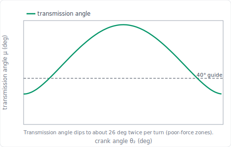
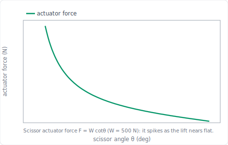

import PlanarMechanicsComments from '../../../../components/planar-mechanics/PlanarMechanicsComments.astro';
import TawkWidget from '../../../../components/TawkWidget.astro';
import UniversalContentContributors from '../../../../components/UniversalContentContributors.astro';
import InArticleAd from '../../../../components/InArticleAd.astro';
import Copyright from '../../../../components/Copyright.astro';
import BionicText from '../../../../components/BionicText.astro';
import TailwindWrapper from '../../../../components/TailwindWrapper.jsx';
import { Tabs, TabItem } from '@astrojs/starlight/components';
import { Card, CardGrid, Badge, Steps, LinkButton, FileTree } from '@astrojs/starlight/components';

<UniversalContentContributors 
  contributors={frontmatter.contributors}
/>

Five lessons told you how a mechanism moves. This one tells you what it costs in force, and how to design for it. A toggle clamp turns a light hand pull into a heavy clamping force; a scissor lift needs a hydraulic cylinder whose force runs away as the platform nears the floor; every pin and link must carry its load without breaking. Force analysis is statics done on the mechanism in a chosen position: free-body diagrams and force polygons give the joint reactions, the transmission angle warns where the force transmits badly, and stress sizing turns those forces into metal. The course then closes by running the whole process backward, synthesis: choosing a mechanism and its dimensions to meet a target. #ForceAnalysis #TransmissionAngle #MechanismSynthesis

## Learning Objectives

By the end of this lesson, you will be able to:

1. **Find** joint reactions with free-body diagrams and force polygons
2. **Relate** mechanical advantage to the velocity ratio through virtual work
3. **Judge** force quality with the transmission angle and size links and pins for stress
4. **Synthesise** a mechanism, choosing type and dimensions, to meet a force and motion target

## Real-World System Problem: From Motion to Metal

<InArticleAd />

A toggle clamp on a machining fixture must hold a part down with several hundred newtons, applied by hand and held without effort while the tool cuts. The designer must answer: what hand force gives the required clamping force, what loads do the pins and links then carry, and are they strong enough? The same questions decide the hydraulic cylinder on a scissor lift and the motor on an engine. Motion analysis found the speeds and accelerations; now we find the forces they imply and the sizes they demand.

### The Force Problem

> **Engineering Question:** For a given input force or torque, what force appears at the output, what reactions load each joint, and are the links and pins strong enough?

### Why Force Analysis Closes the Course

<CardGrid>
  <Card title="Mechanical advantage" icon="rocket">
  The force ratio is the reciprocal of the [velocity ratio](/education/planar-mechanics/velocity-analysis-instantaneous-centers). Motion and force are two views of one machine.
  </Card>
  <Card title="Joint reactions" icon="setting">
  Free-body diagrams and force polygons give the pin loads that bearings and links must carry.
  </Card>
  <Card title="Transmission angle" icon="warning">
  It measures how much of the joint force does useful work. Near the bad zones a mechanism wastes force and wears.
  </Card>
  <Card title="Synthesis" icon="puzzle">
  Run the analysis backward to choose a mechanism type and its link lengths so the target is met.
  </Card>
</CardGrid>

## Fundamental Theory: Statics on a Mechanism

<InArticleAd />

### Free-Body Diagrams and the Force Polygon

<Card title="The Force Polygon" icon="document">
A link in static equilibrium has forces that sum to zero, so drawn tip to tail they **close into a polygon**. Two special cases do most of the work:

- A **two-force member** (forces at only two joints, no other load) carries a force directed **along the line joining the joints**. The coupler of a four-bar and the main link of a toggle are two-force members.
- A **three-force member** has three forces that must be **concurrent** (meet at one point) and close into a **force triangle**. Knowing the directions of all three and the magnitude of one, the triangle gives the other two by measurement.

The force polygon is the statics counterpart of the velocity and acceleration polygons: the same draw-to-scale-and-measure method, now for forces.
</Card>

### Mechanical Advantage by Virtual Work

<Card title="Force Ratio is the Reciprocal of the Velocity Ratio" icon="document">
An ideal (lossless) mechanism conserves power: input power equals output power. With $P = F v = T\omega$,

$$F_\text{in}\,v_\text{in} = F_\text{out}\,v_\text{out} \quad\Rightarrow\quad \text{MA} = \frac{F_\text{out}}{F_\text{in}} = \frac{v_\text{in}}{v_\text{out}}$$

The mechanical advantage is the **reciprocal of the velocity ratio** found in the [velocity analysis](/education/planar-mechanics/velocity-analysis-instantaneous-centers). Where the output slows (a limit or toggle position, velocity ratio toward zero), the mechanical advantage grows large. This is why the same toggle position that stopped the output in the velocity analysis amplifies force here. Real mechanisms lose a little to friction, so an efficiency $\eta < 1$ multiplies the ideal value.
</Card>

### Transmission Angle and Stress

<Card title="Transmission Angle and Allowable Stress" icon="document">
The **transmission angle** $\mu$ is the angle between the coupler and the follower at their joint. The component of the coupler force that drives the follower scales with $\sin\mu$, so $\mu$ near $90\degree$ transmits force well and $\mu$ near $0\degree$ or $180\degree$ transmits almost none. The usual guide is $\mu \ge 40\degree$ throughout the motion.

Once a joint force $F$ is known, the two parts that usually govern are the pin and the link.

**The pin, in shear.** The pin is cut across its section by the joint force:

$$\tau = \frac{F}{A_s}, \qquad A_s = \frac{\pi d^2}{4} \ \text{(single shear)}, \qquad A_s = 2\times\frac{\pi d^2}{4} \ \text{(double shear)}$$

Count the shear planes before anything else. A pin in a simple lap joint is cut on **one** plane; a pin in a clevis or fork, supported on both sides, is cut on **two**, which halves the stress for the same force. Most linkage pins are in double shear, so assuming single shear is the safe, conservative choice when a question does not say.

**The link, in bending.** A rectangular link of thickness $t$ and width $w$ (with $w$ in the plane of bending) under a moment $M = FL$:

$$\sigma = \frac{Mc}{I} = \frac{M}{Z}, \qquad I = \frac{t w^3}{12}, \qquad c = \frac{w}{2}, \qquad Z = \frac{I}{c} = \frac{t w^2}{6} \;\Rightarrow\; \sigma = \frac{6FL}{t w^2}$$

Note that $w$ is **cubed** in $I$: doubling the width in the bending plane cuts the stress by four. Orientation matters far more than material here.

:::caution[Do not check a shear stress against a tensile allowable]
Yield strength $\sigma_y$ is measured in **tension**, so it cannot be compared directly with a shear stress. Convert first. The maximum-shear-stress (Tresca) theory gives the shear yield as

$$\tau_y = 0.5\,\sigma_y \qquad\text{(von Mises gives the less conservative } 0.577\,\sigma_y\text{)}$$

Then each part is checked against its **own** allowable, and the safety factor is the strength divided by the actual stress:

$$N_\text{pin} = \frac{\tau_y}{\tau}, \qquad N_\text{link} = \frac{\sigma_y}{\sigma}$$

The design is acceptable only if **both** exceed the required $N$, and the part with the **lowest** safety factor is the one that governs. Quoting a design safety factor without naming the governing part leaves the answer incomplete.
:::
</Card>

## Application 1: Toggle-Clamp Force Amplification and Sizing

<InArticleAd />

This is the capstone worked example: from hand force to clamping force by force polygon, then the pin and link stresses. The force polygon is the same [graphical method](/education/planar-mechanics/position-analysis-planar-linkages#methods-of-kinematic-analysis) used for velocities and accelerations, now applied to forces: draw the balance to scale, solve it exactly, and confirm in the simulator.

<Card title="Simulator and hands-on lab" icon="rocket">

  <LinkButton href="/product-development/toggle-clamp-mechanism-simulator/" target="_blank" variant="primary" icon="rocket" iconPlacement="start">Open the Toggle Clamp Simulator</LinkButton>

**Hands-on lab:** Continue in the [Toggle Clamp Experiments](/education/mechanism-design-simulation/toggle-clamp-experiments/) lab ([siwit.co/TCM](https://siwit.co/TCM)). Experiments 2 and 4 cover force amplification and pin/link stress sizing.
</Card>

:::note[System Problem Statement]
- **Configuration:** Over-center toggle clamp (a four-bar), resting just past top-dead-centre
- **Task:** Find the clamping force from the hand force, then size the pins and links
- **Data:** hand force $F_h = 100$ N, lock margin $\alpha = 5\degree$ past centre, efficiency $\eta = 0.75$; pin $d = 8$ mm, link $t = 6$ mm, $w = 20$ mm, moment arm $L_\text{arm} = 40$ mm, yield $350$ MPa, safety factor $N = 2$
:::

### Step 1: Force Polygon for the Clamp Arm

The main link is a two-force member, so its force is along the link. The clamp arm is a three-force member (pad reaction, main-link force, pivot reaction), so its force triangle closes.

**Click to reveal the force-polygon construction**

<Steps>

1. **Identify the members.** The main link carries a force along its own line (two-force member). The clamp arm then has three forces: the main-link push at one joint, the pad reaction at the workpiece, and the pivot reaction at $O_4$. ✅

2. **Draw the triangle.** Choose a force scale and mark it (for example 1 cm = 20 N). Lay the known main-link force tip to tail with the pad-reaction direction; the pivot reaction closes the triangle. Measuring the sides gives the pad force and the pivot force. ✅

3. **The over-centre amplification.** Geometrically the ideal force ratio of the toggle is $\text{MA} = \dfrac{1}{2\tan\alpha}$, where $\alpha$ is the angle of the links from the collinear (dead-centre) line. The closer to centre, the larger the amplification. ✅

</Steps>

  <TailwindWrapper>
	
  </TailwindWrapper>

### Step 2: Clamping Force and Stresses

**Click to reveal the numbers**

<Steps>

1. **Mechanical advantage** at the $5\degree$ lock margin. Ideal geometry first, then the efficiency, or both in one step:

   $$\text{MA} = \frac{\eta}{2\tan\alpha} = \frac{0.75}{2\tan 5\degree} = 4.3$$

   taking it in two stages, $\text{MA}_\text{ideal} = 1/(2\tan 5\degree) = 5.72$ and $\text{MA}_\text{real} = 0.75(5.72) = 4.3$. ✅

2. **Clamping force:**

   $$F_\text{clamp} = \text{MA}\times F_h = 4.3 \times 100 = 430 \text{ N}$$ ✅

   The closer the rest position is set to top-dead-centre, the higher this rises, the over-centre design from Lessons 1 and 3 seen as force.

3. **Pin shear** at a representative link/pin force of $800$ N (the internal forces exceed the pad force near the joints). Taking the conservative single-shear case:

   $$A_s = \frac{\pi (8)^2}{4} = 50.3 \text{ mm}^2, \qquad \tau_\text{pin} = \frac{800}{50.3} = 15.9 \text{ MPa}$$ ✅

4. **Pin safety factor**, against the *shear* yield, not the tensile yield:

   $$\tau_y = 0.5(350) = 175 \text{ MPa}, \qquad N_\text{pin} = \frac{175}{15.9} = 11.0$$ ✅

   Had the pin been in double shear the stress would halve to $7.96$ MPa and $N_\text{pin}$ would double to $22$. ✅

5. **Link bending stress**, with $M = FL_\text{arm} = 800(40) = 32{,}000$ N·mm:

   $$\sigma_\text{link} = \frac{6 F L_\text{arm}}{t w^2} = \frac{6(800)(40)}{6(20)^2} = 80 \text{ MPa}$$

   The same result through $Mc/I$: $I = 6(20)^3/12 = 4000$ mm⁴ and $c = 10$ mm, so $\sigma = 32{,}000(10)/4000 = 80$ MPa. ✅

6. **Link safety factor** and the verdict:

   $$N_\text{link} = \frac{350}{80} = 4.4$$

   Both parts clear the required $N = 2$, so the design is acceptable. The **link in bending governs** at $N = 4.4$, against $11.0$ for the pin, so the clamp would fail by the link bending before the pin ever sheared. Any weight saving should come off the pin, and any increase in clamping force is limited by the link. ✅

</Steps>

### Step 3: Verify in the Simulator

**Click to reveal the simulator check**

<Steps>

1. **Open the simulator** ([siwit.co/TCM](https://siwit.co/TCM)) and set the hand force, lock margin, efficiency, and the pin and link sizes. ✅

2. **Confirm** the clamping force rises sharply as the lock margin shrinks toward centre, and read the pin-shear and link-bending stresses with their pass/fail verdict against the allowable. They match the hand calculation. ✅

</Steps>

:::note[Engineering Insight]
The toggle clamp is the whole course in one device: a 1-DOF four-bar ([mobility](/education/planar-mechanics/kinematic-joints-constraint-analysis)), positioned at top-dead-centre ([position](/education/planar-mechanics/position-analysis-planar-linkages)), where the velocity ratio vanishes ([velocity](/education/planar-mechanics/velocity-analysis-instantaneous-centers)), so the mechanical advantage and clamping force spike here in the force analysis, and the resulting pin and link forces must be carried without yielding.
:::

## Application 2: Four-Bar Transmission Angle

<InArticleAd />

The transmission angle tells you where in its cycle a four-bar transmits force well, and where it wastes it.

<Card title="Simulator and hands-on lab" icon="rocket">

  <LinkButton href="/product-development/four-bar-linkage-simulator/" target="_blank" variant="primary" icon="rocket" iconPlacement="start">Open the Four-Bar Linkage Simulator</LinkButton>

**Hands-on lab:** Continue in the [Four-Bar Linkage Experiments](/education/mechanism-design-simulation/four-bar-linkage-experiments/) lab ([siwit.co/FBL](https://siwit.co/FBL)). Experiment 2 maps the transmission angle and mechanism quality.
</Card>

:::note[System Problem Statement]
- **Configuration:** Crank-rocker four-bar (the standard four-bar geometry)
- **Task:** Find the transmission angle over a full crank rotation and the poor-force zones
- **Link lengths:** $a = 40$, $b = 120$, $c = 80$, $d = 100$ mm
:::

### Step 1: Plot the Transmission Angle

**Click to reveal the transmission-angle behaviour**

<Steps>

1. **Measure $\mu$** as the angle between the coupler and follower at joint $B$, taken as the value between $0\degree$ and $90\degree$. At $\theta_2 = 120\degree$ it is $\mu = 74\degree$, an excellent transmission. ✅

2. **Sweep the crank.** Across a full turn $\mu$ rises to about $86\degree$ and falls to about $26\degree$. The dips below the $40\degree$ guide are the **poor-force zones**, where a large coupler force produces only a small useful drive on the follower. ✅

3. **Design response.** If those zones fall inside the working stroke, change the link lengths (Application 4 synthesis) or re-time the load so the heavy work happens where $\mu$ is large. ✅

</Steps>

  <TailwindWrapper>
	
  </TailwindWrapper>

:::note[Engineering Insight]
The transmission angle is a force-quality gauge that costs nothing to check: it comes straight from the [position analysis](/education/planar-mechanics/position-analysis-planar-linkages). Keeping it above about $40\degree$ through the working stroke is one of the first rules of good linkage design.
:::

## Application 3: Scissor-Lift Actuator Force

<InArticleAd />

The scissor lift shows mechanical advantage working against the designer: the actuator force runs away as the platform nears the floor.

<Card title="Simulator and hands-on lab" icon="rocket">

  <LinkButton href="/product-development/scissor-lift-mechanism-simulator/" target="_blank" variant="primary" icon="rocket" iconPlacement="start">Open the Scissor Lift Simulator</LinkButton>

**Hands-on lab:** Continue in the [Scissor Lift Experiments](/education/mechanism-design-simulation/scissor-lift-experiments/) lab ([siwit.co/SLM](https://siwit.co/SLM)). Experiment 1 plots the actuator force and Experiment 8 the link stress.
</Card>

:::note[System Problem Statement]
- **Configuration:** Single-stage scissor lift carrying load $W = 500$ N
- **Task:** Find how the actuator force depends on the scissor angle
:::

### Step 1: Actuator Force by Virtual Work

**Click to reveal the actuator-force relation**

<Steps>

1. **Apply virtual work.** The actuator does work as the base spread changes, the load rises through the height change. Equating, the horizontal-base actuator force to hold load $W$ at scissor angle $\theta$ is:

   $$F_\text{act} = W\cot\theta$$ ✅

   (the exact constant depends on the actuator placement; the simulator gives the precise value for each type).

2. **Read the runaway.** At $\theta = 45\degree$, $F_\text{act} = W = 500$ N; at $\theta = 30\degree$, $866$ N; at $\theta = 10\degree$, $2840$ N. As the platform nears the floor, the mechanical advantage works against the actuator and the force spikes. ✅

3. **Design response.** This is why scissor lifts work over a limited low-angle band, use a diagonal or pantograph actuator placement to improve the low-angle advantage, and never start fully flat. ✅

</Steps>

  <TailwindWrapper>
	
  </TailwindWrapper>

:::note[Engineering Insight]
The $\cot\theta$ runaway is the same geometry that gave the platform its gentle velocity in the [velocity analysis](/education/planar-mechanics/velocity-analysis-instantaneous-centers) (the $\cos\theta$ there), now inverted into force. Good and bad mechanical advantage are two ends of one relationship, and virtual work is the bridge between motion and force.
:::

## Application 4: Synthesise a Four-Bar for a Target

<InArticleAd />

Analysis takes a mechanism and finds its behaviour. **Synthesis** takes a required behaviour and finds the mechanism. This is where the whole course is put to use.

<Card title="Simulator and hands-on lab" icon="rocket">

  <LinkButton href="/product-development/four-bar-linkage-simulator/" target="_blank" variant="primary" icon="rocket" iconPlacement="start">Open the Four-Bar Linkage Simulator</LinkButton>

**Hands-on lab:** Use the [Four-Bar Linkage Experiments](/education/mechanism-design-simulation/four-bar-linkage-experiments/) lab ([siwit.co/FBL](https://siwit.co/FBL)) to test each candidate set of link lengths against the target.
</Card>

:::note[System Problem Statement]
- **Task:** Design a crank-rocker that swings a rocker through a required angle while keeping a good transmission angle
:::

### Step 1: Type and Dimensional Synthesis

**Click to reveal the synthesis process**

<Steps>

1. **Type synthesis.** Choose the mechanism family from the task. A continuous input turning an oscillating output points to a **crank-rocker** four-bar; a straight-line output points to a slider-crank; a clamp pointed to a toggle. The degrees-of-freedom check from the [mobility analysis](/education/planar-mechanics/kinematic-joints-constraint-analysis) confirms one input drives it. ✅

2. **Dimensional synthesis.** Choose the link lengths to meet the motion. For a required rocker swing, fix the ground and rocker, then size the crank and coupler so the rocker reaches both extreme (limit) positions at the wanted angles. The Grashof test from the [position analysis](/education/planar-mechanics/position-analysis-planar-linkages) must pass so the crank fully rotates. ✅

3. **Check force quality.** Run the position analysis and plot the transmission angle (Application 2). If it dips below $40\degree$ inside the working stroke, adjust the link lengths and repeat. Synthesis is this loop: propose lengths, analyse, refine. ✅

4. **Verify the whole design.** Confirm mobility, positions, velocities and mechanical advantage, accelerations and inertia loads, and finally the forces and stresses. A design is finished only when all six checks pass. ✅

</Steps>

:::note[Engineering Insight]
Synthesis is the reason for the other five lessons. Each analysis tool becomes a test the candidate design must pass, and the simulator is where you run those tests quickly before committing to metal. Designing a mechanism is proposing geometry and then subjecting it to every analysis in this course until it survives. The geometry that survives is exactly what you then draw and dimension in the [Parametric Mechanical CAD with FreeCAD](/education/parametric-mechanical-cad-freecad/) course, where these link lengths and limit positions become the sketch constraints of a real part.
:::

## Design Guidelines for Force Analysis and Synthesis

<InArticleAd />

<CardGrid>
  <Card title="Spot the two-force members" icon="rocket">
  A link loaded at only two joints carries force along its line. Finding these first collapses most of the force polygon.
  </Card>
  <Card title="Force is the reciprocal of motion" icon="setting">
  Use the [velocity ratio](/education/planar-mechanics/velocity-analysis-instantaneous-centers): mechanical advantage is its reciprocal. No separate force derivation is needed for the ideal value.
  </Card>
  <Card title="Keep the transmission angle up" icon="warning">
  Hold $\mu \ge 40\degree$ through the working stroke. Check it from the position analysis before sizing anything.
  </Card>
  <Card title="Synthesis is analysis in a loop" icon="puzzle">
  Propose dimensions, run every analysis as a test, refine, and repeat until all checks pass.
  </Card>
</CardGrid>

:::tip[Instrument it]
The joint and bearing forces you solve for here are what wear the pins and overload the motor. Put a load cell, or a pin instrumented with a strain gauge, in the high-force joint, and clamp a current sensor (an ACS712 inline, or an INA219 on the supply) on the drive motor, because motor current is a clean proxy for the torque the linkage demands. Read them with an [ESP32 or STM32](/education/sensor-actuator-interfacing-stm32/), [stream the force-and-current trace](/education/iot-systems/), and let siliconwit.io [warn when a joint force climbs past its rating](https://siliconwit.io).
:::

## Summary and Course Conclusion

<InArticleAd />

### Key Concepts Mastered

1. **Force polygons:** static link forces close into a polygon; two-force members carry force along their line, three-force members close a triangle.
2. **Mechanical advantage:** the reciprocal of the velocity ratio by virtual work, large at the toggle and limit positions.
3. **Transmission angle:** the force-quality gauge, kept above about $40\degree$; the four-bar here dips to $26\degree$ twice per turn.
4. **Stress sizing:** joint forces become pin shear and link bending, checked against the yield stress divided by a safety factor.
5. **Synthesis:** choose the mechanism type and dimensions, then verify against every analysis in the course.

### Force Results at a Glance

| Mechanism | What you solve for | Key relation | Simulator |
|-----------|--------------------|--------------|-----------|
| Toggle clamp | clamping force, stresses | $\text{MA} = \eta/(2\tan\alpha)$ | [siwit.co/TCM](https://siwit.co/TCM) |
| Four-bar | transmission angle | $\mu$ between coupler and follower | [siwit.co/FBL](https://siwit.co/FBL) |
| Scissor lift | actuator force | $F = W\cot\theta$ | [siwit.co/SLM](https://siwit.co/SLM) |
| Crank-slider | crank torque | $T = F\,(ds/d\theta)$ | [siwit.co/CSM](https://siwit.co/CSM) |

### Sizing a Part at a Glance

| Step | Relation |
|------|----------|
| Pin shear stress | $\tau = F/A_s$; &nbsp; $A_s = \pi d^2/4$ single, $2(\pi d^2/4)$ double |
| Shear yield | $\tau_y = 0.5\,\sigma_y$ (Tresca), $0.577\,\sigma_y$ (von Mises) |
| Link bending stress | $\sigma = Mc/I = 6FL/(t w^2)$, &nbsp; $I = t w^3/12$, &nbsp; $Z = t w^2/6$ |
| Safety factors | $N_\text{pin} = \tau_y/\tau$, &nbsp; $N_\text{link} = \sigma_y/\sigma$ |
| Verdict | both must exceed the required $N$; the **lowest** governs, and must be named |

### The Course in One Thread

You met four mechanisms and analysed each through six lenses: whether it moves, where its links sit, how fast they move, how hard they accelerate and what inertia that creates, how to program a motion with a cam, and what forces flow through it and how to design for them. Every result was drawn to scale by hand, confirmed by calculation, and checked in an interactive simulator. That triad, the drawing for intuition, the mathematics for precision, and the simulator for exploration, is how planar mechanisms are understood and designed.

### A Note on Tools

The force polygons, transmission-angle and actuator-force curves here were drawn from the statics and reproduced with a few lines of Python (NumPy). The simulators confirm the forces and report the stress verdicts. No specialised software is required; statics on a mechanism is the whole method.

<InArticleAd />
<PlanarMechanicsComments />
<TawkWidget />
<Copyright />