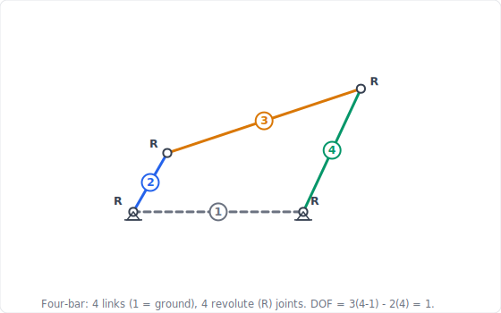
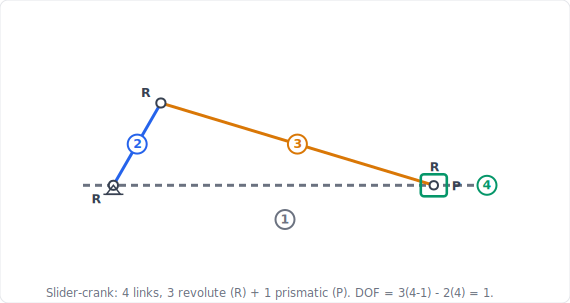

import PlanarMechanicsComments from '../../../../components/planar-mechanics/PlanarMechanicsComments.astro';
import TawkWidget from '../../../../components/TawkWidget.astro';
import UniversalContentContributors from '../../../../components/UniversalContentContributors.astro';
import InArticleAd from '../../../../components/InArticleAd.astro';
import Copyright from '../../../../components/Copyright.astro';
import BionicText from '../../../../components/BionicText.astro';
import TailwindWrapper from '../../../../components/TailwindWrapper.jsx';
import { Tabs, TabItem } from '@astrojs/starlight/components';
import { Card, CardGrid, Badge, Steps, LinkButton, FileTree } from '@astrojs/starlight/components';

<UniversalContentContributors 
  contributors={frontmatter.contributors}
/>

A mechanism with too few degrees of freedom locks up. A mechanism with too many flops around unpredictably. The difference between a useful machine and an expensive pile of parts is whether the designer counted constraints correctly before cutting metal. The Kutzbach-Grübler equation gives you that count from the number of links and joints, and it is the first check every mechanism designer performs. In this lesson you will classify kinematic joints, calculate degrees of freedom, confront the case where the equation lies to you, and verify every answer on the same four mechanisms you can drive in our interactive simulators. #Kinematics #DOF #GrublersEquation

## Learning Objectives

By the end of this lesson, you will be able to:

1. **Identify** different types of kinematic joints and their constraint properties
2. **Calculate** degrees of freedom using the Kutzbach-Grübler equation for planar mechanisms
3. **Diagnose** redundant constraints when the equation disagrees with physical mobility
4. **Verify** mechanism mobility against interactive simulators for four-bar, slider-crank, scissor-lift, and toggle-clamp mechanisms

## Real-World System Problem: Modular Robotic Arm Assembly System

<InArticleAd />

Consider a manufacturing facility that needs flexible automation: one day assembling electronic components, the next day handling automotive parts, and later packaging consumer goods. Traditional fixed robotic systems cannot adapt to this variety of tasks.
The solution? **Modular robotic arms** with interchangeable joint modules that can be reconfigured for different applications. But reconfiguring blindly is dangerous: add the wrong joint and the arm either jams solid or wobbles with motions no motor controls.

### System Challenge: Joint Selection for Reconfigurable Robots

**Critical Engineering Questions:**
- How many joints do we need for a specific task?
- Which joint types provide the required motion?
- How do we guarantee the mechanism has exactly the mobility we intend, no more and no less?
- What constraints do different joints impose on the system?

<Card title="Modular Robot Design Challenge" icon="rocket">
**Design Goal:** Create a joint library where engineers can select and combine different joint types to build task-specific robotic arms and machines.

**Key Requirements:**
- **Flexibility**: Support various motion requirements
- **Analyzability**: Predict system behavior before assembly
- **Optimization**: Minimize complexity while maximizing capability
- **Standardization**: Compatible joint interfaces for easy reconfiguration
</Card>

:::note[Real-World Context]
Companies like **Universal Robots**, **KUKA**, and **ABB** use modular approaches in their robotic systems. Understanding joint constraints is essential for:
- **System Design**: Choosing appropriate joint configurations
- **Path Planning**: Ensuring reachable workspace
- **Control Systems**: Determining actuator requirements
- **Cost Optimization**: Avoiding over-designed solutions
:::

> **Engineering Question:** Given any arrangement of links and joints, how do we predict whether it will move, how many motors it needs, and whether our prediction can be trusted?

### Why Constraint Analysis Matters

**Consequences of getting the count wrong:**
- **Lock-up** when too many constraints leave zero mobility (a structure where you wanted a mechanism)
- **Uncontrolled motion** when too few constraints leave degrees of freedom no actuator commands
- **Binding and broken parts** in over-constrained assemblies that only fit because of manufacturing slop
- **Wasted cost** from motors and controllers driving freedoms the task never needed

**Benefits of systematic analysis:**
- **Predictable mobility** before any hardware is built
- **Correct actuator count** (one independent input per degree of freedom)
- **Early detection** of over-constraint and singular configurations
- **A shared language** that scales from a door hinge to a six-axis robot

## Fundamental Theory: Kinematic Joints and Constraints

<InArticleAd />

To solve our modular robot challenge, we need to understand how joints work and how they constrain motion.

### What are Kinematic Joints?

<Card title="Joint Definition" icon="document">
A **kinematic joint** (or kinematic pair) is a mechanical connection that:
- **Connects** two rigid bodies (links)
- **Allows** specific types of relative motion
- **Constrains** unwanted motions
- **Transmits** forces and moments between bodies

**Key Concept**: Every joint both **enables** desired motion and **removes** undesired motion. The motions it permits are its degrees of freedom; the motions it blocks are its constraints. In a plane, *permitted + constrained = 3* for every joint.
</Card>

In a plane, a single free body has exactly three degrees of freedom: it can translate in X, translate in Y, and rotate about the axis perpendicular to the plane. Every planar joint we attach removes some of these three freedoms. A joint that removes two freedoms (leaving one) is called a lower pair; a joint that removes only one (leaving two) is a higher pair. This single accounting rule, three freedoms minus the constraints, is the entire foundation of mobility analysis.

### Classification of Planar Kinematic Joints

<Tabs>
  <TabItem label="Revolute Joint (R)">

<Card title="Revolute (Pin) Joint" icon="document">

  <TailwindWrapper>
	
  </TailwindWrapper>

**Motion Allowed:** Rotation about the axis perpendicular to the plane
**Motion Constrained:** Translation in both in-plane directions
**Degrees of Freedom:** 1 &nbsp; | &nbsp; **Constraints:** 2

| Planar motion | Permitted? |
|---------------|:----------:|
| X-translation | ❌ |
| Y-translation | ❌ |
| Z-rotation | ✅ |

**This is a *lower pair*** (surface contact, 2 constraints).

**Applications:** Robot shoulder and elbow joints, door hinges, motor shaft connections, every pin in a four-bar linkage.
</Card>

  </TabItem>
  <TabItem label="Prismatic Joint (P)">

<Card title="Prismatic (Slider) Joint" icon="document">

  <TailwindWrapper>
	
  </TailwindWrapper>

**Motion Allowed:** Translation along one in-plane axis
**Motion Constrained:** Translation perpendicular to that axis, and rotation
**Degrees of Freedom:** 1 &nbsp; | &nbsp; **Constraints:** 2

| Planar motion | Permitted? |
|---------------|:----------:|
| X-translation (along slide) | ✅ |
| Y-translation | ❌ |
| Z-rotation | ❌ |

**This is a *lower pair*** (surface contact, 2 constraints).

**Applications:** Linear actuators, hydraulic cylinders, the piston of an engine, telescoping mechanisms, sliding doors.
</Card>

  </TabItem>
  <TabItem label="Higher Pair (Half Joint)">

<Card title="Higher Pair: Cam or Gear Contact" icon="document">

  <TailwindWrapper>
	
  </TailwindWrapper>

A **higher pair** makes contact along a line or at a point rather than over a surface. A cam touching a follower (above), or two gear teeth meshing, can simultaneously **roll** and **slip** at the contact while staying in contact, so it removes only one freedom (the normal direction) instead of two.

**Motion Allowed:** Rolling (rotation) + slipping (tangential translation)
**Motion Constrained:** Translation normal to the contact (must stay in contact)
**Degrees of Freedom:** 2 &nbsp; | &nbsp; **Constraints:** 1

| Planar motion | Permitted? |
|---------------|:----------:|
| Tangential translation (slip) | ✅ |
| Normal translation | ❌ |
| Z-rotation (roll) | ✅ |

**This is a *higher pair*** (line/point contact, only 1 constraint). In the Kutzbach-Grübler equation it is counted as $j_2$.

**Applications:** [Cam-follower systems](/education/planar-mechanics/cam-follower-systems-motion-programming), gear-tooth contact, wheel rolling on a surface, ball bearings.
</Card>

  </TabItem>
</Tabs>

:::tip[Lower pair vs higher pair, in one sentence]
A **lower pair** (revolute, prismatic) touches over a surface and removes **2** planar freedoms; a **higher pair** (cam, gear) touches along a line or point and removes only **1**. That single difference is why the equation has separate terms for $j_1$ and $j_2$.
:::

### Degrees of Freedom Fundamentals

<Card title="Degrees of Freedom in the Plane" icon="document">
**A free rigid body in a plane has 3 DOF:**
- X-translation
- Y-translation
- Z-rotation (about the axis perpendicular to the plane)

For a mechanism of $n$ links, **one link is the fixed ground**, so the moving bodies contribute $3(n-1)$ unconstrained freedoms before any joint is added. Joints then subtract constraints.
</Card>

### The Kutzbach-Grübler Equation

<Card title="Kutzbach-Grübler Equation for Planar Mechanisms" icon="document">
$$M = \text{DOF} = 3(n-1) - 2j_1 - j_2$$

**Where:**
- $n$ = total number of links, **including the ground/frame**
- $j_1$ = number of **lower pairs** (revolute or prismatic, each removing 2 constraints)
- $j_2$ = number of **higher pairs** (cam or gear contact, each removing 1 constraint)

**Reading the equation:** $3(n-1)$ is the total freedom of all moving links; $2j_1 + j_2$ is the total constraint imposed by all joints. Mobility is what is left over.

Mobility is written $M$ as often as DOF, and both appear in this course and in most textbooks. They are the same quantity.

**A counting discipline that avoids most errors.** Set the count out as an inventory before substituting anything:

| Count | Rule |
|-------|------|
| $n$ | every rigid body, **plus the frame as one link**, however many places it is bolted down |
| $j_1$ | every revolute **and** every prismatic joint, since both remove 2 constraints |
| $j_2$ | every rolling or sliding **contact**: cam on follower, gear tooth on gear tooth |

Two traps account for most lost marks. Forgetting the frame gives an answer exactly $3$ too low. Counting a joint where **three** links meet at one pin as a single joint is wrong: $k$ links sharing one pin make $k-1$ joints.
</Card>

:::tip[Interpreting the result]
- **DOF > 0**: a *mechanism*: it moves, and it needs this many independent inputs
- **DOF = 0**: a *structure*: statically determinate, no motion
- **DOF < 0**: *over-constrained*: statically indeterminate, and may bind unless special geometry helps (see Application 3)
- **DOF = 1**: a single-input mechanism, the most common and most controllable design target
:::

### Counting a Higher Pair: Three Worked Cases

Every mechanism analysed later in this lesson happens to have $j_2 = 0$, so the higher-pair term never does any work. These three short counts exercise it, because a cam or gear contact changes the arithmetic and is easy to miscount.

<Card title="Case 1: Cam with a knife-edge translating follower" icon="document">
**Links** ($n = 3$): frame, cam, follower.
**Lower pairs** ($j_1 = 2$): cam-to-frame revolute, follower-in-guide prismatic.
**Higher pairs** ($j_2 = 1$): the knife edge touching the cam surface. It is a *contact*, not a pin, so it removes only 1 constraint: the follower cannot penetrate the cam, but it is free to slide along the profile.

$$M = 3(3-1) - 2(2) - 1 = 6 - 4 - 1 = 1$$

One degree of freedom, one actuator: turn the cam and everything else follows. This is what a cam is for.
</Card>

<Card title="Case 2: The same cam with a roller follower" icon="document">
Adding a roller adds a link and a pin:

**Links** ($n = 4$): frame, cam, roller, follower. &nbsp; **Lower pairs** ($j_1 = 3$): cam-to-frame revolute, roller-to-follower revolute, follower-in-guide prismatic. &nbsp; **Higher pairs** ($j_2 = 1$): roller rolling on the cam surface.

$$M = 3(4-1) - 2(3) - 1 = 9 - 6 - 1 = 2$$

Two, not one. The equation is not wrong: the roller really can spin about its own pin without moving the follower at all. That is a **passive degree of freedom**, the second trap listed below. The mechanism still needs only **one** actuator, because the extra freedom drives no output. Report it as $M = 2$ with one passive freedom, so the useful mobility is 1.
</Card>

<Card title="Case 3: A simple gear pair" icon="document">
**Links** ($n = 3$): frame, gear 1, gear 2. &nbsp; **Lower pairs** ($j_1 = 2$): each gear pinned to the frame. &nbsp; **Higher pairs** ($j_2 = 1$): the meshing teeth.

$$M = 3(3-1) - 2(2) - 1 = 1$$

One input turns both gears at a fixed ratio. Had the teeth been welded rather than meshed, that contact would be a lower pair and $M$ would drop to $0$, a structure. The single constraint difference between a contact and a pin is the whole distinction between $j_1$ and $j_2$.
</Card>

:::tip[The pattern worth remembering]
Swapping one lower pair for one higher pair **adds** one degree of freedom, because a contact constrains half as much as a pin. When a mobility answer comes out one higher than expected, a miscounted contact is the first thing to check, and a passive roller freedom is the second.
:::

### Systematic Joint Analysis Process

<Steps>
1. **Identify all links**, and include the ground/frame as one link.

2. **Classify every joint** as a lower pair ($j_1$) or higher pair ($j_2$), and confirm the constraint count.

3. **Apply the Kutzbach-Grübler equation** to compute the mobility.

4. **Verify physically**: does the predicted mobility match how the real mechanism moves? One actuator should be needed per degree of freedom.

5. **Check for special cases**: redundant constraints, passive joints, and singular configurations can all make the raw equation disagree with reality.
</Steps>

:::caution[Where the equation can mislead you]
1. **Redundant (overlapping) constraints** can make DOF come out negative even though the mechanism moves freely (the scissor lift in Application 3).
2. **Passive degrees of freedom** (a roller that spins without affecting output) inflate the count.
3. **Singular configurations** can momentarily change the *instantaneous* mobility without changing the mechanism's overall DOF (the toggle clamp in Application 4).

This is exactly why we pair every hand calculation in this lesson with a simulator: the equation predicts, the simulator confirms.
:::

## Application 1: Four-Bar Linkage (The Workhorse of Planar Mechanisms)

<InArticleAd />

The four-bar linkage is the most widely used closed-chain mechanism in engineering, from windshield wipers to suspension systems to robotic grippers. We will analyze its mobility, then drive it in the simulator to confirm a single input controls the entire chain.

<Card title="Simulator and hands-on lab" icon="rocket">

  <LinkButton href="/product-development/four-bar-linkage-simulator/" target="_blank" variant="primary" icon="rocket" iconPlacement="start">Open the Four-Bar Linkage Simulator</LinkButton>

**Hands-on lab:** Practice with this mechanism in the [Four-Bar Linkage Experiments](/education/mechanism-design-simulation/four-bar-linkage-experiments/) lab. Experiment 1 (the Grashof condition) is a natural starting point for confirming that a single crank input drives the whole linkage.
</Card>

:::note[System Problem Statement]
- **Configuration:** Crank-rocker four-bar linkage (a packaging-line diverter arm)
- **Task:** Determine the mobility and the number of motors required
- **Link lengths (a crank-rocker set):** crank $a = 40$ mm, coupler $b = 120$ mm, follower/rocker $c = 80$ mm, ground $d = 100$ mm

**What we need to calculate:**
1. **Number of links** including ground
2. **Joint types and counts** ($j_1$, $j_2$)
3. **Mobility** from the Kutzbach-Grübler equation
4. **Verification** that a single crank input determines the whole linkage

**Key Question:** How many independent inputs does a four-bar linkage need, and why is it the default choice for controlled planar motion?
:::

<Card title="Equivalent System Model" icon="document">
**Given the four links:**
- **Link 1**: ground/frame (the fixed bar of length $d$)
- **Link 2**: crank (input link of length $a$)
- **Link 3**: coupler (floating link of length $b$)
- **Link 4**: follower/rocker (output link of length $c$)

**The four joints** are all pin (revolute) connections: ground-crank ($O_2$), crank-coupler ($A$), coupler-follower ($B$), follower-ground ($O_4$).
</Card>

### Step 1: Count Links and Joints

**Click to reveal the link and joint inventory**

<Steps>

1. **Count links (include ground):**

   $$n = 4 \quad (\text{ground} + \text{crank} + \text{coupler} + \text{follower})$$ ✅

2. **Classify the joints:**

   All four connections are pin joints, so they are revolute lower pairs:

   $$j_1 = 4 \quad (\text{4 revolute joints}), \qquad j_2 = 0 \quad (\text{no higher pairs})$$ ✅

</Steps>

  <TailwindWrapper>
	
  </TailwindWrapper>

### Step 2: Apply the Kutzbach-Grübler Equation

**Click to reveal the mobility calculation**

<Steps>

1. **Substitute into the equation:**

   $$\text{DOF} = 3(n-1) - 2j_1 - j_2$$

   $$\text{DOF} = 3(4-1) - 2(4) - 0$$ ✅

   $$\text{DOF} = 9 - 8 = 1 \text{ DOF}$$ ✅

2. **Interpret the result:**

   - The linkage has **mobility 1**: a single input fully determines every link's position.
   - **Motors required: 1**, applied at the crank ($O_2$).
   - With one input fixed, the coupler and follower angles are completely determined by the geometry (you solve for them explicitly in the [position analysis](/education/planar-mechanics/position-analysis-planar-linkages)). ✅

</Steps>

### Step 3: Verify in the Simulator

**Click to reveal the simulator verification**

<Steps>

1. **Open the** [Four-Bar Linkage Simulator](/product-development/four-bar-linkage-simulator/) (short link [siwit.co/FBL](https://siwit.co/FBL)) and load the **Crank-Rocker (Grashof)** preset, or set $a = 40$, $b = 120$, $c = 80$, $d = 100$ mm. ✅

2. **Observe the single input:** the simulator exposes exactly one driving variable, the crank angle. Sweep it from 0 to 360 degrees. ✅

3. **Confirm mobility = 1:** every other quantity the simulator plots ($\theta_3$, $\theta_4$, $\omega_3$, $\omega_4$, the coupler-point path) is fully determined by that one crank angle. There is no second freedom to set. ✅

4. **Connect to the equation:** the fact that one slider controls the whole figure is the physical meaning of $\text{DOF} = 1$. If the linkage had 2 DOF, the simulator would need two independent inputs to pin down the configuration. ✅

</Steps>

:::note[Engineering Insight]
The four-bar linkage is the workhorse of planar mechanism design precisely because $\text{DOF} = 1$: a single motor produces a fully determined, repeatable output motion. This is the ideal most mechanisms are designed toward.

**Key Concept:** Four links + four revolute joints is the minimum closed chain with mobility 1. Remove a joint and it falls apart; add a constraint and it locks. Every mechanism in this lesson is, at heart, a variation on this balance.
:::

## Application 2: Slider-Crank Mechanism (Replacing a Pin with a Slider)

<InArticleAd />

The slider-crank converts rotation into straight-line motion and is the heart of every piston engine, pump, and compressor. It looks different from the four-bar, but its mobility is identical, and seeing *why* deepens the joint-counting intuition.

<Card title="Simulator and hands-on lab" icon="rocket">

  <LinkButton href="/product-development/crank-slider-mechanism-simulator/" target="_blank" variant="primary" icon="rocket" iconPlacement="start">Open the Crank-Slider Simulator</LinkButton>

**Hands-on lab:** Practice with this mechanism in the [Crank-Slider Experiments](/education/mechanism-design-simulation/crank-slider-experiments/) lab. Experiment 1 (the baseline kinematic profile) lets you drive the single crank input and watch the piston motion it fully determines.
</Card>

:::note[System Problem Statement]
- **Configuration:** In-line slider-crank (an internal-combustion engine / reciprocating compressor)
- **Task:** Determine mobility and compare it to the four-bar linkage
- **Typical geometry:** crank $r = 50$ mm, connecting rod $l = 150$ mm, offset $e = 0$

**What we need to calculate:**
1. **Links and joints**, identifying the one prismatic joint
2. **Mobility** from the Kutzbach-Grübler equation
3. **Why** swapping a revolute for a prismatic joint leaves mobility unchanged

**Key Question:** Why does the slider-crank, despite its different appearance, need exactly one input just like the four-bar?
:::

<Card title="Equivalent System Model" icon="document">
**The four links:**
- **Link 1**: engine block / frame (ground)
- **Link 2**: crank (input)
- **Link 3**: connecting rod (coupler)
- **Link 4**: piston / slider (output)

**The four joints:**
- **3 revolute joints**: crank-frame ($O_2$), crank-rod, rod-piston
- **1 prismatic joint**: piston sliding in the cylinder bore
</Card>

### Step 1: Count Links and Joints

**Click to reveal the link and joint inventory**

<Steps>

1. **Count links (include ground):**

   $$n = 4 \quad (\text{frame} + \text{crank} + \text{connecting rod} + \text{piston})$$ ✅

2. **Classify the joints:**

   Three pin joints plus one sliding joint, all lower pairs:

   $$j_1 = 4 \quad (\text{3 revolute} + \text{1 prismatic}), \qquad j_2 = 0$$ ✅

   **Note:** a prismatic joint is a lower pair just like a revolute joint. Both remove 2 planar constraints, so both count toward $j_1$.

</Steps>

  <TailwindWrapper>
	
  </TailwindWrapper>

### Step 2: Apply the Kutzbach-Grübler Equation

**Click to reveal the mobility calculation**

<Steps>

1. **Substitute:**

   $$\text{DOF} = 3(4-1) - 2(4) - 0 = 9 - 8 = 1 \text{ DOF}$$ ✅

2. **Compare to the four-bar:** identical mobility. The only change from Application 1 is that one revolute joint was replaced by a prismatic joint, and since both are lower pairs with 2 constraints each, the count is unchanged. ✅

</Steps>

### Step 3: The "Revolute at Infinity" Insight and Simulator Check

**Click to reveal the geometric interpretation and verification**

<Steps>

1. **A slider is a pin on an infinitely long link.** Imagine the rocker $c$ of the four-bar growing longer and longer. Its tip traces an ever-flatter arc until, in the limit, the arc becomes a straight line and the pin becomes a slider. The slider-crank is the four-bar with its follower stretched to infinity, which is why the mobility is preserved. ✅

2. **Open the** [Crank-Slider Mechanism Simulator](/product-development/crank-slider-mechanism-simulator/) (short link [siwit.co/CSM](https://siwit.co/CSM)) and set $r = 50$, $l = 150$, $e = 0$. ✅

3. **Confirm mobility = 1:** the only driving input is the crank angle. The piston displacement, velocity, and acceleration the simulator plots are all consequences of that single input. ✅

4. **Try the offset:** set $e \neq 0$. The motion becomes asymmetric (the quick-return effect), but the mobility is **still 1**: changing geometry never changes the joint count, only the path traced. ✅

</Steps>

:::note[Engineering Insight]
A prismatic joint and a revolute joint are interchangeable in the mobility equation: each is a lower pair removing 2 constraints. The slider-crank and four-bar are mobility-equivalent, which is why one input drives each.

**Practical Impact:** This equivalence lets designers swap rotary and linear elements (a pin-jointed rocker for a hydraulic cylinder, say) without disturbing the degree-of-freedom budget. You will use exactly this freedom when sizing actuators in the [force analysis](/education/planar-mechanics/force-analysis-mechanism-synthesis).
:::

## Application 3: Scissor Lift (When the Equation Lies: Grübler's Paradox)

<InArticleAd />

So far the equation has matched reality perfectly. Now we meet the case every engineer must recognize: a mechanism that **moves with one degree of freedom**, yet whose raw Kutzbach-Grübler count comes out **negative**. The scissor lift is the classic example, and resolving the contradiction is one of the most important skills in this lesson.

<Card title="Simulator and hands-on lab" icon="rocket">

  <LinkButton href="/product-development/scissor-lift-mechanism-simulator/" target="_blank" variant="primary" icon="rocket" iconPlacement="start">Open the Scissor Lift Simulator</LinkButton>

**Hands-on lab:** Practice with this mechanism in the [Scissor Lift Experiments](/education/mechanism-design-simulation/scissor-lift-experiments/) lab. Experiment 1 (the baseline height and force profile) lets you raise the platform on a single actuator input and observe that it stays horizontal throughout.
</Card>

:::note[System Problem Statement]
- **Configuration:** Single-stage symmetric scissor lift (a warehouse work platform)
- **Task:** Compute the raw mobility, compare it to the observed motion, and reconcile the difference
- **Model:** the two crossed arms, the base, and the platform (the hydraulic actuator is treated as the *driver* of whatever single freedom exists, so it is excluded from the link count)

**What we need to calculate:**
1. **Raw mobility** from the Kutzbach-Grübler equation
2. **Observed mobility** (how the real lift actually moves)
3. **The number of redundant constraints** that reconcile the two
4. **Verification** in the simulator

**Key Question:** The equation predicts the platform cannot move, yet warehouse lifts rise smoothly on a single cylinder. Who is right, and why?
:::

<Card title="Equivalent System Model" icon="document">
**The four links:**
- **Link 1**: base (ground)
- **Link 2**: arm A
- **Link 3**: arm B
- **Link 4**: platform

**The five joints:**
- **Center pivot:** revolute joint where arms A and B cross
- **Arm A to base:** revolute (pinned)
- **Arm B to base:** prismatic (rolls/slides along the base)
- **Arm A to platform:** prismatic (rolls/slides along the platform)
- **Arm B to platform:** revolute (pinned)

So: 3 revolute + 2 prismatic = 5 lower pairs.
</Card>

  <TailwindWrapper>
	
  </TailwindWrapper>

### Step 1: Apply the Equation Naively

**Click to reveal the raw mobility calculation**

<Steps>

1. **Inventory:**

   $$n = 4, \qquad j_1 = 5 \ (\text{3R} + \text{2P}), \qquad j_2 = 0$$ ✅

2. **Substitute:**

   $$\text{DOF} = 3(4-1) - 2(5) - 0 = 9 - 10 = -1 \text{ DOF}$$ ⚠️ ✅

3. **Read the result literally:** $\text{DOF} = -1$ predicts an **over-constrained structure** that should not move at all, and might even bind. ✅

</Steps>

### Step 2: Compare with Physical Reality

**Click to reveal the contradiction**

<Steps>

1. **A real scissor lift clearly moves.** A single hydraulic cylinder raises and lowers the platform, and the platform stays horizontal throughout. That is the behavior of a **1-DOF mechanism**, not a $-1$-DOF structure. ✅

2. **The contradiction:**

   $$\text{DOF}_{\text{equation}} = -1 \qquad \text{but} \qquad \text{DOF}_{\text{observed}} = +1$$

   The equation is off by 2. This discrepancy is **Grübler's paradox**. ✅

</Steps>

### Step 3: Reconcile with Redundant Constraints

**Click to reveal the resolution**

<Steps>

1. **The fix: redundant constraints.** The Kutzbach-Grübler equation assumes every joint imposes *independent* constraints. The scissor lift's special symmetry violates that assumption: equal-length arms pivoting at their shared midpoint force the platform to stay parallel to the base. That "stay parallel" condition is enforced **more than once** by the symmetric geometry, so some constraints overlap and do no new work. ✅

2. **Account for the overlap.** Let $r$ be the number of redundant constraints. The corrected mobility is:

   $$\text{DOF}_{\text{actual}} = 3(n-1) - 2j_1 - j_2 + r$$ ✅

   Solving with the observed mobility:

   $$1 = -1 + r \quad \Rightarrow \quad r = 2 \text{ redundant constraints}$$ ✅

3. **Physical source of the 2 redundancies:** both prismatic joints have parallel axes and the arms are symmetric, so the orientation of the platform is pinned down by several joints that all say the same thing. Two of those constraint equations are linearly dependent on the others, so they remove no additional freedom. ✅

</Steps>

### Step 4: Verify in the Simulator

**Click to reveal the simulator verification**

<Steps>

1. **Open the** [Scissor Lift Mechanism Simulator](/product-development/scissor-lift-mechanism-simulator/) (short link [siwit.co/SLM](https://siwit.co/SLM)). ✅

2. **Confirm a single input:** the simulator drives the lift with exactly one variable (the actuator length, or equivalently the scissor angle $\theta$). One input, one degree of freedom. ✅

3. **Confirm the platform stays horizontal** at every height. That preserved horizontal orientation is the *visible signature* of the redundant constraints: the symmetry enforces it automatically, which is why the raw equation over-counted the constraints. ✅

4. **Conclusion:** observed mobility = 1, matching the corrected calculation, not the raw $-1$. ✅

</Steps>

:::note[Engineering Insight]
The Kutzbach-Grübler equation is **necessary but not sufficient**. It is exact only when all joint constraints are independent. Symmetric and parallel-motion mechanisms (scissor lifts, pantographs, parallelogram linkages) routinely produce redundant constraints, making the raw count too low.

**Key Concept:** When the equation disagrees with the mechanism you can build, suspect redundant constraints (special geometry) before suspecting your arithmetic. Engineers exploit this deliberately: the redundancy that "breaks" the equation is the very thing that keeps a scissor-lift platform level and stiff.

**Why this lesson pairs every calculation with a simulator:** the equation is your fast first prediction, but for anything with symmetry you confirm mobility against the real, moving mechanism. The prediction guides; the simulation decides.
:::

## Application 4: Toggle Clamp (Mobility vs. the Singular Configuration)

<InArticleAd />

A toggle clamp holds a workpiece with enormous force from a light hand effort, and stays clamped even when you let go. It is a 1-DOF four-bar, yet at one special position it behaves dramatically differently. Distinguishing the mechanism's *overall mobility* from its *instantaneous behavior at a singularity* is the final concept of this lesson.

<Card title="Simulator and hands-on lab" icon="rocket">

  <LinkButton href="/product-development/toggle-clamp-mechanism-simulator/" target="_blank" variant="primary" icon="rocket" iconPlacement="start">Open the Toggle Clamp Simulator</LinkButton>

**Hands-on lab:** Practice with this mechanism in the [Toggle Clamp Experiments](/education/mechanism-design-simulation/toggle-clamp-experiments/) lab. Experiment 1 (top-dead-centre and self-locking) maps directly onto the singular configuration discussed here.
</Card>

:::note[System Problem Statement]
- **Configuration:** Over-center toggle clamp (a machining-fixture hold-down)
- **Task:** Determine mobility, then explain self-locking without changing the DOF count
- **Behavior of interest:** the over-center "toggle" position where clamping force spikes and the clamp self-locks

**What we need to calculate:**
1. **Links and joints**
2. **Mobility** from the Kutzbach-Grübler equation
3. **Why self-locking is a singular configuration, not a change in mobility**

**Key Question:** If the clamp still has only one degree of freedom, what exactly happens at the toggle point that makes it lock?
:::

<Card title="Equivalent System Model" icon="document">
**The four links:**
- **Link 1**: clamp base (ground)
- **Link 2**: handle (input)
- **Link 3**: main link (coupler)
- **Link 4**: clamp arm carrying the pad (output)

**The four joints:** all revolute pins: handle-base ($O_2$), handle-main link ($A$), main link-clamp arm ($B$), clamp arm-base ($O_4$).

This is the same topology as the four-bar in Application 1.
</Card>

  <TailwindWrapper>
	
  </TailwindWrapper>

### Step 1: Confirm Mobility

**Click to reveal the mobility calculation**

<Steps>

1. **Inventory:**

   $$n = 4, \qquad j_1 = 4 \ (\text{4 revolute}), \qquad j_2 = 0$$ ✅

2. **Substitute:**

   $$\text{DOF} = 3(4-1) - 2(4) - 0 = 9 - 8 = 1 \text{ DOF}$$ ✅

3. **Interpretation:** the toggle clamp is a four-bar linkage. One input (the handle) determines the whole configuration, exactly as in Application 1. ✅

</Steps>

### Step 2: What Happens at Top-Dead-Center

**Click to reveal the singular-configuration analysis**

<Steps>

1. **The toggle (over-center) position:** the clamp reaches a configuration where the handle link and main link become **collinear** (top-dead-center). At that instant the input crank can move while the output pad barely moves at all. ✅

2. **What changes, and what does not:**
   - The **mobility stays 1**. The mechanism still has exactly one degree of freedom; you have not added or removed any joint.
   - The **instantaneous velocity ratio** between input and output goes to zero (the output is momentarily stationary with respect to the input). This makes the **mechanical advantage spike toward infinity**: a small handle force produces a very large clamping force. ✅

3. **Self-locking:** because the geometry sits slightly past top-dead-center at rest, any reaction force from the clamped part tries to push the linkage *back through* the collinear position, where the mechanical advantage works against it. The clamp holds with no continued handle effort. This is a **geometric (singular) property of one configuration**, not a property of the degree-of-freedom count. ✅

</Steps>

### Step 3: Verify in the Simulator

**Click to reveal the simulator verification**

<Steps>

1. **Open the** [Toggle Clamp Mechanism Simulator](/product-development/toggle-clamp-mechanism-simulator/) (short link [siwit.co/TCM](https://siwit.co/TCM)). ✅

2. **Confirm a single input:** the handle angle $\theta_h$ is the only driver. One input, one degree of freedom, just as the equation says. ✅

3. **Drive the handle toward top-dead-center** and watch the mechanical-advantage and transmission-angle plots: mechanical advantage rises sharply as the links approach collinear, even though the mechanism never gained a degree of freedom. ✅

4. **Conclusion:** mobility is constant at 1 across the entire motion; the dramatic force amplification is an instantaneous singular effect of geometry. ✅

</Steps>

:::note[Engineering Insight]
**Mobility (the global DOF count) and the instantaneous configuration are different things.** The toggle clamp keeps mobility 1 everywhere, yet at top-dead-center its velocity ratio collapses and mechanical advantage spikes, the basis of self-locking clamps, riveters, and crushers.

**Key Concept:** The Kutzbach-Grübler equation tells you *how many* inputs a mechanism needs, not *how it transmits force at a given position*. Force transmission and singularities are taken up in Lessons 3, 4, and 6. Joint counting is the gate you pass first.
:::

## Design Application: Modular Serial Robot Arm

<InArticleAd />

The four mechanisms above are **closed chains** (their links form loops). The modular robot arm from our opening challenge is an **open chain** (a series of links ending in a free end-effector), and open chains follow a simpler rule: degrees of freedom **add up**. Let us size the modular arm.

### Open-Chain Rule: Series Joints Add

<Card title="Why Serial Joints Add Their DOF" icon="document">
In an open serial chain with only single-DOF joints, the Kutzbach-Grübler equation reduces to a simple sum. For $m$ single-DOF joints in series:

$$\text{DOF} = 3(n-1) - 2j_1 = 3(m) - 2(m) = m$$

(since an $m$-joint open chain has $n = m + 1$ links). **Each serial joint adds exactly one degree of freedom**, which is why robot arms are described by their joint count: a "6-axis" robot has 6 DOF.
</Card>

<Tabs>
  <TabItem label="2-DOF Arm">

**Configuration:** ground + upper arm + forearm, joined by 2 revolute joints (shoulder, elbow).

$$n = 3, \quad j_1 = 2 \quad \Rightarrow \quad \text{DOF} = 3(3-1) - 2(2) = 6 - 4 = 2$$ ✅

**Capability:** positions the end-effector anywhere in its planar workspace. Needs 2 motors.

  </TabItem>
  <TabItem label="3-DOF Arm">

**Configuration:** ground + 3 moving links, joined by 3 revolute joints (shoulder, elbow, wrist).

$$n = 4, \quad j_1 = 3 \quad \Rightarrow \quad \text{DOF} = 3(4-1) - 2(3) = 9 - 6 = 3$$ ✅

**Capability:** positions *and* orients the end-effector in the plane. Needs 3 motors.

  </TabItem>
  <TabItem label="Hybrid R-R-P Arm">

**Configuration:** ground + 2 rotating links + 1 sliding link, joined by 2 revolute + 1 prismatic joint.

$$n = 4, \quad j_1 = 3 \quad \Rightarrow \quad \text{DOF} = 3(4-1) - 2(3) = 9 - 6 = 3$$ ✅

**Capability:** mixes rotation with linear extension for a different workspace shape. Same DOF as the 3R arm because the prismatic joint is also a single-DOF lower pair.

  </TabItem>
  <TabItem label="6-DOF Industrial Arm">

**Configuration:** ground + 6 moving links, 6 revolute joints in series (the standard anthropomorphic industrial robot).

$$n = 7, \quad j_1 = 6 \quad \Rightarrow \quad \text{DOF} = 3(7-1) - 2(6) = 18 - 12 = 6$$ ✅

**Capability:** full position + orientation control. Needs 6 servo motors, one per joint.

*(In 3D this becomes the spatial Grübler equation $F = 6(n-1) - \sum c_i$; see the Spatial Mechanics course.)*

  </TabItem>
</Tabs>

:::tip[Open chain vs closed chain, in one line]
**Open (serial) chains add DOF** with each joint, giving large, easily-controlled workspaces. **Closed chains** (Applications 1 to 4) trade workspace for rigidity, force amplification, and constrained, repeatable paths. Real machines combine both.
:::

## Design Guidelines for Joint Selection

<InArticleAd />

<CardGrid>
  <Card title="Revolute Joints (R)">
  **Best for:** rotational positioning, compact designs, high-precision applications.

  **Considerations:** limited workspace per joint; needs rotary actuators; ideal for dexterous manipulation.
  </Card>
  <Card title="Prismatic Joints (P)">
  **Best for:** linear positioning, extended reach, high force transmission.

  **Considerations:** larger footprint; needs linear actuators; excellent for pick-and-place and lifting.
  </Card>
  <Card title="Higher Pairs (cam, gear)">
  **Best for:** programmed motion profiles and timed motion ([cam design](/education/planar-mechanics/cam-follower-systems-motion-programming)), speed/torque conversion.

  **Considerations:** line/point contact means higher stress; needs careful lubrication and surface hardening.
  </Card>
  <Card title="Closed vs Open Chains">
  **Closed (1-DOF):** rigid, repeatable, force-amplifying. **Open (serial):** large workspace, easy control. Match the architecture to the task.
  </Card>
</CardGrid>

### DOF Optimization Strategy

<Steps>
1. **Analyze the task first.** Identify the required end-effector motions and the minimum DOF that achieves them.

2. **Right-size the mobility.** Avoid over-constraint (DOF $< 0$, binding) and avoid unnecessary freedoms (each one costs a motor and a controller). Target DOF = task requirement, adding redundancy only when fault tolerance or obstacle avoidance justifies it.

3. **Plan one actuator per degree of freedom.** Input count must equal DOF for full control.

4. **Verify before building.** Compute mobility with Kutzbach-Grübler, then confirm against a simulation, especially for any symmetric or parallel-motion mechanism where redundant constraints may hide.
</Steps>

## Summary and Next Steps

<InArticleAd />

### Key Concepts Mastered

1. **Joint types:** revolute and prismatic are lower pairs (1 DOF, 2 constraints); cam/gear contacts are higher pairs (2 DOF, 1 constraint).
2. **Kutzbach-Grübler equation:** $\text{DOF} = 3(n-1) - 2j_1 - j_2$ for any planar mechanism.
3. **Grübler's paradox:** redundant constraints from special geometry can make the raw count too low; the scissor lift moves with 1 DOF despite a raw count of $-1$.
4. **Mobility vs. singularity:** a mechanism's DOF is global; self-locking and force spikes (the toggle clamp) are instantaneous geometric effects that do not change the DOF.
5. **Open vs. closed chains:** serial joints add DOF; closed loops constrain it.

### The Four Mechanisms at a Glance

| Mechanism | $n$ | $j_1$ | $j_2$ | Raw DOF | Actual DOF | Simulator |
|-----------|:---:|:-----:|:-----:|:-------:|:----------:|-----------|
| Four-bar linkage | 4 | 4 | 0 | 1 | 1 | [siwit.co/FBL](https://siwit.co/FBL) |
| Slider-crank | 4 | 4 | 0 | 1 | 1 | [siwit.co/CSM](https://siwit.co/CSM) |
| Scissor lift | 4 | 5 | 0 | −1 | 1 (2 redundant) | [siwit.co/SLM](https://siwit.co/SLM) |
| Toggle clamp | 4 | 4 | 0 | 1 | 1 | [siwit.co/TCM](https://siwit.co/TCM) |

### Professional Design Principles

<CardGrid>
  <Card title="System Mobility" icon="rocket">
  **DOF = 0**: fixed structure. **DOF > 0**: mobile mechanism. **DOF < 0**: over-constrained, check for redundant constraints before rejecting.
  </Card>
  <Card title="Actuator Planning" icon="setting">
  One actuator per DOF. Input count = DOF count for full control.
  </Card>
  <Card title="Verify, Don't Trust" icon="warning">
  Kutzbach-Grübler is necessary but not sufficient. Confirm symmetric mechanisms against simulation.
  </Card>
  <Card title="Right-Size DOF" icon="puzzle">
  Match mobility to the task. Don't pay for freedoms you never command.
  </Card>
</CardGrid>

:::tip[Industry Best Practice]
**"Design for the task, not for general capability."** Start from the required motions, determine the minimum DOF, then add redundancy only when flexibility or fault tolerance justifies it.
:::

### Real-World Applications

This joint-and-constraint methodology underpins:
- **Industrial robots:** automotive assembly, welding, painting
- **Manufacturing equipment:** scissor lifts, toggle-clamp fixtures, indexing tables
- **Automotive systems:** suspension linkages, steering mechanisms, engine slider-cranks
- **Service and mobile platforms:** lifts, grippers, inspection arms

Next, [Position Analysis of Planar Linkages](/education/planar-mechanics/position-analysis-planar-linkages) takes the four-bar linkage whose mobility we just confirmed and solves for the exact position of every link using vector loop equations, the foundation for the velocity, acceleration, and force analysis that follows.

<InArticleAd />
<PlanarMechanicsComments />
<TawkWidget />
<Copyright />