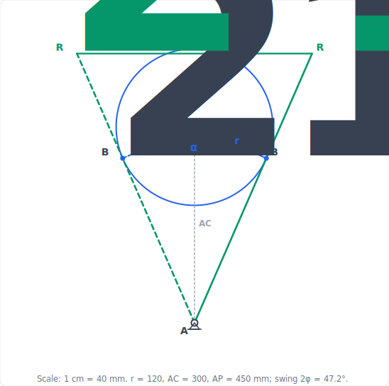

import PlanarMechanicsComments from '../../../../components/planar-mechanics/PlanarMechanicsComments.astro';
import TawkWidget from '../../../../components/TawkWidget.astro';
import UniversalContentContributors from '../../../../components/UniversalContentContributors.astro';
import InArticleAd from '../../../../components/InArticleAd.astro';
import Copyright from '../../../../components/Copyright.astro';
import BionicText from '../../../../components/BionicText.astro';
import TailwindWrapper from '../../../../components/TailwindWrapper.jsx';
import { Tabs, TabItem } from '@astrojs/starlight/components';
import { Card, CardGrid, Badge, Steps, LinkButton, FileTree } from '@astrojs/starlight/components';

<UniversalContentContributors 
  contributors={frontmatter.contributors}
/>


Mobility analysis confirmed that the four-bar linkage, slider-crank, scissor lift, and toggle clamp each move with a single degree of freedom. That tells you one input controls them, but not where that input puts the output. Turn the crank of a four-bar by a known angle and the coupler and follower take up specific angles that the geometry alone decides. Position analysis finds those angles. It is the problem you must solve before any velocity, acceleration, or force analysis, because all of those are built on top of the positions. In this lesson you write the vector loop equation for each mechanism and solve it in closed form, then check the answer in the simulator. #PositionAnalysis #VectorLoops #Freudenstein

## Learning Objectives

By the end of this lesson, you will be able to:

1. **Formulate** the vector loop equation for any closed planar linkage
2. **Solve** the four-bar position problem in closed form with the Freudenstein equation
3. **Classify** mechanisms with the Grashof condition and handle open and crossed assembly modes
4. **Locate** coupler-point paths and limit (dead-center) positions, verifying each against a simulator

## Real-World System Problem: Predicting Where the Output Goes

<InArticleAd />


A windshield wiper must sweep a precise arc and stop short of the A-pillar. An engine piston must reach top-dead-center exactly when the crank does. A scissor-lift platform must reach a target height and stay level. In every case the designer commits to link lengths and then has to predict, before any metal is cut, exactly where the output sits for every input position. Guessing is not an option, because a few millimetres of error can mean a wiper that hits the trim or a piston that collides with a valve.

### The Position Problem

Position analysis answers one question for a single-degree-of-freedom mechanism:

> **Engineering Question:** Given the input link angle, what are the angles and coordinates of every other link?

For an open serial chain (a robot arm), this is direct: add the links nose to tail. For a closed chain (the four mechanisms of this course), the links form a loop that must close on itself, and that closure condition is what we solve.

### Why Position Analysis Comes First

<CardGrid>
  <Card title="Foundation for everything" icon="rocket">
  Velocity is the time derivative of position; acceleration is the derivative of velocity. You cannot find either until the positions are solved.
  </Card>
  <Card title="Reachability and interference" icon="warning">
  Position analysis shows whether the output reaches its target and whether links collide or bind anywhere in the range of motion.
  </Card>
  <Card title="Path generation" icon="puzzle">
  A point on the coupler traces a curve. Position analysis predicts that curve, which is how linkages are made to follow a required path.
  </Card>
  <Card title="Limit positions" icon="setting">
  It locates the extreme positions where the output reverses, the basis of dead-center clamping and stroke limits.
  </Card>
</CardGrid>

## Methods of Kinematic Analysis

<InArticleAd />


Position, velocity, and acceleration are solved by **two core methods**, graphical and analytical, that you then **confirm with a simulator**. One further trick, the instantaneous center, is worth knowing as a quick velocity shortcut, but the course does not build on it (the fourth card explains why). These are not rivals: each answers the same question in a different way, so you use them to check one another. The three analysis lessons (this one, [velocity](/education/planar-mechanics/velocity-analysis-instantaneous-centers), and [acceleration](/education/planar-mechanics/acceleration-analysis-dynamic-forces)) apply the same set to the same mechanisms, so it is worth meeting them together before diving into the algebra.

<CardGrid>
  <Card title="Graphical (drawing-instrument) method" icon="pencil">
  **Core method.** Draw the mechanism to scale on paper and read the answer straight off the drawing. Position comes from striking arcs with a **compass**; velocity and acceleration come from **polygons** built with a **set square** and measured with a **scale rule** and **protractor**: the classical *draughtsman's drawing set*. It is intuitive and always works, but it handles one instant at a time and only to drawing-board precision (a few percent).
  </Card>
  <Card title="Analytical (vector-loop) method" icon="document">
  **Core method.** Write the loop-closure condition $\sum \vec{r}_i = 0$ as equations and solve them: in closed form for position (the Freudenstein equation), and by differentiating the *same* loop for velocity and acceleration. It is exact, and once written it can be evaluated at every angle of a full cycle or coded into a spreadsheet.
  </Card>
  <Card title="Simulator (confirm and lab)" icon="rocket">
  **How you confirm.** The interactive simulators in this course (and packages like MATLAB or 2D-linkage software) solve the loop numerically and animate the whole cycle. Every worked example ends by reading the same answer off the simulator, and the hands-on labs are built on it. It is only as trustworthy as the model you set up, so it confirms the two methods above rather than replacing them.
  </Card>
  <Card title="Instantaneous centers (worth knowing)" icon="puzzle">
  **A velocity shortcut, not our main road.** Locate the point each link instantaneously turns about (using Kennedy's theorem) and read a velocity ratio directly, with no equations. It is a neat one-step check, but it gives *velocities only*: there is no instantaneous center for acceleration, so it cannot follow a problem through the full position, velocity, acceleration chain the way the graphical polygon can. We note it and use it as a check; we build on the polygon, the loop, and the simulator.
  </Card>
</CardGrid>

### How the methods fit together

Treat them as a sequence, not a menu: **draw, solve, simulate**. **Draw it first** with the drawing set to *see* the mechanism and get a quick answer at the instant of interest. **Solve it analytically** to turn that sketch into an exact number and, crucially, to sweep the *whole* cycle instead of one pose. **Simulate it** to animate the motion, plot a full revolution, confirm the drawing and the algebra, and drive the lab exercises. The **instantaneous center** sits outside this sequence as an optional one-step check on a velocity ratio, nothing more.

The real payoff is cross-checking. The length you *measure* off a velocity polygon should equal the value you *compute* by differentiating the loop, which should match what the *simulator* reports. When all three agree, you can trust the result; when they disagree, one of them has exposed a mistake. Every worked example in these three lessons follows this rhythm, so you build the habit of confirming a kinematic answer three independent ways.

:::note[The draughtsman's drawing set]
The graphical method is done with a small kit of drawing instruments, the same one used on a traditional drawing board: a **scale rule** (to lay lengths off to a chosen scale, e.g. 1 cm = 20 mm), a **compass and dividers** (to strike arcs and transfer lengths), a pair of **set squares** (to draw the perpendiculars a velocity or acceleration polygon needs), and a **protractor** (to set and read angles). Choosing and *labelling* a sensible scale is the first step of every graphical solution, because every length you later measure is only as good as that scale.
:::

### How Close Is Close Enough?

You draw a polygon, measure $50.2$ mm/s, then compute $50.84$ mm/s. Is that a success or a mistake? Without a stated tolerance the cross-check is worthless, because any disagreement can be explained away. Here is what board work actually costs you.

| Source of error | Typical size | How to reduce it |
|---|---|---|
| Scale rule reading | $\pm 0.5$ mm on the page | choose a scale that fills the page |
| Protractor reading | $\pm 0.5\degree$ | construct perpendiculars with a set square, not a protractor |
| Compass slip | $\pm 0.5$ mm | sharp lead, re-check the opening against the rule |
| Line thickness | $\pm 0.3$ mm | 0.3 mm pencil, hard grade |
| Near-tangent intersection | unbounded | re-draw at a different instant |
| **Combined, carefully drawn** | **1 to 2 percent** | |
| **Combined, hurried** | **5 to 10 percent** | |

:::tip[The acceptance rule]
Agreement between drawing and calculation of **better than 2 percent** confirms both, and you should move on. Between **2 and 5 percent**, re-draw before suspecting the algebra. **Beyond 5 percent**, one of them contains a real error, and the fastest route to it is to check the **directions** first, then the **scale label**, then the arithmetic. Direction errors dominate by a wide margin; scale-label errors are second.

By this rule, $50.2$ against $50.84$ is a $1.3\%$ agreement. That is a pass. Say so, and move on.
:::

The drawing is not just a warm-up for the algebra. It catches what algebra hides: a wrongly signed $\omega_3$ still produces a plausible number, but it produces a visibly wrong polygon. A sliver of a triangle warns you the mechanism is near a singularity long before you notice a small denominator in a formula. And the arcs, tangents and perpendiculars you strike by hand are the same geometric constraints you will later apply in a parametric CAD sketch.

## Fundamental Theory: The Vector Loop Method

<InArticleAd />


### Links as Vectors That Close a Loop

<Card title="Vector Loop Principle" icon="document">
Treat each link as a vector pointing from one joint to the next. In any closed kinematic loop, walking around the links and back to the start gives zero net displacement:

$$\sum_{i} \vec{r}_i = 0$$

This single geometric fact turns a drawing into algebra. Each vector contributes a cosine term to the x-equation and a sine term to the y-equation, giving two scalar equations per loop.
</Card>

The power of the method is that it is the same for every linkage. You label the links as vectors, write the loop sum, split it into x and y components, mark which angles are known and which are unknown, and solve. The four-bar gives two equations in two unknown angles. The slider-crank gives two equations in one unknown angle and one unknown distance. The procedure never changes; only the bookkeeping does.

### The Four-Bar Loop in Component Form

We use the same link labels as the simulator: link $a$ is the input crank, $b$ the coupler, $c$ the follower, and $d$ the ground. Place the origin at the crank pivot, the ground link $d$ along the positive x-axis, and measure all angles counterclockwise from it.

<Card title="Four-Bar Vector Loop" icon="document">
$$\vec{a} + \vec{b} - \vec{c} - \vec{d} = 0$$

**X-component:**
$$a\cos\theta_2 + b\cos\theta_3 - c\cos\theta_4 - d = 0$$

**Y-component:**
$$a\sin\theta_2 + b\sin\theta_3 - c\sin\theta_4 = 0$$

**Known:** link lengths $a, b, c, d$ and the input angle $\theta_2$.
**Unknown:** the coupler angle $\theta_3$ and the follower angle $\theta_4$.
</Card>

These are two nonlinear equations in two unknowns. The next section solves them in closed form, so no guessing or iteration is needed.

## Application 1: Four-Bar Position by the Freudenstein Equation

<InArticleAd />


This is the central worked example of the lesson. We solve the four-bar position problem exactly, then read the same angles off the simulator.

<Card title="Simulator and hands-on lab" icon="rocket">
<div style={{ display: 'flex', justifyContent: 'center', width: '100%', margin: '0.25rem 0 1rem' }}>
  <LinkButton href="/product-development/four-bar-linkage-simulator/" target="_blank" variant="primary" icon="rocket" iconPlacement="start">Open the Four-Bar Linkage Simulator</LinkButton>
</div>

**Hands-on lab:** Continue in the [Four-Bar Linkage Experiments](/education/mechanism-design-simulation/four-bar-linkage-experiments/) lab. Experiment 5 (coupler-curve exploration) extends the position analysis below to the path traced by a coupler point.
</Card>

:::note[System Problem Statement]
- **Configuration:** Crank-rocker four-bar (the default geometry at [siwit.co/FBL](https://siwit.co/FBL))
- **Task:** Find the coupler and follower angles for a given crank angle, in closed form
- **Link lengths:** crank $a = 40$ mm, coupler $b = 120$ mm, follower $c = 80$ mm, ground $d = 100$ mm
- **Input:** crank angle $\theta_2 = 60°$

**What we need to calculate:**
1. The constants of the Freudenstein equation
2. The follower angle $\theta_4$
3. The coupler angle $\theta_3$
4. The open and crossed assembly modes

**Key Question:** Given only the four link lengths and the crank angle, how do we compute the exact output angle without trial and error?
:::

### Step 1: Draw the Space Diagram and Measure

The [graphical method](#methods-of-kinematic-analysis) solves the position problem with the drawing set alone, no equations. It is the fastest way to *see* the answer, and it doubles as a check on the algebra that follows. The whole trick is that two of the four link lengths ($b$ and $c$) are fixed, so the joint $B$ must lie at a known distance from *both* $A$ and $O_4$, and the only such points are where two arcs cross.

<details>
<summary>**Click to reveal the graphical position solution (arc-intersection)**</summary>

<Steps>

1. **Choose and note a scale.** Pick a length scale that fills the page, say **1 cm = 20 mm**, and write it on the drawing. Every length below is laid off with the scale rule at this scale. ✅

2. **Ground and crank.** Draw the ground $O_2O_4 = d = 100$ mm horizontally. With a **protractor** set $\theta_2 = 60\degree$ at $O_2$ and lay off the crank $O_2A = a = 40$ mm with the scale rule. Point $A$ is the crank pin. ✅

3. **Intersect the coupler and follower arcs.** Open the **compass** to the coupler length $b = 120$ mm and strike an arc centred on $A$; reset it to the follower length $c = 80$ mm and strike an arc centred on $O_4$. The arcs cross at **two** points, the two assembly modes. Take the upper crossing (the *open* mode) as the coupler-follower joint $B$; the lower crossing is the *crossed* mode. ✅

4. **Measure the unknowns.** Draw $AB$ (coupler) and $O_4B$ (follower), then read their angles from the horizontal with the **protractor**: $\theta_3 \approx 18\degree$ and $\theta_4 \approx 65\degree$. ✅

</Steps>

<div style={{ display: 'flex', justifyContent: 'center', width: '100%', margin: '1.25rem 0' }}>
  <TailwindWrapper>
	
  </TailwindWrapper>
</div>

</details>

The drawing gives each angle to within a degree or so. The closed-form Freudenstein solution below pins them to $\theta_3 = 18.4\degree$ and $\theta_4 = 64.9\degree$, and the simulator confirms both. Reading to about $\pm1\degree$ is normal for board work, enough to catch a gross error and to tell the two assembly modes apart, which is exactly what the graphical method is for.

### Step 2: Eliminate the Coupler Angle

<details>
<summary>**Click to reveal the elimination of $\theta_3$**</summary>

<Steps>

1. **Isolate the coupler terms** in both component equations:

   $$b\cos\theta_3 = d + c\cos\theta_4 - a\cos\theta_2$$
   $$b\sin\theta_3 = c\sin\theta_4 - a\sin\theta_2$$ ✅

2. **Square both equations and add.** Because $\cos^2\theta_3 + \sin^2\theta_3 = 1$, the coupler angle $\theta_3$ disappears, leaving one equation in $\theta_4$:

   $$b^2 = a^2 + c^2 + d^2 + 2cd\cos\theta_4 - 2ad\cos\theta_2 - 2ac\cos(\theta_4 - \theta_2)$$ ✅

</Steps>

</details>

### Step 3: Form the Freudenstein Equation

<details>
<summary>**Click to reveal the Freudenstein constants**</summary>

<Steps>

1. **Divide through by $2ac$** and group the constant terms. The result is the **Freudenstein equation**:

   $$K_1\cos\theta_4 - K_2\cos\theta_2 + K_3 = \cos(\theta_4 - \theta_2)$$ ✅

2. **Define the three constants** from the link lengths only:

   $$K_1 = \frac{d}{a}, \qquad K_2 = \frac{d}{c}, \qquad K_3 = \frac{a^2 - b^2 + c^2 + d^2}{2ac}$$ ✅

3. **Evaluate** for $a=40$, $b=120$, $c=80$, $d=100$:

   $$K_1 = \frac{100}{40} = 2.500, \quad K_2 = \frac{100}{80} = 1.250, \quad K_3 = \frac{1600 - 14400 + 6400 + 10000}{2(40)(80)} = \frac{3600}{6400} = 0.5625$$ ✅

</Steps>

</details>

### Step 4: Solve for the Follower Angle

<details>
<summary>**Click to reveal the closed-form solution for $\theta_4$**</summary>

<Steps>

1. **Expand** $\cos(\theta_4 - \theta_2)$ and substitute the half-angle $t = \tan(\theta_4/2)$. This converts the equation into a quadratic $A t^2 + B t + C = 0$ with:

   $$A = \cos\theta_2 - K_1 - K_2\cos\theta_2 + K_3$$
   $$B = -2\sin\theta_2$$
   $$C = K_1 - (K_2 + 1)\cos\theta_2 + K_3$$ ✅

2. **Evaluate** at $\theta_2 = 60°$ ($\cos 60° = 0.500$, $\sin 60° = 0.866$):

   $$A = 0.500 - 2.500 - 1.250(0.500) + 0.5625 = -2.0625$$
   $$B = -2(0.866) = -1.732$$
   $$C = 2.500 - (2.250)(0.500) + 0.5625 = 1.9375$$ ✅

3. **Solve the quadratic.** The two roots give the two assembly modes:

   $$\theta_4 = 2\arctan\!\left(\frac{-B \mp \sqrt{B^2 - 4AC}}{2A}\right)$$

   $$B^2 - 4AC = 3.000 - 4(-2.0625)(1.9375) = 18.98, \qquad \sqrt{18.98} = 4.357$$ ✅

4. **Open mode** (minus sign):

   $$\theta_4 = 2\arctan\!\left(\frac{1.732 - 4.357}{-4.125}\right) = 2\arctan(0.6364) = 64.9°$$ ✅

   The crossed mode (plus sign) gives the other branch, discussed in Step 5.

</Steps>

</details>

### Step 5: Solve for the Coupler Angle

<details>
<summary>**Click to reveal the closed-form solution for $\theta_3$**</summary>

<Steps>

1. **Eliminate $\theta_4$ instead** (square-and-add the follower terms) to get a second Freudenstein form in $\theta_3$, with:

   $$K_4 = \frac{d}{b}, \qquad K_5 = \frac{c^2 - d^2 - a^2 - b^2}{2ab}$$

   $$K_4 = \frac{100}{120} = 0.8333, \qquad K_5 = \frac{6400 - 10000 - 1600 - 14400}{2(40)(120)} = \frac{-19600}{9600} = -2.0417$$ ✅

   :::caution[Two families of constants, and one shared member]
   $K_1$, $K_2$, $K_3$ came from eliminating $\theta_3$ to solve for the **follower** angle $\theta_4$. $K_4$ and $K_5$ come from eliminating the **other** angle, $\theta_4$, to solve for the **coupler** angle $\theta_3$. They are different derivations that happen to use similar notation, which is why they are easy to mix up.

   $K_1 = d/a$ appears in **both** sets, and is not recomputed here. $K_2$ and $K_3$ belong only to the $\theta_4$ solution; $K_4$ and $K_5$ only to the $\theta_3$ solution. Never substitute one family into the other's quadratic.
   :::

2. **Quadratic coefficients:**

   $$D = \cos\theta_2 - K_1 + K_4\cos\theta_2 + K_5 = -3.625$$
   $$E = -2\sin\theta_2 = -1.732$$
   $$F = K_1 + (K_4 - 1)\cos\theta_2 + K_5 = 0.375$$ ✅

3. **Solve** (open mode, minus sign):

   $$\theta_3 = 2\arctan\!\left(\frac{-E - \sqrt{E^2 - 4DF}}{2D}\right) = 2\arctan(0.1617) = 18.4°$$ ✅

   :::caution[The mode sign must match in both solutions]
   The minus sign here is the **same** choice that gave $\theta_4 = 64.9\degree$ in Step 4. This is not optional. A physical linkage is assembled in one mode, so $\theta_3$ and $\theta_4$ must both be read from that mode: minus with minus for open, plus with plus for crossed.

   Mixing them, taking $\theta_4$ from the open branch and $\theta_3$ from the crossed, produces two angles that are each individually valid but describe a linkage that does not exist. Nothing in the arithmetic warns you. The residual check in the next step is what catches it, which is precisely why that step is not optional.
   :::

4. **Substitute back into the original loop equation.** This is the mandatory last step of every position solution, not a flourish ($\theta_2=60°$, $\theta_3=18.4°$, $\theta_4=64.9°$):

   $$40\cos 60° + 120\cos 18.4° - 80\cos 64.9° - 100 = 20 + 113.9 - 33.9 - 100 \approx 0$$
   $$40\sin 60° + 120\sin 18.4° - 80\sin 64.9° = 34.6 + 37.8 - 72.5 \approx 0$$ ✅

   Both residuals should come out to a fraction of a millimetre against link lengths of tens of millimetres. If either is a few millimetres or more, something is wrong: most often a mismatched assembly mode, an angle left in degrees where radians were needed, or a sign slip in a quadratic coefficient. **The loop either closes or it does not**, and this check takes fifteen seconds. Make it a habit now and it will save an entire question later. ✅

</Steps>

</details>

### Step 6: Sweep the Crank and Verify in the Simulator

<details>
<summary>**Click to reveal the full-rotation table and verification**</summary>

<Steps>

1. **Repeat the solution** for crank angles across a full turn (open mode). A short Python script automates it: ✅

   ```python
   import numpy as np

   def four_bar_position(a, b, c, d, theta2_deg, mode="open"):
       """Closed-form four-bar position. a=crank, b=coupler, c=follower, d=ground."""
       t2 = np.radians(theta2_deg)
       K1, K2 = d/a, d/c
       K3 = (a**2 - b**2 + c**2 + d**2) / (2*a*c)
       A = np.cos(t2) - K1 - K2*np.cos(t2) + K3
       B = -2*np.sin(t2)
       C = K1 - (K2 + 1)*np.cos(t2) + K3
       s = -1 if mode == "open" else 1
       t4 = 2*np.arctan2(-B + s*np.sqrt(B**2 - 4*A*C), 2*A)

       K4 = d/b
       K5 = (c**2 - d**2 - a**2 - b**2) / (2*a*b)
       D = np.cos(t2) - K1 + K4*np.cos(t2) + K5
       E = -2*np.sin(t2)
       F = K1 + (K4 - 1)*np.cos(t2) + K5
       t3 = 2*np.arctan2(-E + s*np.sqrt(E**2 - 4*D*F), 2*D)
       return np.degrees(t3) % 360, np.degrees(t4) % 360

   for th2 in range(0, 121, 30):
       th3, th4 = four_bar_position(40, 120, 80, 100, th2)
       print(f"theta2={th2:3d}  theta3={th3:6.1f}  theta4={th4:6.1f}")
   ```

2. **Results** (open mode): ✅

   | Crank $\theta_2$ | Coupler $\theta_3$ | Follower $\theta_4$ |
   |:---:|:---:|:---:|
   | 0° | 36.3° | 62.7° |
   | 30° | 22.4° | 55.3° |
   | 60° | 18.4° | 64.9° |
   | 90° | 18.9° | 80.3° |
   | 120° | 22.0° | 96.3° |

3. **Verify in the simulator.** Set $a=40$, $b=120$, $c=80$, $d=100$, choose the **Open** assembly, and drive the crank to each angle. The simulator's reported $\theta_3$ and $\theta_4$ match the table. ✅

</Steps>

</details>

:::note[Engineering Insight]
The Freudenstein equation reduces the entire four-bar position problem to evaluating three constants and solving one quadratic. There is no iteration and no guessing, which is exactly why it is the standard method coded into mechanism software and into our simulator.

**Key Concept:** The two roots of the quadratic are the **open** and **crossed** assembly modes. A physical linkage stays in whichever mode it was assembled in; the math gives both, and you select the one that matches your build. The same two equations you solved here are the ones the [velocity analysis](/education/planar-mechanics/velocity-analysis-instantaneous-centers) differentiates to find velocities.
:::

## Theory: Grashof Classification

<InArticleAd />


Before solving a four-bar, you can predict how it will move from the link lengths alone. The **Grashof condition** compares the shortest and longest links to the other two.

<Card title="The Grashof Condition" icon="document">
Let $s$ be the shortest link, $l$ the longest, and $p, q$ the remaining two. The linkage is **Grashof** (at least one link can fully rotate) when:

$$s + l \le p + q$$

For our default four-bar: $s = 40$ (crank), $l = 120$ (coupler), and $p + q = 80 + 100 = 180$. Since $40 + 120 = 160 \le 180$, it is Grashof, and because the shortest link is the crank, it is a **crank-rocker**: the crank fully rotates while the follower rocks.
</Card>

<Tabs>
  <TabItem label="Grashof (s + l < p + q)">

  At least one link makes a full revolution. Which one depends on which link is the ground:

  - **Shortest link is the crank or follower:** crank-rocker (input rotates, output rocks)
  - **Shortest link is the ground:** double-crank (both side links rotate fully)
  - **Shortest link is the coupler:** double-rocker (both side links rock, coupler rotates)

  </TabItem>
  <TabItem label="Non-Grashof (s + l > p + q)">

  No link can complete a full revolution. The mechanism is a **triple-rocker**: every moving link only oscillates. Useful when limited, bounded motion is required.

  </TabItem>
  <TabItem label="Change-point (s + l = p + q)">

  The links can become collinear (fully extended or folded). The **parallelogram linkage** is the classic case: it keeps the coupler parallel to the ground but can flip into an anti-parallelogram at the change point. Handle with care, because the assembly mode can switch here.

  </TabItem>
</Tabs>

:::tip[Verify in the simulator]
Load the four-bar simulator presets ([siwit.co/FBL](https://siwit.co/FBL)) in turn: **Crank-Rocker**, **Double-Crank**, **Double-Rocker**, **Triple-Rocker**, and **Parallelogram**. Each one is built so its link lengths satisfy the matching Grashof case above. Driving the crank shows directly which links rotate and which only rock.
:::

## Application 2: Slider-Crank Position

<InArticleAd />


The slider-crank loop has one unknown angle (the connecting rod) and one unknown distance (the slider position), so its position solution is a single closed-form expression rather than a quadratic.

<Card title="Simulator and hands-on lab" icon="rocket">
<div style={{ display: 'flex', justifyContent: 'center', width: '100%', margin: '0.25rem 0 1rem' }}>
  <LinkButton href="/product-development/crank-slider-mechanism-simulator/" target="_blank" variant="primary" icon="rocket" iconPlacement="start">Open the Crank-Slider Simulator</LinkButton>
</div>

**Hands-on lab:** Continue in the [Crank-Slider Experiments](/education/mechanism-design-simulation/crank-slider-experiments/) lab. Experiment 1 (baseline kinematic profile) plots the slider displacement you derive below across a full crank rotation.
</Card>

:::note[System Problem Statement]
- **Configuration:** In-line slider-crank (engine or compressor)
- **Task:** Find the slider position and connecting-rod angle for a given crank angle
- **Geometry:** crank $r = 50$ mm, connecting rod $l = 150$ mm, offset $e = 0$
- **Input:** crank angle $\theta = 60°$
:::

### Step 1: Draw the Space Diagram and Measure

The [graphical method](#methods-of-kinematic-analysis) locates the piston with the drawing set alone. The crank pin $A$ rides a circle of radius $r$, and the piston $B$ lies on the centre-line exactly one rod length $l$ from $A$, so swinging the rod from $A$ onto the centre-line fixes it.

<details>
<summary>**Click to reveal the graphical position solution (rod-swing)**</summary>

<Steps>

1. **Choose and note a scale.** Pick a scale that fills the page, say **1 cm = 20 mm**, and mark it on the drawing. ✅

2. **Centre-line and crank.** Draw the slider centre-line through $O$. With the **protractor** set $\theta = 60\degree$ at $O$ and lay off the crank $OA = r = 50$ mm with the scale rule; $A$ is the crank pin. ✅

3. **Swing the rod.** Open the **compass** to the rod length $l = 150$ mm, centre it on $A$, and cut the centre-line at $B$, the piston. ✅

4. **Measure.** Scale the piston distance $OB \approx 169$ mm, and read the rod angle $\phi \approx 17\degree$ from the centre-line with the protractor. ✅

</Steps>

<div style={{ display: 'flex', justifyContent: 'center', width: '100%', margin: '1.25rem 0' }}>
  <TailwindWrapper>
	
  </TailwindWrapper>
</div>

</details>

The drawing gives $OB$ and $\phi$ to within a millimetre and a degree. The loop equations below give the exact $s$ and $\phi$, and the simulator confirms both.

### Step 2: Write and Solve the Loop

<details>
<summary>**Click to reveal the slider-crank position solution**</summary>

<Steps>

1. **Loop in components.** With the slider on the x-axis at distance $s$ from the crank pivot, crank angle $\theta$, rod angle $\phi$ below the axis, and vertical offset $e$:

   $$r\cos\theta + l\cos\phi = s \qquad\text{(x)}$$
   $$r\sin\theta - l\sin\phi = e \qquad\text{(y)}$$ ✅

2. **Solve the y-equation for the rod angle** $\phi$:

   $$\sin\phi = \frac{r\sin\theta - e}{l} \quad\Rightarrow\quad \phi = \arcsin\!\left(\frac{r\sin\theta - e}{l}\right)$$ ✅

3. **Substitute into the x-equation** for the slider position (eliminating $\phi$ with $\cos\phi = \sqrt{1 - \sin^2\phi}$):

   $$s = r\cos\theta + \sqrt{l^2 - (r\sin\theta - e)^2}$$ ✅

</Steps>

</details>

### Step 3: Evaluate and Verify

<details>
<summary>**Click to reveal the numbers and simulator check**</summary>

<Steps>

1. **Rod angle** at $\theta = 60°$, $e = 0$:

   $$\phi = \arcsin\!\left(\frac{50\sin 60°}{150}\right) = \arcsin(0.2887) = 16.8°$$ ✅

2. **Slider position:**

   $$s = 50\cos 60° + \sqrt{150^2 - (50\sin 60°)^2} = 25 + \sqrt{22500 - 1875} = 25 + 143.6 = 168.6 \text{ mm}$$ ✅

3. **Verify in the simulator.** Set $r=50$, $l=150$, $e=0$, drive the crank to $60°$, and read the slider position and rod angle. They match. ✅

4. **Dead centers.** The slider reaches its extremes when crank and rod are collinear: at $\theta = 0°$, $s_\text{max} = r + l = 200$ mm (top-dead-center), and at $\theta = 180°$, $s_\text{min} = l - r = 100$ mm (bottom-dead-center). The stroke is $2r = 100$ mm. These are the limit positions of the slider. ✅

</Steps>

</details>

:::note[Engineering Insight]
Adding the offset $e$ makes the equation asymmetric, which produces the quick-return behavior taken up in the [velocity analysis](/education/planar-mechanics/velocity-analysis-instantaneous-centers). Notice that the slider position is the part of the four-bar story where the follower link has been stretched to infinity: the rocker arc becomes a straight slide, and the two-unknown quadratic collapses to one closed-form distance.
:::

## Application 3: Scissor-Lift Position

<InArticleAd />


Not every position problem is a four-bar loop. The scissor lift is governed by a direct geometric relationship, which makes it a clean contrast to Applications 1 and 2.

<Card title="Simulator and hands-on lab" icon="rocket">
<div style={{ display: 'flex', justifyContent: 'center', width: '100%', margin: '0.25rem 0 1rem' }}>
  <LinkButton href="/product-development/scissor-lift-mechanism-simulator/" target="_blank" variant="primary" icon="rocket" iconPlacement="start">Open the Scissor Lift Simulator</LinkButton>
</div>

**Hands-on lab:** Continue in the [Scissor Lift Experiments](/education/mechanism-design-simulation/scissor-lift-experiments/) lab. Experiment 1 (baseline height and force profile) plots the platform height equation derived below.
</Card>

:::note[System Problem Statement]
- **Configuration:** Single-stage symmetric scissor lift
- **Task:** Find the platform height and base spread as a function of the scissor angle
- **Geometry:** arm length $L = 300$ mm, stages $n = 1$
- **Input:** scissor angle $\theta = 30°$
:::

### Step 1: Draw the Space Diagram and Measure

The [graphical method](#methods-of-kinematic-analysis) reads the platform height straight off a scaled drawing of one scissor stage. Each arm pivots at its centre, so the platform rises as the arms swing up from the horizontal.

<details>
<summary>**Click to reveal the graphical position solution**</summary>

<Steps>

1. **Choose and note a scale.** A scissor arm is long, so pick a scale such as **1 cm = 40 mm** and mark it on the drawing. ✅

2. **Base and arms.** Draw the base line. With the **protractor** set $\theta = 30\degree$, lay off one arm of length $L = 300$ mm from the fixed bottom pin with the scale rule, and draw the crossing arm from the sliding bottom pin at the same angle. ✅

3. **Platform.** Join the two upper arm ends with the platform line, parallel to the base. ✅

4. **Measure.** Scale the vertical gap between the base and platform: $h \approx 150$ mm, matching $h = L\sin\theta$ below. ✅

</Steps>

<div style={{ display: 'flex', justifyContent: 'center', width: '100%', margin: '1.25rem 0' }}>
  <TailwindWrapper>
	
  </TailwindWrapper>
</div>

</details>

The measured height confirms the closed-form $h = L\sin\theta$ solved next, and the simulator confirms both.

### Step 2: Height and Spread from Geometry

<details>
<summary>**Click to reveal the scissor-lift position relations**</summary>

<Steps>

1. **Each arm of length $L$** makes angle $\theta$ with the base. The vertical rise of one crossing is $L\sin\theta$, and stacking $n$ stages multiplies it:

   $$h = n\,L\sin\theta$$ ✅

2. **The horizontal spread** of the arm ends along the base is:

   $$S = L\cos\theta$$ ✅

3. **Evaluate** at $L = 300$ mm, $n = 1$, $\theta = 30°$:

   $$h = 1 \times 300 \times \sin 30° = 150 \text{ mm}, \qquad S = 300\cos 30° = 259.8 \text{ mm}$$ ✅

</Steps>

</details>

### Step 3: Verify and Read the Range

<details>
<summary>**Click to reveal the simulator check and limit positions**</summary>

<Steps>

1. **Verify in the simulator.** Set $L = 300$, one stage, and drive the angle to $30°$. The reported platform height is $150$ mm. ✅

2. **Limit positions.** Height is maximum as $\theta \to 90°$ (arms vertical, $h \to nL$) and minimum as $\theta \to 0°$ (arms flat, $h \to 0$). Real lifts work in a bounded band, for example $10°$ to $80°$, because the force demand near the flat position grows without bound, a result derived in the [force analysis](/education/planar-mechanics/force-analysis-mechanism-synthesis). ✅

3. **Multi-stage scaling.** Setting $n = 2$ or $3$ in the simulator multiplies the height by $n$ for the same arm length, confirming $h = nL\sin\theta$. ✅

</Steps>

</details>

:::note[Engineering Insight]
The scissor lift shows that position analysis is about finding the closure relationship, whatever its form. Here it is a one-line trigonometric identity rather than a vector-loop quadratic, yet it plays the same role: it is the foundation that the [velocity analysis](/education/planar-mechanics/velocity-analysis-instantaneous-centers) differentiates for platform velocity and the [acceleration analysis](/education/planar-mechanics/acceleration-analysis-dynamic-forces) differentiates again for platform acceleration.
:::

## Application 4: Toggle-Clamp Limit Position

<InArticleAd />


The toggle clamp is a four-bar, so its general position solution is the Freudenstein method of Application 1. Its distinctive position-analysis question is different: where is the **limit (toggle) position** that gives the clamp its self-locking behavior?

<Card title="Simulator and hands-on lab" icon="rocket">
<div style={{ display: 'flex', justifyContent: 'center', width: '100%', margin: '0.25rem 0 1rem' }}>
  <LinkButton href="/product-development/toggle-clamp-mechanism-simulator/" target="_blank" variant="primary" icon="rocket" iconPlacement="start">Open the Toggle Clamp Simulator</LinkButton>
</div>

**Hands-on lab:** Continue in the [Toggle Clamp Experiments](/education/mechanism-design-simulation/toggle-clamp-experiments/) lab. Experiment 1 (top-dead-centre and self-locking) locates the limit position discussed here.
</Card>

:::note[System Problem Statement]
- **Configuration:** Over-center toggle clamp (a four-bar)
- **Task:** Locate the top-dead-center position where the handle link and main link are collinear
- **Concept:** the limit position is where the clamp's mechanical advantage becomes very large and it self-locks
:::

### Step 1: Draw the Space Diagram

The [graphical method](#methods-of-kinematic-analysis) finds the toggle (limit) position by construction: the clamp reaches its limit when the handle and the main link line up, so you swing the handle until the drawing shows that alignment.

<details>
<summary>**Click to reveal the toggle-position construction**</summary>

<Steps>

1. **Choose a scale and draw the skeleton.** Mark a scale (say **1 cm = 20 mm**) and lay off the four-bar skeleton to scale with the scale rule and compass: ground $O_2O_4$, handle $O_2A$, main link $AB$, clamp arm $O_4B$. ✅

2. **Find top-dead-centre.** With the compass, swing the handle $O_2A$ until $O_2$, $A$ and $B$ fall on one straight line (check the alignment with the straight edge of a set square). That collinear position is the limit (toggle) position analysed below. ✅

3. **Measure.** Read the handle angle at the toggle position with the protractor; it fixes the clamping geometry solved for exactly next. ✅

</Steps>

<div style={{ display: 'flex', justifyContent: 'center', width: '100%', margin: '1.25rem 0' }}>
  <TailwindWrapper>
	
  </TailwindWrapper>
</div>

</details>

### Step 2: The Collinear (Toggle) Condition

<details>
<summary>**Click to reveal the limit-position geometry**</summary>

<Steps>

1. **Limit positions of any four-bar** occur when two links line up. For the toggle clamp, top-dead-center (TDC) is the handle angle at which the **handle link and main link become collinear**, so the toggle angle between them is zero. ✅

2. **Why this is a position-analysis result.** It is found purely from the geometry of the loop, with no forces involved: solve the loop closure for the handle angle that makes the two link vectors parallel. The clamp is set to rest a few degrees past this angle, the "lock margin". ✅

3. **Why it matters.** At the collinear position a small handle motion produces almost no pad motion, so the velocity ratio collapses. This is the same singular configuration seen in the [mobility analysis](/education/planar-mechanics/kinematic-joints-constraint-analysis); the [velocity analysis](/education/planar-mechanics/velocity-analysis-instantaneous-centers) quantifies the velocity ratio while the [force analysis](/education/planar-mechanics/force-analysis-mechanism-synthesis) quantifies the force amplification it creates. ✅

</Steps>

</details>

### Step 3: Locate It in the Simulator

<details>
<summary>**Click to reveal the simulator check**</summary>

<Steps>

1. **Open the simulator** and drive the handle slowly. The information panel reports the TDC handle angle, the position where the handle and main link align. ✅

2. **Observe the pad.** As the handle approaches TDC, the pad position changes more and more slowly for the same handle increment, confirming you are at a limit position. Past TDC by the lock margin, the clamp holds itself closed. ✅

</Steps>

</details>

:::note[Engineering Insight]
Limit positions are where the output momentarily stops and reverses. Finding them is a pure position-analysis task, yet they govern force amplification (toggle clamps), stroke ends (engine dead centers), and motion reversal (rocker extremes). Locating them before building the mechanism is how designers place the self-locking point exactly where they want it.
:::

## Theory: Coupler Points and Coupler Curves

<InArticleAd />


A point fixed to the coupler link, but not on the line between its two joints, traces a closed path called a **coupler curve** as the crank rotates. Coupler curves are how a single four-bar can generate straight-line segments, figure-eights, and dwell paths used in walking mechanisms, film advances, and mixing machines.

<Card title="Coupler-Point Coordinates" icon="document">
Let joint $A$ (crank-coupler) be at $(x_A, y_A)$, found from the crank: $x_A = a\cos\theta_2$, $y_A = a\sin\theta_2$. A coupler point $P$ lies a distance $r_P$ from $A$ at a fixed angle $\gamma$ from the coupler line:

$$x_P = x_A + r_P\cos(\theta_3 + \gamma)$$
$$y_P = y_A + r_P\sin(\theta_3 + \gamma)$$

Once the position analysis gives $\theta_2$ and $\theta_3$ at each instant, sweeping the crank traces the full coupler curve.
</Card>

:::tip[Verify in the simulator]
The four-bar simulator ([siwit.co/FBL](https://siwit.co/FBL)) plots the coupler-point path directly. Change the link lengths and watch the curve change shape, then reproduce a few of its points with the equations above using the $\theta_3$ values from your position solution. Experiment 5 in the four-bar lab is built around this.
:::

## Application 5: Quick-Return Position (a Slider-Crank Inversion)

<InArticleAd />


The metal shaper cuts a flat surface by driving a single-point tool back and forth across the work while the table steps sideways. Cutting happens on the forward stroke only, so the ram should move slowly and steadily as it cuts and then snap back quickly on the idle return. The drive that does this is the **crank-and-slotted-lever quick-return mechanism**, and it is the same four-link slider-crank chain as the engine of Application 2 with a different link held fixed: fix the frame and you get the reciprocating engine, fix the link carrying the sliding block and you get the shaper's quick return. The geometry alone sets how much faster the return is than the cut.

<Card title="Hands-on lab" icon="rocket">
<div style={{ display: 'flex', justifyContent: 'center', width: '100%', margin: '0.25rem 0 1rem' }}>
  <LinkButton href="/product-development/crank-slider-mechanism-simulator/" target="_blank" variant="primary" icon="rocket" iconPlacement="start">Open the Crank-Slider Simulator</LinkButton>
</div>

**Hands-on lab:** This inversion has no simulator of its own, but the quick-return *principle* is Experiment 2 of the [Crank-Slider Experiments](/education/mechanism-design-simulation/crank-slider-experiments/) lab: add an offset and the forward and return strokes become unequal, the same asymmetry the shaper drives to an extreme. The shaper numbers below come from the drawing and the trigonometry, which confirm each other.
</Card>

:::note[System Problem Statement]
- **Configuration:** Crank-and-slotted-lever quick-return (a metal shaper ram drive), an inversion of the slider-crank chain
- **Task:** Find the lever swing, the crank angles for the cutting and return strokes, the time ratio, and the ram stroke
- **Geometry:** crank $r = 120$ mm, fixed centre distance $AC = 300$ mm (fulcrum $A$ below crank centre $C$), driving-point length $AP = 450$ mm
- **Key feature:** the extreme lever positions occur where the crank is perpendicular to the lever

**Key Question:** how much faster is the return stroke than the cutting stroke, and how long is the ram stroke?
:::

### Step 1: Draw the Space Diagram and Measure

The [graphical method](#methods-of-kinematic-analysis) settles this mechanism with the drawing set alone, because the two extreme positions of the lever are simply the two tangents drawn from the fulcrum $A$ to the crank circle. At an extreme, the sliding block sits at the tangent point, so the crank $CB$ is perpendicular to the lever $AB$.

<details>
<summary>**Click to reveal the graphical position solution (tangent extremes)**</summary>

<Steps>

1. **Choose and note a scale.** Pick a scale that fills the page, say **1 cm = 40 mm**, and mark it on the drawing. ✅

2. **Fixed centres.** Mark the fulcrum $A$, and directly above it the crank centre $C$ with $AC = 300$ mm to scale. The line $AC$ is the centre-line the lever swings about. ✅

3. **Crank circle.** Open the **compass** to $r = 120$ mm and draw the crank circle about $C$. ✅

4. **Extreme lever positions.** Draw the two tangent lines from $A$ to this circle; they touch at $B_1$ and $B_2$. Extend each to the driving point at $AP = 450$ mm to get the ram-end extremes $R_1$ and $R_2$. These two lines are the lever at the ends of its swing. ✅

5. **Measure.** Read the half-swing $\varphi \approx 23.6\degree$ each side of $AC$ (total swing about $47\degree$) with the **protractor**; the crank angle between the extremes on the $A$ side measures about $133\degree$ and on the far side about $227\degree$; the ram travel $R_1R_2 \approx 360$ mm with the scale rule. ✅

</Steps>

<div style={{ display: 'flex', justifyContent: 'center', width: '100%', margin: '1.25rem 0' }}>
  <TailwindWrapper>
	
  </TailwindWrapper>
</div>

</details>

The drawing gives the swing, the crank angles, and the stroke to within a degree and a millimetre. The trigonometry below gives them exactly, and they agree.

### Step 2: Solve the Geometry

<details>
<summary>**Click to reveal the closed-form quick-return solution**</summary>

<Steps>

1. **Half-swing of the lever.** At each extreme the crank is perpendicular to the lever, so triangle $ACB$ is right-angled at the tangent point $B$:

   $$\sin\varphi = \frac{r}{AC} = \frac{120}{300} = 0.4 \quad\Rightarrow\quad \varphi = 23.58\degree$$

   The lever swings $2\varphi = 47.16\degree$ in total. ✅

2. **Crank angles for the two strokes.** Because the crank is perpendicular to the lever at both extremes, the crank angle swept while the ram makes its **return** (the arc nearer $A$) is

   $$\alpha_\text{return} = 180\degree - 2\varphi = 132.84\degree, \qquad \alpha_\text{cutting} = 360\degree - \alpha_\text{return} = 227.16\degree$$ ✅

3. **Time ratio.** The crank turns at constant speed, so the stroke times are in the ratio of these angles:

   $$\frac{\text{cutting time}}{\text{return time}} = \frac{\alpha_\text{cutting}}{\alpha_\text{return}} = \frac{227.16}{132.84} = 1.71$$

   The return stroke is about $1.7$ times faster than the cut. ✅

4. **Ram stroke.** The driving point swings through $\pm\varphi$ about $A$ at radius $AP$, so the stroke is the chord between its extremes:

   $$\text{stroke} = 2\,AP\sin\varphi = 2 \times 450 \times 0.4 = 360 \text{ mm}$$ ✅

</Steps>

</details>

### Step 3: Confirm the Principle

<details>
<summary>**Click to reveal the drawing-versus-calculation check and the simulator principle**</summary>

<Steps>

1. **Drawing against calculation.** The construction measured about $133\degree$ and $227\degree$ for the crank angles and $360$ mm for the stroke; the trigonometry gives $132.84\degree$, $227.16\degree$, and $360$ mm. They agree to within drawing tolerance, which is the confirmation this inversion needs. ✅

2. **The principle in the simulator.** Open the crank-slider simulator and choose the **Quick-Return (offset)** preset (crank $60$, rod $120$, offset $50$ mm). The forward and return strokes take unequal times, a time ratio of about $1.6$: the same quick-return asymmetry, in its milder offset-slider form. The shaper's crank-and-slotted-lever drives that asymmetry harder still by placing the fulcrum close to the crank. ✅

</Steps>

</details>

:::note[Engineering Insight]
The shaper cuts on the slow forward stroke and flies back on the fast return, so a time ratio above one is the entire purpose: metal is removed only while cutting, and the idle return should waste as little time as possible. Bringing the centre distance $AC$ closer to the crank radius $r$ raises the half-swing $\varphi$, which raises both the stroke and the time ratio. The same slider-crank chain that reciprocates a piston in Application 2, inverted, now drives a cutting ram; the ram velocity and the [Coriolis](/education/planar-mechanics/acceleration-analysis-dynamic-forces) term that the block sliding along the lever introduces are the natural next questions for the velocity and acceleration analyses.
:::

## Design Guidelines for Position Analysis

<InArticleAd />


<CardGrid>
  <Card title="Classify before you solve" icon="rocket">
  Apply the Grashof test first. It tells you whether the input can fully rotate and what motion type to expect, before any equation is solved.
  </Card>
  <Card title="Pick one assembly mode" icon="setting">
  The position equations give open and crossed solutions. Choose the mode that matches your build and confirm the mechanism never passes through a change point that would switch modes.
  </Card>
  <Card title="Solve the whole range" icon="puzzle">
  Sweep the input across its full travel, not just one position. Interference and binding usually appear at the extremes, not the middle.
  </Card>
  <Card title="Find the limit positions" icon="warning">
  Locate dead-center and toggle positions explicitly. They set the stroke ends and the self-locking points, and they are where velocity and force behavior change most sharply.
  </Card>
</CardGrid>

## Summary and Next Steps

<InArticleAd />


### Key Concepts Mastered

1. **Vector loop method:** every closed linkage gives two scalar equations per loop from the condition that the link vectors sum to zero.
2. **Freudenstein equation:** the four-bar position problem reduces to three constants and one quadratic, with the two roots being the open and crossed modes.
3. **Slider-crank and scissor lift:** their closure conditions are a single closed-form expression each, including the dead-center and height limits.
4. **Grashof classification:** link lengths predict whether the mechanism is a crank-rocker, double-crank, double-rocker, triple-rocker, or change-point linkage.
5. **Coupler curves and limit positions:** position analysis predicts the path of a coupler point and the extreme positions where the output reverses.

### Position Solutions at a Glance

| Mechanism | What you solve for | Closure relation | Simulator |
|-----------|--------------------|------------------|-----------|
| Four-bar | $\theta_3$, $\theta_4$ | Freudenstein quadratic | [siwit.co/FBL](https://siwit.co/FBL) |
| Slider-crank | $s$, $\phi$ | $s = r\cos\theta + \sqrt{l^2 - (r\sin\theta - e)^2}$ | [siwit.co/CSM](https://siwit.co/CSM) |
| Scissor lift | $h$, $S$ | $h = nL\sin\theta$ | [siwit.co/SLM](https://siwit.co/SLM) |
| Toggle clamp | handle angle, TDC | Freudenstein, collinear limit | [siwit.co/TCM](https://siwit.co/TCM) |
| Quick-return (shaper) | time ratio, stroke | $\sin\varphi = r/AC$, stroke $= 2\,AP\sin\varphi$ | drawing $+$ calc |

### A Note on Tools

Every result in this lesson was found in closed form by hand and reproduced with a few lines of Python (NumPy). The simulators then confirm the same numbers interactively. No specialised motion-analysis software is needed; the mathematics is the tool.

Next, [Velocity Analysis and Instantaneous Centers](/education/planar-mechanics/velocity-analysis-instantaneous-centers) differentiates the very loop equations solved here. The four-bar position equations become velocity equations for $\omega_3$ and $\omega_4$, and the slider-crank position gives the piston velocity, drawn first as a velocity polygon and then confirmed by the differentiated loop.


<InArticleAd />
<PlanarMechanicsComments />
<TawkWidget />
<Copyright />