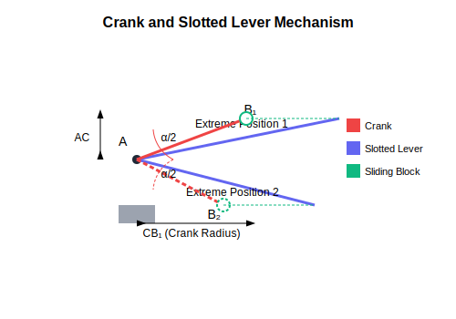
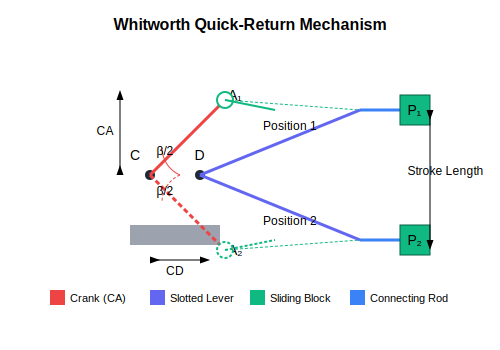

import PlanarMechanicsComments from '../../../../components/planar-mechanics/PlanarMechanicsComments.astro';
import TawkWidget from '../../../../components/TawkWidget.astro';
import UniversalContributors from '../../../../components/UniversalContributors.astro';
import Copyright from '../../../../components/Copyright.astro';
import BionicText from '../../../../components/BionicText.astro';
import TailwindWrapper from '../../../../components/TailwindWrapper.jsx';
import { Tabs, TabItem } from '@astrojs/starlight/components';
import { Card, CardGrid } from '@astrojs/starlight/components';

<UniversalContributors 
  contributors={frontmatter.contributors}
/>

import CrankSliderDemo from './components/demos/CrankSliderDemo'; 
import FourBarLinkageDemo from './components/demos/FourBarLinkageDemo';

## Learning Objectives

By the end of this lecture, you should be able to:

1. Understand the fundamental concepts of planar mechanics in the context of mechatronic systems
2. Analyze position and displacement in various planar mechanisms
3. Apply graphic and analytical methods to solve position analysis problems
4. Interpret the relationship between mechanism geometry and motion characteristics
5. Calculate time ratios for quick-return mechanisms used in machinery
6. Analyze four-bar linkages and slider-crank mechanisms in different configurations

:::tip[Key Concept]
Planar mechanics provides the foundation for designing and analyzing mechanisms found in robotic systems, manufacturing equipment, and other mechatronic applications where controlled motion is essential.
:::

## Introduction to Planar Mechanics

Planar mechanics studies the motion of objects that are constrained to move in a plane. In mechatronic systems, most mechanisms follow planar motion, making this study essential for designing and analyzing:

<CardGrid>
  <Card title="Robotic Manipulators">
    Understanding joint movements and workspace analysis in robotic arms.
  </Card>
  <Card title="Manufacturing Equipment">
    Analyzing mechanisms in CNC machines, conveyor systems, and automated assembly lines.
  </Card>
  <Card title="Consumer Electronics">
    Designing hinges, buttons, and other mechanical interfaces in electronic devices.
  </Card>
  <Card title="Biomedical Devices">
    Creating precise motion control for prosthetics, surgical robots, and diagnostic equipment.
  </Card>
</CardGrid>

### Key Concepts in Planar Mechanics

A **mechanism** is a mechanical device that transfers or transforms motion, force, or energy. Understanding planar mechanisms requires analyzing:

1. **Kinematics**: The study of motion without considering the forces that cause it
2. **Position Analysis**: Determining the location and orientation of each link in a mechanism
3. **Displacement Analysis**: Analyzing how elements move relative to one another
4. **Velocity Analysis**: Studying the speed and direction of motion 
5. **Acceleration Analysis**: Examining how velocity changes over time

This lecture focuses on position and displacement analysis, which form the foundation for more advanced kinematic studies.

## Terminology and Basic Concepts

Before diving into position analysis, let's establish the essential terminology used in mechanism analysis:

- **Link**: A rigid body that connects to other bodies in a mechanism
- **Joint**: A connection between two or more links that allows relative motion
- **Kinematic Pair**: Two links connected through a joint
- **Kinematic Chain**: A series of links connected by joints
- **Degree of Freedom (DOF)**: The number of independent parameters needed to define the configuration of a mechanism

:::note
In planar mechanisms, each rigid body has a maximum of 3 degrees of freedom: translation along the x and y axes, and rotation around the z axis.
:::

## Position and Displacement Analysis

Position analysis is the first step in understanding mechanism behavior. It addresses the question: "Where is each component of the mechanism at a given instant?"

### Graphical Method

The graphical method uses scaled drawings to determine the position of mechanism components. While traditional drafting has been largely replaced by CAD systems, the principles remain important for visualization and understanding.

Steps in graphical analysis:
1. Draw the mechanism to scale, showing known positions
2. Apply geometric constraints based on link lengths and joint types
3. Use geometric construction to determine unknown positions
4. Measure the resulting configuration to find required dimensions

### Analytical Method

The analytical method uses mathematical equations to solve for unknown positions. This approach:
- Provides precise results
- Can be implemented in software
- Allows for parametric analysis
- Forms the basis for computational mechanics

For planar mechanisms, we often use:
- Vector loop equations
- Trigonometric relationships
- Complex number representations

## Quick-Return Mechanisms: Position Analysis Applications

Quick-return mechanisms are widely used in manufacturing equipment where the working stroke should be slower (for precision) than the return stroke (for efficiency). Let's examine some common examples:

### Crank and Slotted Lever Mechanism

This mechanism converts rotary motion to reciprocating motion with different forward and return stroke times. It's commonly used in shapers, slotting machines, and other machine tools.

For a crank and slotted lever mechanism, the time ratio is a key performance parameter:

:::tip[Mathematical Derivation]
For a mechanism with:
- Center distance between fixed points = AC
- Crank radius = CB₁

The key angle α can be found using:
$$\sin(\alpha/2) = \frac{CB_1}{AC}$$

The time ratio is then calculated as:
$$\text{Time ratio} = \frac{\text{Time of cutting stroke}}{\text{Time of return stroke}} = \frac{360° - \alpha}{\alpha}$$
:::

### Whitworth Quick-Return Mechanism

The Whitworth mechanism is another common quick-return design used in machine tools. It uses a rotating crank to drive a slotted lever, creating reciprocating motion with unequal forward and return times.

In the Whitworth mechanism:

:::tip[Time Ratio Calculation]
For a mechanism with:
- Fixed center distance CD
- Crank length CA

The angle β can be found using:
$$\cos(\beta/2) = \frac{CD}{CA}$$

The time ratio is then:
$$\text{Time ratio} = \frac{\text{Time of cutting stroke}}{\text{Time of return stroke}} = \frac{360° - \beta}{\beta}$$
:::

## Four-Bar Linkage Position Analysis

The four-bar linkage is one of the most versatile and widely used mechanisms in mechatronic systems. It consists of four links connected by four revolute joints, with one link fixed to form the frame.

  <TailwindWrapper>
    <FourBarLinkageDemo client:load />
  </TailwindWrapper>

### Position Analysis Methods for Four-Bar Linkages

Position analysis of four-bar linkages can be approached through several methods:

<Tabs>
  <TabItem label="Vector Loop Method">
    This method uses vector equations to represent the closed loop formed by the four links:
    
    $$\vec{r}_1 + \vec{r}_2 - \vec{r}_4 - \vec{r}_3 = 0$$
    
    Where:
    - $\vec{r}_1$ represents the ground link
    - $\vec{r}_2$, $\vec{r}_3$, and $\vec{r}_4$ represent the other three links
    
    By expressing these vectors in terms of their lengths and angles, we can solve for unknown positions.
  </TabItem>
  <TabItem label="Complex Number Method">
    Each link can be represented as a complex number:
    
    $$r_i e^{j\theta_i}$$
    
    The loop closure equation becomes:
    
    $$r_1 e^{j\theta_1} + r_2 e^{j\theta_2} - r_4 e^{j\theta_4} - r_3 e^{j\theta_3} = 0$$
    
    This can be separated into real and imaginary parts to solve for unknown angles.
  </TabItem>
  <TabItem label="Analytical Geometry">
    Using the law of cosines and other geometric relationships to solve for unknown positions:
    
    $$r_4^2 = r_1^2 + r_3^2 - 2r_1r_3\cos(\theta_3 - \theta_1)$$
    
    This approach is particularly useful for position analysis of specific configurations.
  </TabItem>
</Tabs>

## Slider-Crank Mechanism Analysis

The slider-crank mechanism converts rotary motion to linear motion or vice versa. It's essential in engines, pumps, and linear actuators commonly used in mechatronic systems.

  <TailwindWrapper>
    <CrankSliderDemo client:load />
  </TailwindWrapper>

### Position Analysis of Slider-Crank Mechanisms

For a slider-crank mechanism with:
- Crank length = r
- Connecting rod length = l
- Crank angle = θ

The position of the slider (x) measured from the crank center is:

:::tip[Mathematical Relationship]
$$x = r\cos\theta + l\cos\phi$$

Where $\phi$ is the angle of the connecting rod, found using:

$$\sin\phi = \frac{r\sin\theta}{l}$$

Through trigonometric substitution, this can be simplified to:

$$x = r\cos\theta + l\sqrt{1-\left(\frac{r\sin\theta}{l}\right)^2}$$
:::

This equation is fundamental to designing precise linear motion systems in mechatronic applications.

## Example Problems

### Example 1: Crank and Slotted Lever Quick-Return Mechanism

<Card title="Crank and Slotted Lever Analysis" icon="open-book">

A crank and slotted lever mechanism used in a shaper has a center distance of 300 mm between the center of oscillation of the slotted lever and the center of rotation of the crank. The radius of the crank is 120 mm. Calculate the ratio of the time of cutting to the time of return stroke.

</Card>

Solution

Given:
- Center distance AC = 300 mm
- Crank radius CB₁ = 120 mm

Step 1: Find the angle α/2 using:
$$\sin(\alpha/2) = \frac{CB_1}{AC} = \frac{120}{300} = 0.4$$

Step 2: Calculate α/2:
$$\alpha/2 = \sin^{-1}(0.4) = 23.6°$$

Step 3: Find α:
$$\alpha = 2 \times 23.6° = 47.2°$$

Step 4: Calculate the time ratio:
$$\text{Time ratio} = \frac{\text{Time of cutting stroke}}{\text{Time of return stroke}} = \frac{360° - \alpha}{\alpha} = \frac{360° - 47.2°}{47.2°} = \frac{312.8°}{47.2°} = 6.63$$

Therefore, the cutting stroke takes 6.63 times longer than the return stroke, which makes this mechanism suitable for operations requiring a slow cutting action and a quick return.

### Example 2: Four-Bar Linkage Position Analysis

<Card title="Four-Bar Position Analysis" icon="open-book">

A four-bar linkage ABCD has the following dimensions:
- AB = 40 mm (input link)
- BC = 120 mm (coupler)
- CD = 100 mm (output link)
- AD = 150 mm (fixed link)

If the input link AB makes an angle of 60° with the horizontal (measured counterclockwise), determine the position of point C and the angle of the output link CD with respect to the horizontal.

</Card>

Solution

Given:
- AB = 40 mm
- BC = 120 mm
- CD = 100 mm
- AD = 150 mm
- Angle of AB = 60° with horizontal

We'll solve this using the vector loop method.

Step 1: Set up a coordinate system with A at the origin and D at (150, 0).

Step 2: Calculate the position of B:
$$B_x = AB \times \cos(60°) = 40 \times 0.5 = 20 \text{ mm}$$
$$B_y = AB \times \sin(60°) = 40 \times 0.866 = 34.64 \text{ mm}$$

Step 3: The position of C must satisfy two conditions:
- It must be 120 mm from B
- It must be 100 mm from D

This creates two circles with centers at B and D with radii 120 mm and 100 mm respectively. The intersection of these circles gives the position of C.

Using the analytical approach, we can solve for C using:
$$(C_x - B_x)^2 + (C_y - B_y)^2 = BC^2$$
$$(C_x - D_x)^2 + (C_y - D_y)^2 = CD^2$$

Substituting the known values and solving these equations:
$$(C_x - 20)^2 + (C_y - 34.64)^2 = 120^2$$
$$(C_x - 150)^2 + C_y^2 = 100^2$$

Solving these equations (through algebraic manipulation or numerically):
$$C_x = 123.8 \text{ mm}$$
$$C_y = 72.6 \text{ mm}$$

Step 4: Calculate the angle of CD with horizontal:
$$\theta_{CD} = \tan^{-1}\left(\frac{C_y - D_y}{C_x - D_x}\right) = \tan^{-1}\left(\frac{72.6 - 0}{123.8 - 150}\right) = \tan^{-1}\left(\frac{72.6}{-26.2}\right) = 110.1°$$

Therefore, point C is at position (123.8 mm, 72.6 mm) and the output link CD makes an angle of 110.1° with the horizontal.

### Example 3: Slider-Crank Position Analysis

<Card title="Slider-Crank Position Analysis" icon="open-book">

A slider-crank mechanism has a crank length of 50 mm and a connecting rod length of 200 mm. Calculate the position of the slider when the crank makes an angle of 45° with the horizontal. Also determine the mechanical advantage at this position.

</Card>

Solution

Given:
- Crank length r = 50 mm
- Connecting rod length l = 200 mm
- Crank angle θ = 45°

Step 1: Calculate the position of the slider:
$$x = r\cos\theta + l\sqrt{1-\left(\frac{r\sin\theta}{l}\right)^2}$$

$$x = 50\cos(45°) + 200\sqrt{1-\left(\frac{50\sin(45°)}{200}\right)^2}$$

$$x = 50 \times 0.7071 + 200\sqrt{1-\left(\frac{50 \times 0.7071}{200}\right)^2}$$

$$x = 35.36 + 200\sqrt{1-\left(\frac{35.36}{200}\right)^2}$$

$$x = 35.36 + 200\sqrt{1-0.0312}$$

$$x = 35.36 + 200\sqrt{0.9688}$$

$$x = 35.36 + 200 \times 0.9843$$

$$x = 35.36 + 196.86 = 232.22 \text{ mm}$$

Step 2: Calculate the angle of the connecting rod (φ):
$$\sin\phi = \frac{r\sin\theta}{l} = \frac{50\sin(45°)}{200} = \frac{35.36}{200} = 0.1768$$

$$\phi = \sin^{-1}(0.1768) = 10.18°$$

Step 3: Calculate the mechanical advantage (MA):
$$MA = \frac{F_{output}}{F_{input}} = \frac{\cos\phi}{\sin\theta \times \frac{l}{r}}$$

$$MA = \frac{\cos(10.18°)}{\sin(45°) \times \frac{200}{50}}$$

$$MA = \frac{0.9842}{0.7071 \times 4} = \frac{0.9842}{2.8284} = 0.348$$

Therefore, the slider position is 232.22 mm from the crank center, and the mechanical advantage at this position is 0.348.

## Assignment Problem: Whitworth Quick-Return Mechanism

<Card title="Whitworth Mechanism Design" icon="pencil">

A Whitworth quick-return mechanism is to be designed for a shaping machine with the following requirements:
- The ratio of cutting time to return time should be approximately 2:1
- The length of the stroke should be 300 mm
- The fixed link length is 400 mm

Determine:
1. The required length of the crank
2. The angle β (as defined in the lecture)
3. The exact time ratio achieved with your design
4. The required length of the slotted lever to achieve the stroke length

Provide a sketch of your design with all dimensions clearly labeled.

</Card>

Hint

1. Start by determining angle β from the required time ratio using:
   $$\text{Time ratio} = \frac{360° - \beta}{\beta}$$

2. With β known, find the crank length using:
   $$\cos(\beta/2) = \frac{\text{fixed link length}}{\text{crank length}}$$

3. For the stroke length, remember that it depends on the length of the slotted lever and the angle through which it oscillates.

## Key Takeaways for Mechatronic Design

<Card title="Key Takeaways" icon="star">

- **Position analysis** forms the foundation for understanding mechanism behavior in mechatronic systems
- **Quick-return mechanisms** provide different speeds for working and return strokes, essential for many manufacturing processes
- **Four-bar linkages** offer versatility for creating complex motion paths with simple components
- **Slider-crank mechanisms** efficiently convert between rotary and linear motion in numerous applications
- **Mathematical models** allow precise prediction of mechanism behavior, enabling optimization before physical prototyping
- **Graphical and analytical methods** complement each other and provide different insights into mechanism performance

</Card>

## Further Reading

- "Theory of Machines and Mechanisms" by Uicker, Pennock, and Shigley, Chapter 2-3
- "Mechanics of Machinery" by Ramamurti, Chapter 1-2
- "Kinematics, Dynamics, and Design of Machinery" by Waldron and Kinzel, Chapter 4
- "Planar Mechanical Design: A Computational Approach" by Erdman and Sandor

## Next Lecture

In the next lecture, we will explore velocity analysis in planar mechanisms, building on the position analysis concepts covered today. We will examine techniques like the instantaneous center method and relative velocity method, which are essential for understanding how mechanism components move in relation to each other.

<PlanarMechanicsComments />
<TawkWidget />
<Copyright />