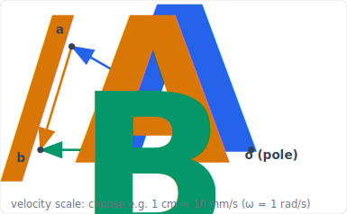
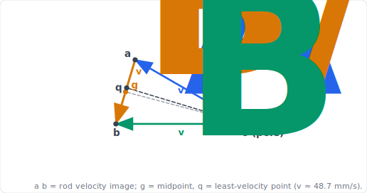
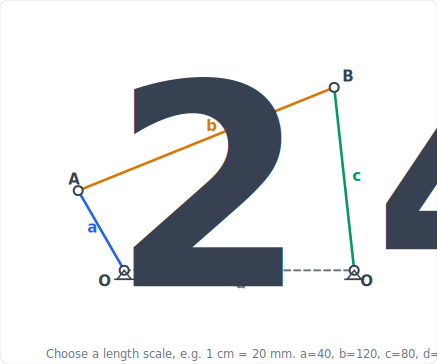
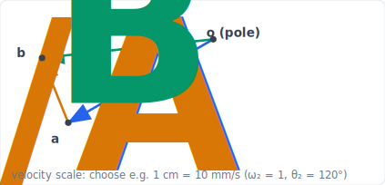
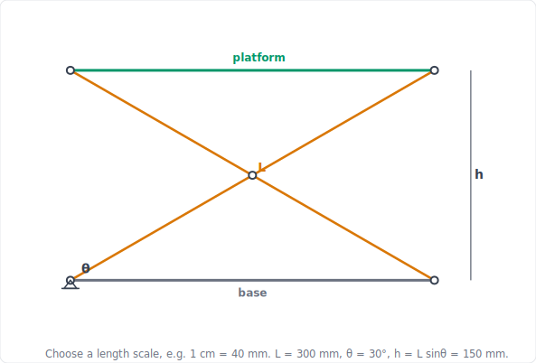
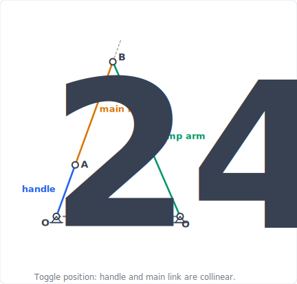
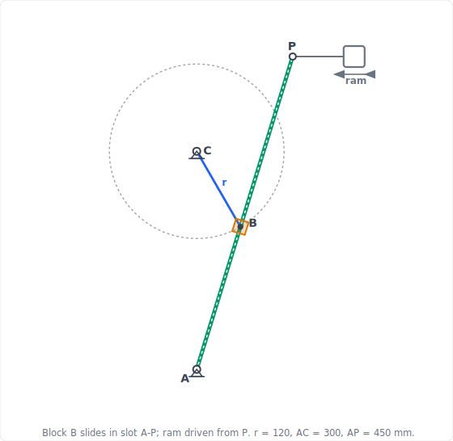

import PlanarMechanicsComments from '../../../../components/planar-mechanics/PlanarMechanicsComments.astro';
import TawkWidget from '../../../../components/TawkWidget.astro';
import UniversalContentContributors from '../../../../components/UniversalContentContributors.astro';
import InArticleAd from '../../../../components/InArticleAd.astro';
import Copyright from '../../../../components/Copyright.astro';
import BionicText from '../../../../components/BionicText.astro';
import TailwindWrapper from '../../../../components/TailwindWrapper.jsx';
import { Tabs, TabItem } from '@astrojs/starlight/components';
import { Card, CardGrid, Badge, Steps, LinkButton, FileTree } from '@astrojs/starlight/components';

<UniversalContentContributors 
  contributors={frontmatter.contributors}
/>


Position analysis found where every link sits for a given input angle. Velocity analysis answers the next question: how fast is each link moving at that instant? The answer comes almost for free, because velocity is the time derivative of position, and you already have the position equations. Differentiate the vector loop from the position analysis and you get a set of linear equations for the velocities. Velocity matters because it sets the kinetic energy of every part, the flow rate of a pump, and the bearing loads, and because a smooth-looking mechanism can still have a sharp velocity peak that drives vibration. In this lesson you draw the velocity polygon, differentiate the loop to confirm it, and read the velocity ratio that becomes mechanical advantage. You also meet the instantaneous center, a neat velocity shortcut, and see why the course builds on the polygon rather than on it. #VelocityAnalysis #VelocityPolygon #MechanicalAdvantage

## Learning Objectives

By the end of this lesson, you will be able to:

1. **Construct** the velocity polygon with the drawing set and measure the link velocities from it
2. **Differentiate** the vector loop to obtain the velocity equations, and solve for piston and angular velocities in closed form
3. **Read** the velocity ratio as mechanical advantage and verify every result in a simulator
4. **Recognise** the instantaneous center as a velocity shortcut, and know why the course builds on the polygon instead

## Real-World System Problem: Piston Velocity in Engines and Compressors

<InArticleAd />


The engine in a car, the compressor in an air conditioner, and the pump in a hydraulic system are all crank-sliders. Each converts steady rotation into a back-and-forth piston motion, and the velocity of that piston is never constant through the stroke. It starts at zero, rises to a peak somewhere past mid-stroke, and falls back to zero, and exactly where the peak lands decides the bearing loads, the lubrication demand, and the vibration the machine produces.

### The Velocity Problem

> **Engineering Question:** Given the input link's angular velocity, how fast is every other point and link moving at this instant?

For the crank-slider the key output is the piston velocity. For the four-bar it is the angular velocities of the coupler and follower. For the scissor lift it is the platform velocity. All of them come from one operation: differentiating the position loop with respect to time.

### Why Velocity Analysis Matters

<CardGrid>
  <Card title="Bearing and lubrication loads" icon="warning">
  Peak sliding speed sets the oil-film demand and the friction power lost at every joint.
  </Card>
  <Card title="Flow and delivery" icon="puzzle">
  In a pump or compressor the piston velocity is the volumetric flow rate, so its profile is the delivery curve.
  </Card>
  <Card title="Vibration" icon="setting">
  A sharp velocity peak means a large acceleration nearby ([acceleration analysis](/education/planar-mechanics/acceleration-analysis-dynamic-forces)), and that is what shakes the machine.
  </Card>
  <Card title="Mechanical advantage" icon="rocket">
  The ratio of input speed to output speed is the velocity ratio, and it is the reciprocal of the force ratio ([force analysis](/education/planar-mechanics/force-analysis-mechanism-synthesis)).
  </Card>
</CardGrid>

## Fundamental Theory: Velocity by Differentiating the Loop

<InArticleAd />


### Two Conventions to Fix Before Any Numbers

<Card title="Signs: counterclockwise is positive" icon="document">
The convention set in the [position analysis](/education/planar-mechanics/position-analysis-planar-linkages) carries straight through: **angles and angular velocities are positive counterclockwise**. It is repeated here because velocity is the first place negative answers become common, and a sign is a physical statement, not bookkeeping.

- $\omega_3 = -0.174$ rad/s means the coupler turns **clockwise** while the crank turns counterclockwise.
- A negative piston velocity $V_P$ means the piston moves **toward** the crankshaft, that is, in the $-x$ direction.

Read every sign out loud as a direction before moving on. When a later result surprises you, the sign is usually where the story starts.
</Card>

<Card title="Normalisation: why results are quoted as v/(rω)" icon="document">
Velocities in this lesson are often reported **normalised**, as $v/(r\omega)$ rather than in mm/s. Dividing by $r\omega$, the crank pin's own speed, produces a **dimensionless** number that answers the question "how fast is this point moving compared with the crank pin?"

$$\frac{v}{r\omega} = 1.055 \quad\text{means}\quad v = 1.055 \times r\omega$$

The payoff is that the normalised result depends **only on the geometry ratio $l/r$**, not on the crank radius or the running speed. One table then covers every engine with that proportion, at every speed. To recover a real velocity, multiply back by $r\omega$: with $r = 50$ mm and $\omega = 100$ rad/s, $1.055$ becomes $1.055 \times 50 \times 100 = 5275$ mm/s $= 5.3$ m/s.

:::caution[Do not attach units to a normalised value]
A quoted $-1.055$ is **not** $-1.055$ mm/s. It is a pure ratio. Reporting a normalised figure as though it were a velocity is one of the most common errors in this topic, and the fix is simply to state the normalisation whenever you quote one. The same convention applies to accelerations, normalised by $r\omega^2$.
:::
</Card>

### Differentiate the Position Loop

<Card title="From Position to Velocity" icon="document">
The position loop is a statement that the link vectors close. Differentiating it with respect to time gives a statement that their velocities are consistent. For the four-bar position loop:

**Position loop (x, y):**
$$a\cos\theta_2 + b\cos\theta_3 - c\cos\theta_4 - d = 0$$
$$a\sin\theta_2 + b\sin\theta_3 - c\sin\theta_4 = 0$$

**Differentiate** (the ground $d$ is constant, $\omega_i = \dot\theta_i$):
$$-a\omega_2\sin\theta_2 - b\omega_3\sin\theta_3 + c\omega_4\sin\theta_4 = 0$$
$$a\omega_2\cos\theta_2 + b\omega_3\cos\theta_3 - c\omega_4\cos\theta_4 = 0$$

These are two **linear** equations in the unknown angular velocities $\omega_3$ and $\omega_4$. The positions from the position analysis are the known coefficients.
</Card>

This is the central idea of the lesson. Position analysis was nonlinear and needed the Freudenstein trick to solve. Velocity analysis is linear, because differentiation turns the trigonometric position terms into coefficients that multiply the unknown velocities. Once you have the positions, finding the velocities is just solving two linear equations, and the same step repeated in the [acceleration analysis](/education/planar-mechanics/acceleration-analysis-dynamic-forces) gives the accelerations.

### Ways to Get the Velocity

Velocity uses the same [methods](/education/planar-mechanics/position-analysis-planar-linkages#methods-of-kinematic-analysis) as position, in the same **draw, solve, simulate** rhythm: the graphical velocity polygon is the core hand method, the analytical velocity loop is its exact confirmation, and each Application ends by reading the answer off the simulator.

<Tabs>
  <TabItem label="Graphical (velocity polygon)">

  Build the **velocity polygon** with the drawing set. Draw each velocity vector to scale, head to tail, using the key rule that the velocity of one point *relative to another point on the same rigid link is perpendicular to the line joining them*. Where the construction lines cross closes the polygon, and you **measure** the unknown velocities off it with the scale rule. This is the core hand method, worked in every Application below, and the same construction becomes the acceleration polygon in the [next lesson](/education/planar-mechanics/acceleration-analysis-dynamic-forces).

  </TabItem>
  <TabItem label="Analytical (velocity loop)">

  **Differentiate** the position loop and solve the resulting linear equations. Exact, fast, and easy to program; it is the method behind our simulators and the closed-form confirmation in each Application.

  </TabItem>
  <TabItem label="Instantaneous centers (worth knowing)">

  Every moving link has, at each instant, a point about which it appears to purely rotate: its **instantaneous center** (IC). Locate it and every point on the link has speed $v = \omega \times (\text{distance to the IC})$, which gives a velocity ratio in one step. It is worth knowing and makes a quick geometric check, but the course does not build on it, for the reason in the note below.

  </TabItem>
</Tabs>

:::note[Reading the notation, and the two direction rules]
The symbol $\vec V_{B/A}$ is read "**the velocity of $B$ relative to $A$**" (equivalently, "of $B$ **with respect to** $A$"): how fast $B$ appears to move when you sit on $A$ and watch. The full velocity of $B$ is then the velocity of $A$ plus this relative part:

$$\vec V_B = \vec V_A + \vec V_{B/A}$$

Two direction rules settle every velocity polygon, and you should commit them to memory:

- **Turning link.** If $A$ and $B$ are two points on the same rigid link, $\vec V_{B/A}$ is **perpendicular** to the line $AB$, with magnitude $\omega \times AB$. (A rigid link cannot stretch, so $B$ can only swing around $A$.)
- **Sliding pair.** Where one part slides along another (a piston on its centre-line, a block in a slotted lever), the sliding part of the velocity is **parallel** to the slide.

When a point **both slides along a link and that link turns** (a block in a rotating slot, as in the quick-return shaper), the *acceleration* picks up an extra **Coriolis** term that has no velocity counterpart; it is defined and used in the [acceleration analysis](/education/planar-mechanics/acceleration-analysis-dynamic-forces).
:::

:::note[Instantaneous centers: a shortcut we note, not a road we build on]
The instantaneous center gives **velocities only**. It has no counterpart for acceleration, so it cannot carry a problem through the full position, then velocity, then acceleration chain that this course follows. The velocity polygon can: it is the same drawing discipline that becomes the [acceleration polygon](/education/planar-mechanics/acceleration-analysis-dynamic-forces) in Lesson 4, so the effort you spend learning it pays off twice. Locating every center by **Kennedy's theorem** (for any three links in plane motion, their three instantaneous centers are collinear) also grows quickly with size, since a mechanism of $n$ links has $\tfrac{n(n-1)}{2}$ centers, while the polygon and the loop stay the same size on any linkage. So we treat the instantaneous center as a fact worth knowing and a one-step check on a velocity ratio, and we build the course on the polygon, the loop, and the simulator.
:::

### Velocity Ratio and Mechanical Advantage

<Card title="Velocity Ratio" icon="document">
The **velocity ratio** of a mechanism is the output speed divided by the input speed. For a four-bar it is $\omega_4/\omega_2$.

By conservation of power (input power equals output power in an ideal mechanism), the force or torque ratio is the **reciprocal** of the velocity ratio:

$$\frac{T_\text{out}}{T_\text{in}} = \frac{\omega_\text{in}}{\omega_\text{out}}$$

This quantity is the **mechanical advantage**. It is defined here from velocities and used again in the [force analysis](/education/planar-mechanics/force-analysis-mechanism-synthesis) from forces; the two views are the same number seen from opposite sides. When the output slows to a near stop (a limit position), the velocity ratio approaches zero and the mechanical advantage grows very large.
</Card>

## Application 1: Piston Velocity of the Slider-Crank

<InArticleAd />


This is the central worked example. We differentiate the slider position from the [position analysis](/education/planar-mechanics/position-analysis-planar-linkages) and find where the piston velocity actually peaks, which is not where intuition first suggests.

<Card title="Simulator and hands-on lab" icon="rocket">
<div style={{ display: 'flex', justifyContent: 'center', width: '100%', margin: '0.25rem 0 1rem' }}>
  <LinkButton href="/product-development/crank-slider-mechanism-simulator/" target="_blank" variant="primary" icon="rocket" iconPlacement="start">Open the Crank-Slider Simulator</LinkButton>
</div>

**Hands-on lab:** Continue in the [Crank-Slider Experiments](/education/mechanism-design-simulation/crank-slider-experiments/) lab ([siwit.co/CSM](https://siwit.co/CSM)). Experiment 1 plots this velocity profile; Experiment 2 explores how an offset turns it into a quick-return.
</Card>

:::note[System Problem Statement]
- **Configuration:** In-line slider-crank (engine or compressor), offset $e = 0$
- **Task:** Find the piston velocity over a full crank rotation and locate its peak
- **Geometry:** crank $r = 50$ mm, connecting rod $l = 150$ mm ($l/r = 3$)
- **Input:** constant crank speed $\omega$

**Key Question:** At what crank angle is the piston moving fastest, and how large is that peak compared with $r\omega$?
:::

### Step 1: Draw the Space Diagram

Choose and mark a length scale before you start (for a page, 1 cm = 20 mm works well); the scale is yours to pick, but always state it on the drawing. Then construct the space diagram with a set square and compass at the instant you want, here the crank at $\theta = 60\degree$.

<details>
<summary>**Click to reveal the space-diagram construction**</summary>

<Steps>

1. **Centre-line and pivot.** Draw the cylinder centre-line horizontally and mark the crank pivot $O$ on it. ✅

2. **Set the crank.** From $O$, draw $OA$ at $\theta = 60\degree$ above the centre-line, length $r = 50$ mm to scale. Point $A$ is the crank pin. ✅

3. **Swing the rod.** With centre $A$ and radius $l = 150$ mm, strike an arc cutting the centre-line at $B$. The line $AB$ is the connecting rod and $B$ is the piston. ✅

4. **Measure.** The piston sits $s \approx 169$ mm from $O$, matching the position solution. Your drawing should match the figure below. ✅

</Steps>

<div style={{ display: 'flex', justifyContent: 'center', width: '100%', margin: '1.25rem 0' }}>
  <TailwindWrapper>
	
  </TailwindWrapper>
</div>

</details>

### Step 2: Construct the Velocity Polygon

The velocity polygon solves $\vec V_B = \vec V_A + \vec V_{B/A}$ graphically: draw the three velocity vectors head to tail to a chosen scale and read the answer off the figure.

<details>
<summary>**Click to reveal the velocity-polygon construction**</summary>

<Steps>

1. **Crank-pin velocity.** Pick a pole $o$ and a velocity scale. Draw $o\,a$ **perpendicular to the crank** $OA$, with length $v_A = r\omega$. Taking $\omega = 1$ rad/s gives $v_A = 50$ mm/s. ✅

2. **Direction of the piston velocity.** The piston slides along the centre-line, so $v_B$ is **horizontal**. Draw a construction line through the pole $o$ parallel to the slide. ✅

3. **Direction of the relative velocity.** $v_{B/A}$ is **perpendicular to the connecting rod** $AB$. From $a$, draw a line perpendicular to $AB$. ✅

4. **Close the polygon.** Where the two construction lines cross is point $b$. Then $o\,b = v_B$ is the piston velocity and $a\,b = v_{B/A}$ is the relative velocity. ✅

5. **Measure.** $|o\,b| \approx 50.8$ mm/s, so $V_P \approx 1.02\,r\omega$ at $\theta = 60\degree$. This matches the analytical value in Step 3 within drawing tolerance. ✅

</Steps>

<div style={{ display: 'flex', justifyContent: 'center', width: '100%', margin: '1.25rem 0' }}>
  <TailwindWrapper>
	
  </TailwindWrapper>
</div>

</details>

### Step 3: Confirm by Differentiation

<details>
<summary>**Click to reveal the closed-form piston velocity**</summary>

<Steps>

1. **Differentiate the slider position** ($e = 0$) with $\dot\theta = \omega$ and $\sqrt{l^2 - r^2\sin^2\theta} = l\cos\phi$. This is the **exact** result, with no approximation anywhere in it:

   $$s = r\cos\theta + \sqrt{l^2 - r^2\sin^2\theta} \;\Rightarrow\; V_P = -r\omega\left(\sin\theta + \frac{r\sin\theta\cos\theta}{l\cos\phi}\right)$$ ✅

2. **Write it as harmonics**, the **approximate** form, obtained by setting $\cos\phi \approx 1$: the primary plus secondary terms

   $$V_P \approx -r\omega\left(\sin\theta + \frac{r}{2l}\sin 2\theta\right)$$

   The secondary (twice-per-revolution) term from the connecting rod is what engine balancing must handle. ✅

3. **Know which one you are using, and say so.** The two disagree slightly. At $\theta = 60\degree$ with $l/r = 3$:

   | Form | $V_P/(r\omega)$ |
   |---|:---:|
   | Exact | $-1.017$ |
   | Harmonic (approximate) | $-1.010$ |

   About $0.6\%$ apart, and the gap grows as the rod gets shorter (small $l/r$). The tables in this lesson use the **exact** form throughout, so a value differing from yours in the third digit usually means you used the harmonic one, not that you made an error. The harmonic form is the right tool for balancing work, where separating the once- and twice-per-revolution terms is the whole point; the exact form is the right tool for a numerical answer. State which you used. ✅

4. **Tabulate** $V_P/(r\omega)$, from the exact form, for $l/r = 3$:

   | Crank $\theta$ | $V_P/(r\omega)$ |
   |:---:|:---:|
   | 0\degree | 0.000 |
   | 30\degree | -0.646 |
   | 60\degree | -1.017 |
   | 73\degree | **-1.055** (peak) |
   | 90\degree | -1.000 |
   | 120\degree | -0.715 |
   | 180\degree | 0.000 |

   At $\theta = 60\degree$ the formula gives $V_P = -1.017\,r\omega$, confirming the $50.8$ mm/s measured from the polygon. ✅

4. **The peak** is about $1.055\,r\omega$ near $\theta = 73\degree$, **not** at $90\degree$: the secondary harmonic shifts it earlier in the stroke. The drawing gives one instant; the calculus gives the whole curve and the true maximum. ✅

</Steps>

</details>

### Step 4: Connecting-Rod Angular Velocity

<details>
<summary>**Click to reveal the rod angular velocity**</summary>

<Steps>

1. **Rod angular velocity** from differentiating $\phi = \arcsin((r/l)\sin\theta)$. Differentiating the vertical closure $r\sin\theta = l\sin\phi$ gives the rate of the rod's *inclination*:

   $$\dot\phi = \frac{r\omega\cos\theta}{l\cos\phi}$$

   The rod's angular velocity in the counterclockwise-positive convention carries the opposite sign, because the rod leans to the other side of the centre-line from the crank ($\theta_3 = -\phi$):

   $$\omega_3 = -\frac{r\omega\cos\theta}{l\cos\phi}$$ ✅

2. **Evaluate at the working instant** $\theta = 60\degree$, with $r = 50$ mm, $l = 150$ mm, $\omega = 1$ rad/s:

   $$\phi = \arcsin\!\left(\tfrac{50}{150}\sin 60\degree\right) = 16.78\degree, \qquad \cos\phi = 0.9574$$

   $$\omega_3 = -\frac{50(1)(0.5)}{150(0.9574)} = -0.174 \text{ rad/s}$$ ✅

   **What the negative sign means physically:** the crank turns counterclockwise while the rod swings clockwise. The sign is not a slip, it is the answer to "which way", and it is what makes the crank-pin rubbing velocity in Step 5 an *addition* rather than a subtraction. Carry it. ✅

3. **Check the extremes.** At $\theta = 0\degree$: $|\omega_3| = (r/l)\omega = 0.333\,\omega$, the rod rotating fastest. At $\theta = 90\degree$: $\omega_3 = 0$, the rod momentarily not rotating, only translating. ✅

4. **A one-step check.** The rod's instantaneous center is where the crank line and the vertical through the piston cross, the same intersection that fixed $b$ in the polygon; dividing $v_A$ by the distance from that center to $A$ reproduces the same $\omega_3$. It is a quick confirmation, not the working method. ✅

</Steps>

</details>

### Step 5: Points on the Rod, and Rubbing Velocities at the Pins

In an engine the connecting rod is a real body with mass, and every pin rubs. Two questions follow from the same polygon you already drew: how fast does a chosen point on the rod move (its inertia needs this), and how fast do the pin surfaces rub? The rubbing speed is worth knowing because it sets the **friction heat, the oil-film thickness, and the wear life** at each bearing: the faster a journal rubs, the more power it dissipates and the harder its lubrication has to work, so the crank pin and main bearing are sized and oiled for their rubbing speeds, not the engine's output speed.

<details>
<summary>**Click to reveal the velocity image and rubbing velocities**</summary>

<Steps>

1. **The rod's velocity image.** Every point of the rigid rod $AB$ maps to a point on the line $a\,b$ of the polygon, in the same proportion: a point one-third along $AB$ from $A$ sits one-third along $a\,b$ from $a$. The line $a\,b$ is the **velocity image** of the rod, and reading any point's velocity is just measuring from the pole $o$ to its image. ✅

2. **Velocity of the rod's mid-point $G$.** The mass centre sits at the middle of $AB$, so its image $g$ is the middle of $a\,b$. Measuring $o\,g$ gives $v_G \approx 48.7$ mm/s, the velocity the rod's inertia force will use in the [acceleration analysis](/education/planar-mechanics/acceleration-analysis-dynamic-forces). ✅

3. **The least-velocity point.** The slowest point on the rod is the one whose image is the foot of the **perpendicular** from the pole $o$ onto the line $a\,b$ (point $q$). Here it lands about $66$ mm from $A$, close to the mid-point, with $v_\text{min} \approx 48.7$ mm/s. At this instant the rod's points hardly differ in speed, from $48.7$ mm/s near the middle to about $50.8$ mm/s at the piston. ✅

4. **Rubbing velocity at a pin.** At a pin joint the two links turn at different rates, so the journal surface rubs at the *relative* angular velocity times the pin radius:

   $$v_\text{rub} = r_p\,\lvert\omega_i - \omega_j\rvert$$

   **Use signed angular velocities inside the bars, then take the modulus.** This one rule handles both cases automatically and is the only reliable way to get it right: if the two links turn in opposite senses the difference of the signed values *adds* their magnitudes, and if they turn the same way it *subtracts* them. Guessing add-or-subtract from a sketch is where marks are lost.

   With $\omega_2 = +1$ rad/s (crank, counterclockwise), $\omega_3 = -0.174$ rad/s (rod, clockwise, from Step 4), $\omega_\text{frame} = 0$ and $\omega_\text{piston} = 0$ (the piston translates, it does not rotate):

   | Pin | Links joined | $\lvert\omega_i - \omega_j\rvert$ (rad/s) | $r_p$ (mm) | $v_\text{rub}$ (mm/s) |
   |---|---|:---:|:---:|:---:|
   | Main bearing $O$ | crank, frame | $\lvert +1 - 0\rvert = 1.000$ | 25 | 25.0 |
   | Crank pin $A$ | crank, rod | $\lvert +1 - (-0.174)\rvert = 1.174$ | 20 | 23.5 |
   | Gudgeon pin $B$ | rod, piston | $\lvert -0.174 - 0\rvert = 0.174$ | 15 | 2.6 |

   The crank pin has the highest relative rate because crank and rod turn in **opposite** senses, so the subtraction of a negative adds their magnitudes; the gudgeon pin rubs slowest because only the rod's small $\omega_3$ acts against a non-rotating piston. Note that the crank pin does not rub fastest here despite its highest relative rate, because the main bearing's larger radius wins: **radius and relative speed both matter**. Multiplying each rubbing velocity by the friction force at that pin gives the power lost there. ✅

</Steps>

<div style={{ display: 'flex', justifyContent: 'center', width: '100%', margin: '1.25rem 0' }}>
  <TailwindWrapper>
	
  </TailwindWrapper>
</div>

</details>

### Step 6: Verify in the Simulator

<details>
<summary>**Click to reveal the simulator check**</summary>

<Steps>

1. **Open the simulator** ([siwit.co/CSM](https://siwit.co/CSM)), set $r = 50$, $l = 150$, $e = 0$, and run it. ✅

2. **Read the velocity chart.** The reported maximum piston velocity divided by $r\omega$ is about $1.05$, with the peak before mid-stroke, matching the table. The mean of $|V_P|/(r\omega)$ over a cycle is $2/\pi \approx 0.637$. ✅

3. **Add an offset.** Set $e \ne 0$ and the forward and return peaks become unequal (the quick-return of Experiment 2). Mobility stays one; only the velocity profile changes. ✅

</Steps>

</details>

:::note[Engineering Insight]
The piston velocity is the primary sine plus a secondary harmonic from the connecting rod, and that secondary term shifts the true peak earlier than mid-stroke. A longer rod (larger $l/r$) shrinks the secondary term and pushes the peak toward $90°$, which is why long-rod engines run smoother. This is the velocity groundwork for the inertia-force and balancing analysis that follows.
:::

## Application 2: Angular Velocities of the Four-Bar

<InArticleAd />


For the four-bar we draw the velocity polygon to read the coupler and follower angular velocities, then confirm with the velocity loop and read the velocity ratio that becomes mechanical advantage.

<Card title="Simulator and hands-on lab" icon="rocket">
<div style={{ display: 'flex', justifyContent: 'center', width: '100%', margin: '0.25rem 0 1rem' }}>
  <LinkButton href="/product-development/four-bar-linkage-simulator/" target="_blank" variant="primary" icon="rocket" iconPlacement="start">Open the Four-Bar Linkage Simulator</LinkButton>
</div>

**Hands-on lab:** Continue in the [Four-Bar Linkage Experiments](/education/mechanism-design-simulation/four-bar-linkage-experiments/) lab ([siwit.co/FBL](https://siwit.co/FBL)). The angular-velocity charts there plot $\omega_3$ and $\omega_4$ against crank angle.
</Card>

:::note[System Problem Statement]
- **Configuration:** Crank-rocker four-bar (the standard four-bar geometry)
- **Task:** Find $\omega_3$ and $\omega_4$, and the velocity ratio, at a chosen instant
- **Link lengths:** $a = 40$, $b = 120$, $c = 80$, $d = 100$ mm
- **Input:** $\theta_2 = 120\degree$ (a well-conditioned instant for the polygon), with positions $\theta_3 = 22.0\degree$, $\theta_4 = 96.3\degree$ from the position analysis
:::

### Step 1: Draw the Space Diagram

Construct the four-bar to scale at $\theta_2 = 120\degree$ using the same arc-intersection method you used for position analysis.

<details>
<summary>**Click to reveal the space-diagram construction**</summary>

<Steps>

1. **Ground and crank.** Draw the ground $O_2O_4 = d = 100$ mm horizontally. From $O_2$, draw the crank $O_2A$ at $\theta_2 = 120\degree$, length $a = 40$ mm. ✅

2. **Intersect the arcs.** With centre $A$ and radius $b = 120$ mm, and centre $O_4$ and radius $c = 80$ mm, strike two arcs. Their intersection is the coupler-follower joint $B$ (the upper intersection is the open assembly). ✅

3. **Measure.** The coupler sits at $\theta_3 \approx 22\degree$ and the follower at $\theta_4 \approx 96\degree$, matching the position solution. ✅

</Steps>

<div style={{ display: 'flex', justifyContent: 'center', width: '100%', margin: '1.25rem 0' }}>
  <TailwindWrapper>
	
  </TailwindWrapper>
</div>

</details>

### Step 2: Construct the Velocity Polygon

<details>
<summary>**Click to reveal the velocity-polygon construction**</summary>

<Steps>

1. **Crank-pin velocity.** Pick a pole $o$ and a velocity scale. Draw $o\,a$ **perpendicular to the crank** $O_2A$, length $v_A = a\omega_2$. With $\omega_2 = 1$ rad/s, $v_A = 40$ mm/s. ✅

2. **Direction of the follower velocity.** Point $B$ moves perpendicular to the follower $O_4B$. Draw a construction line through the pole $o$ perpendicular to the follower. ✅

3. **Direction of the relative velocity.** $v_{B/A}$ is perpendicular to the coupler $AB$. From $a$, draw a line perpendicular to the coupler. ✅

4. **Close the polygon.** The two construction lines cross at $b$. Then $o\,b = v_B$ is the velocity of $B$ on the follower and $a\,b = v_{B/A}$ is the relative velocity. ✅

5. **Measure and convert.** $|o\,b| \approx 41$ mm/s and $|a\,b| \approx 17$ mm/s, so

   $$\omega_4 = \frac{v_B}{c} = \frac{41}{80} \approx 0.51 \text{ rad/s}, \qquad \omega_3 = \frac{v_{B/A}}{b} = \frac{17}{120} \approx 0.14 \text{ rad/s}$$ ✅

</Steps>

<div style={{ display: 'flex', justifyContent: 'center', width: '100%', margin: '1.25rem 0' }}>
  <TailwindWrapper>
	
  </TailwindWrapper>
</div>

</details>

### Step 3: Confirm by the Velocity Loop

<details>
<summary>**Click to reveal the closed-form angular velocities**</summary>

<Steps>

1. **Differentiating the position loop** gives two linear equations whose Cramer's-rule solution is:

   $$\omega_3 = \frac{a\,\omega_2\sin(\theta_4 - \theta_2)}{b\,\sin(\theta_3 - \theta_4)}, \qquad \omega_4 = \frac{a\,\omega_2\sin(\theta_2 - \theta_3)}{c\,\sin(\theta_4 - \theta_3)}$$ ✅

2. **At $\theta_2 = 120\degree$** ($\theta_3 = 22.0\degree$, $\theta_4 = 96.3\degree$, $\omega_2 = 1$):

   $$\frac{\omega_3}{\omega_2} = +0.139, \qquad \frac{\omega_4}{\omega_2} = +0.514$$ ✅

   These confirm the $0.14$ and $0.51$ measured from the polygon.

3. **Full profile** across the crank rotation:

   | Crank $\theta_2$ | $\omega_3/\omega_2$ | $\omega_4/\omega_2$ |
   |:---:|:---:|:---:|
   | 30\degree | -0.262 | +0.122 |
   | 60\degree | -0.040 | +0.457 |
   | 90\degree | +0.064 | +0.539 |
   | 120\degree | +0.139 | +0.514 |

   At $\theta_2 = 60\degree$ (the instant used for position analysis) the coupler is almost in pure translation, $\omega_3 \approx 0$, so its velocity triangle is very thin. That is why we drew the polygon at $120\degree$ instead. ✅

</Steps>

</details>

### Step 4: Velocity Ratio and Mechanical Advantage

<details>
<summary>**Click to reveal the mechanical advantage**</summary>

<Steps>

1. **Velocity ratio** at $\theta_2 = 120\degree$: the follower turns at $\omega_4/\omega_2 = 0.514$ of the crank. ✅

2. **Mechanical advantage** is the reciprocal:

   $$\text{MA} = \frac{\omega_2}{\omega_4} = \frac{1}{0.514} = 1.95$$ ✅

   An ideal crank torque appears amplified about twice at the follower here. The value changes through the cycle and grows large near the limit positions, which the [force analysis](/education/planar-mechanics/force-analysis-mechanism-synthesis) uses.

</Steps>

</details>

:::note[Engineering Insight]
The velocity polygon and the velocity loop give the same $\omega_3$ and $\omega_4$ by two independent routes: the drawing shows at a glance how the coupler and follower velocities relate, and the loop gives precision and the full profile across the cycle. For a one-step sanity check you can also place the input-output instantaneous center where the coupler line $AB$ extended meets the ground line and read $\omega_4/\omega_2$ from the distance ratio, but the polygon and the loop are the working methods. The instant you pick matters for the drawing: at $\theta_2 = 60\degree$ the coupler barely rotates and the polygon collapses to a sliver, so $120\degree$ is the clearer instant to construct.
:::

## Application 3: Platform Velocity of the Scissor Lift

<InArticleAd />


The scissor-lift height was a one-line expression in the position analysis, so its velocity is one differentiation away.

<Card title="Simulator and hands-on lab" icon="rocket">
<div style={{ display: 'flex', justifyContent: 'center', width: '100%', margin: '0.25rem 0 1rem' }}>
  <LinkButton href="/product-development/scissor-lift-mechanism-simulator/" target="_blank" variant="primary" icon="rocket" iconPlacement="start">Open the Scissor Lift Simulator</LinkButton>
</div>

**Hands-on lab:** Continue in the [Scissor Lift Experiments](/education/mechanism-design-simulation/scissor-lift-experiments/) lab ([siwit.co/SLM](https://siwit.co/SLM)). The platform-velocity chart plots the relation derived here.
</Card>

:::note[System Problem Statement]
- **Configuration:** Single-stage scissor lift, arm $L = 300$ mm, $n = 1$
- **Task:** Relate platform velocity to the scissor angular rate $\dot\theta$
- **Input:** scissor angle $\theta$ changing at rate $\dot\theta$
:::

### Step 1: Draw the Space Diagram

Draw the scissor to scale at $\theta = 30\degree$ to fix the geometry before finding the velocity.

<details>
<summary>**Click to reveal the space-diagram construction**</summary>

<Steps>

1. **Base and arms.** Draw the base horizontally. From the fixed bottom pin draw one arm of length $L = 300$ mm at $\theta = 30\degree$; draw the second arm from the sliding bottom pin so the two cross at their midpoints. ✅

2. **Platform.** Join the two upper arm ends with the platform line, which stays parallel to the base. ✅

3. **Measure.** The platform height is $h = L\sin\theta = 300\sin 30\degree = 150$ mm, matching the position solution. ✅

</Steps>

<div style={{ display: 'flex', justifyContent: 'center', width: '100%', margin: '1.25rem 0' }}>
  <TailwindWrapper>
	
  </TailwindWrapper>
</div>

</details>

### Step 2: Differentiate the Height

<details>
<summary>**Click to reveal the platform velocity**</summary>

<Steps>

1. **From the platform height** $h = nL\sin\theta$, differentiate with respect to time:

   $$v_\text{platform} = \frac{dh}{dt} = nL\cos\theta\,\dot\theta$$ ✅

2. **Read the behaviour.** Near the flat position ($\theta \to 0°$), $\cos\theta \to 1$, so the platform rises quickly for a given $\dot\theta$. Near the top ($\theta \to 90°$), $\cos\theta \to 0$, so the platform velocity falls to zero even while the arms keep closing. The lift slows as it reaches full height. ✅

3. **The actuator side.** A constant actuator speed does not give a constant platform speed, because the geometry between actuator length and angle is itself nonlinear. The simulator's velocity chart shows the actual platform-velocity curve for the chosen actuator type. ✅

</Steps>

</details>

### Step 3: Verify in the Simulator

<details>
<summary>**Click to reveal the simulator check**</summary>

<Steps>

1. **Open the simulator** ([siwit.co/SLM](https://siwit.co/SLM)), set $L = 300$, one stage, and run it at a fixed actuator speed. ✅

2. **Confirm** that the platform velocity is largest at low angle and tapers toward zero near full height, matching $v = nL\cos\theta\,\dot\theta$. ✅

</Steps>

</details>

:::note[Engineering Insight]
The factor $\cos\theta$ means a scissor lift naturally slows as it nears full height, a gentle, self-limiting behaviour that is convenient for positioning a platform. The same $\cos\theta$ reappears inverted in the [force analysis](/education/planar-mechanics/force-analysis-mechanism-synthesis), where it makes the actuator force grow large at low angle.
:::

## Application 4: Velocity Ratio of the Toggle Clamp

<InArticleAd />


The toggle clamp shows velocity analysis at its most dramatic: at the toggle position the output velocity ratio collapses to zero, which is the exact mechanism behind self-locking.

<Card title="Simulator and hands-on lab" icon="rocket">
<div style={{ display: 'flex', justifyContent: 'center', width: '100%', margin: '0.25rem 0 1rem' }}>
  <LinkButton href="/product-development/toggle-clamp-mechanism-simulator/" target="_blank" variant="primary" icon="rocket" iconPlacement="start">Open the Toggle Clamp Simulator</LinkButton>
</div>

**Hands-on lab:** Continue in the [Toggle Clamp Experiments](/education/mechanism-design-simulation/toggle-clamp-experiments/) lab ([siwit.co/TCM](https://siwit.co/TCM)). Experiment 1 shows the velocity ratio collapsing at top-dead-centre.
</Card>

:::note[System Problem Statement]
- **Configuration:** Over-center toggle clamp (a four-bar)
- **Task:** Show why the pad velocity per unit handle velocity goes to zero at the toggle position
- **Concept:** the limit position located by position analysis is where the velocity ratio vanishes
:::

### Step 1: Draw the Space Diagram at the Toggle Position

Sketch the four-bar skeleton at top-dead-centre, where the geometry behind self-locking becomes visible.

<details>
<summary>**Click to reveal the toggle-position construction**</summary>

<Steps>

1. **Ground and handle.** Draw the base line $O_2O_4$. From $O_2$ draw the handle to joint $A$. ✅

2. **Collinear main link.** Draw the main link from $A$ to $B$ in line with the handle, so $O_2$, $A$, and $B$ lie on one straight line. This collinear configuration is top-dead-centre. ✅

3. **Clamp arm.** Join $O_4$ to $B$. Near this position $B$ moves almost perpendicular to the clamp arm, so the pad velocity per unit handle velocity drops toward zero. ✅

</Steps>

<div style={{ display: 'flex', justifyContent: 'center', width: '100%', margin: '1.25rem 0' }}>
  <TailwindWrapper>
	
  </TailwindWrapper>
</div>

</details>

### Step 2: Velocity Ratio Near the Toggle

<details>
<summary>**Click to reveal the vanishing velocity ratio**</summary>

<Steps>

1. **Apply the four-bar velocity solution.** As the handle approaches top-dead-center, the handle link and main link become collinear. In the velocity-ratio expression, the term $\sin(\theta_3 - \theta_4)$ in the denominator does not vanish, but the geometry drives the **output** pad velocity per unit handle velocity toward zero: the pad momentarily stops while the handle still moves. ✅

2. **The consequence.** A vanishing velocity ratio means, by the power balance of the theory section, that the **mechanical advantage grows very large**:

   $$\text{MA} = \frac{1}{\text{velocity ratio}} \to \text{large}$$ ✅

   A modest handle force produces a very large clamping force. This is the quantitative form of the self-locking seen in the [mobility analysis](/education/planar-mechanics/kinematic-joints-constraint-analysis).

3. **Mobility is unchanged.** The clamp still has one degree of freedom throughout. What changes at the toggle is the instantaneous velocity ratio, not the number of inputs. This is the difference between a singular configuration and a change in mobility. ✅

</Steps>

</details>

### Step 3: Verify in the Simulator

<details>
<summary>**Click to reveal the simulator check**</summary>

<Steps>

1. **Open the simulator** ([siwit.co/TCM](https://siwit.co/TCM)) and drive the handle toward top-dead-center. ✅

2. **Watch the mechanical-advantage chart** rise sharply as the links approach collinear, while the pad velocity per handle increment falls toward zero. Past the toggle by the lock margin, the clamp holds itself closed. ✅

</Steps>

</details>

:::note[Engineering Insight]
Self-locking is a velocity-ratio effect. At the toggle position the output stops moving for an instant relative to the input, so the velocity ratio is zero and the mechanical advantage is, in the ideal case, unbounded. Toggle clamps, bolt cutters, and rock crushers all live at this position deliberately. The [force analysis](/education/planar-mechanics/force-analysis-mechanism-synthesis) turns this velocity argument into the actual clamping force and the stresses it creates.
:::

## Application 5: Ram Velocity of the Quick-Return Shaper

<InArticleAd />


The metal shaper of the [position analysis](/education/planar-mechanics/position-analysis-planar-linkages#application-5-quick-return-position-a-slider-crank-inversion) drives its cutting ram through a **crank-and-slotted-lever** mechanism, an inversion of the slider-crank. It brings in something the engine did not have: the crank pin is a **block that slides inside the slotted lever** while the lever turns. That sliding-in-a-turning-slot is exactly the joint whose velocity polygon carries a slip vector, and whose acceleration will carry a Coriolis term.

<Card title="Hands-on lab" icon="rocket">
<div style={{ display: 'flex', justifyContent: 'center', width: '100%', margin: '0.25rem 0 1rem' }}>
  <LinkButton href="/product-development/crank-slider-mechanism-simulator/" target="_blank" variant="primary" icon="rocket" iconPlacement="start">Open the Crank-Slider Simulator</LinkButton>
</div>

**Hands-on lab:** This inversion has no simulator of its own; the drawing and the calculation confirm each other here. For the related quick-return *principle*, open the crank-slider simulator's **Quick-Return (offset)** preset and watch the velocity curve go asymmetric, then continue in the [Crank-Slider Experiments](/education/mechanism-design-simulation/crank-slider-experiments/) lab.
</Card>

:::note[System Problem Statement]
- **Configuration:** Crank-and-slotted-lever quick-return (shaper ram drive)
- **Task:** Find the ram velocity, and the block's slip velocity in the slot, at the instant drawn
- **Geometry:** crank $r = 120$ mm, centre distance $AC = 300$ mm, driving length $AP = 450$ mm
- **Input:** constant crank speed $\omega_2 = 1$ rad/s, crank at the cutting-stroke instant shown (block $205$ mm from the fulcrum $A$)
:::

### Step 1: Draw the Space Diagram

Fix the mechanism to scale at the chosen instant so the polygon has real directions to work from. The crank $CB$ sets where the block sits, and the line $A$ through $B$ to $P$ is the slotted lever.

<details>
<summary>**Click to reveal the space-diagram construction**</summary>

<Steps>

1. **Choose and note a scale**, say **1 cm = 40 mm**, and draw the fixed centres $A$ and $C$ with $AC = 300$ mm. ✅

2. **Crank and block.** Draw the crank $CB = r = 120$ mm to the given angle; $B$ is the sliding block. ✅

3. **Slotted lever.** Draw the lever from $A$ through $B$ and on to the driving point $P$ at $AP = 450$ mm. Measure the block distance $AB \approx 205$ mm and the lever angle. ✅

</Steps>

<div style={{ display: 'flex', justifyContent: 'center', width: '100%', margin: '1.25rem 0' }}>
  <TailwindWrapper>
	
  </TailwindWrapper>
</div>

</details>

### Step 2: Construct the Velocity Polygon

The block $B$ is two coincident points at this instant: $B_2$ on the **crank** and $B_3$ on the **lever**. They share a position but not a velocity, and the difference is the slip along the slot: $\vec V_{B_2} = \vec V_{B_3} + \vec V_{B_2/B_3}$.

<details>
<summary>**Click to reveal the velocity-polygon construction**</summary>

<Steps>

1. **Velocity of the block on the crank.** Pick a pole $o$ and a velocity scale. Draw $o\,b_2$ **perpendicular to the crank** $CB$, length $v_{B_2} = r\omega_2 = 120$ mm/s. ✅

2. **Direction of the coincident lever point.** $B_3$ belongs to the turning lever, so $\vec V_{B_3}$ is **perpendicular to the lever** $AB$. Draw that direction through the pole $o$. ✅

3. **Direction of the slip.** The block slides along the slot, so $\vec V_{B_2/B_3}$ is **parallel to the lever** $AB$. Draw that direction through $b_2$. ✅

4. **Close the polygon.** The two construction lines meet at $b_3$. Then $o\,b_3 = v_{B_3}$ and $b_3\,b_2 = v_{B_2/B_3}$ is the slip. Measuring: $v_{B_3} \approx 81.8$ mm/s and the slip $\approx 87.8$ mm/s. ✅

5. **Lever angular velocity.** $\omega_\text{lever} = \dfrac{v_{B_3}}{AB} = \dfrac{81.8}{205} \approx 0.399$ rad/s. ✅

</Steps>

<div style={{ display: 'flex', justifyContent: 'center', width: '100%', margin: '1.25rem 0' }}>
  <TailwindWrapper>
	
  </TailwindWrapper>
</div>

</details>

### Step 3: Ram Velocity and Analytical Check

<details>
<summary>**Click to reveal the ram velocity and confirmation**</summary>

<Steps>

1. **From lever speed to ram speed.** The driving point $P$ is on the same lever at $AP = 450$ mm, so its velocity is **perpendicular to the lever** with magnitude

   $$v_P = \omega_\text{lever} \times AP = 0.399 \times 450 \approx 179.6 \text{ mm/s}$$ ✅

2. **The ram takes the horizontal part.** The ram slides horizontally, so its speed is the horizontal component of $v_P$, about $172$ mm/s at this instant. ✅

3. **Analytical confirmation.** Resolving the crank-pin velocity $v_{B_2} = 120$ mm/s along and across the lever gives the slip $v_{B_2}\cos\!\angle(CB,\,AB)$ and the transverse part $v_{B_2}\sin\!\angle(CB,\,AB)$; the transverse part divided by $AB$ returns $\omega_\text{lever} = 0.399$ rad/s, and the slip returns $87.8$ mm/s, matching the polygon. ✅

4. **Why it matters.** The ram speed varies through the stroke, and it is deliberately low and steady over the cutting pass and high on the return. The [acceleration analysis](/education/planar-mechanics/acceleration-analysis-dynamic-forces) takes the next step: because the block slides while the lever turns, its acceleration carries a **Coriolis** term with no counterpart in the plain slider-crank. ✅

</Steps>

</details>

:::note[Engineering Insight]
The slotted-lever quick-return turns one steady crank rotation into a slow cutting stroke and a fast return, and the velocity polygon shows why: the block's velocity splits into a part that swings the lever (which drives the ram) and a part that slips harmlessly along the slot. Near the dead positions almost all of the crank-pin velocity becomes slip and the lever barely moves; through mid-stroke the split reverses and the ram runs fastest. The sliding-in-a-turning-slot joint is what makes this mechanism, and it is the reason its acceleration needs the Coriolis term.
:::

## Programming Velocity Analysis

<InArticleAd />


The whole lesson reduces to differentiating the loop and solving a linear system, which is a few lines of Python.

```python
import numpy as np

def crank_slider_velocity(theta, r, l, omega):
    """Piston velocity for an in-line slider-crank (e = 0)."""
    phi = np.arcsin((r/l)*np.sin(theta))
    return -r*omega*(np.sin(theta) + (r*np.sin(theta)*np.cos(theta))/(l*np.cos(phi)))

def four_bar_omega(a, b, c, theta2, theta3, theta4, omega2):
    """Coupler and follower angular velocities from the velocity loop."""
    w3 = a*omega2*np.sin(theta4 - theta2) / (b*np.sin(theta3 - theta4))
    w4 = a*omega2*np.sin(theta2 - theta3) / (c*np.sin(theta4 - theta3))
    return w3, w4

# Slider-crank: locate the peak (l/r = 3)
r, l, omega = 0.050, 0.150, 1.0
th = np.linspace(0, 2*np.pi, 100000)
v = crank_slider_velocity(th, r, l, omega)
i = np.argmax(np.abs(v))
print(f"peak |Vp|/(r*omega) = {abs(v[i])/(r*omega):.3f} at {np.degrees(th[i]):.1f} deg")
# peak |Vp|/(r*omega) = 1.055 at 73.2 deg

# Four-bar at theta2 = 60 deg (positions from the position analysis)
w3, w4 = four_bar_omega(40, 120, 80,
                        np.radians(60), np.radians(18.4), np.radians(64.9), 1.0)
print(f"w3/w2 = {w3:.3f}, w4/w2 = {w4:.3f}")   # w3/w2 = -0.040, w4/w2 = 0.457
```

## Design Guidelines for Velocity Analysis

<InArticleAd />


<CardGrid>
  <Card title="Differentiate, don't restart" icon="rocket">
  Velocity equations are the time derivative of the position loop. Reuse the positions from the position analysis rather than setting up a new problem.
  </Card>
  <Card title="Find the real peak" icon="warning">
  Do not assume the maximum speed is at mid-stroke. The secondary harmonic shifts the peak, and components must be sized for the true maximum.
  </Card>
  <Card title="Draw first, then confirm" icon="puzzle">
  The velocity polygon gives the velocities geometrically and the velocity loop confirms them exactly. Two independent routes agreeing is your check that both are right.
  </Card>
  <Card title="Watch the limit positions" icon="setting">
  Where the velocity ratio approaches zero, mechanical advantage grows large. Place these positions deliberately, as in a toggle clamp.
  </Card>
</CardGrid>

## Summary and Next Steps

<InArticleAd />


### Key Concepts Mastered

1. **Velocity polygon:** drawn with the drawing set, using the rule that relative velocity between two points on a link is perpendicular to the link; it is the core hand method and becomes the acceleration polygon next lesson.
2. **Velocity loop:** differentiating the position loop gives linear equations for the unknown velocities, the exact confirmation of the polygon.
3. **Piston velocity:** the slider-crank peak is about $1.055\,r\omega$ near $73°$ for $l/r = 3$, ahead of mid-stroke, because of the secondary harmonic.
4. **Instantaneous center:** a velocity-only shortcut for the velocity ratio, worth knowing as a quick check; the course builds on the polygon because that construction also carries into acceleration.
5. **Mechanical advantage:** the reciprocal of the velocity ratio, large near limit positions, the basis of self-locking.

### Velocity Results at a Glance

| Mechanism | What you solve for | Key relation | Simulator |
|-----------|--------------------|--------------|-----------|
| Slider-crank | piston velocity $V_P$ | exact: $-r\omega\left(\sin\theta + \tfrac{r\sin\theta\cos\theta}{l\cos\phi}\right)$; &nbsp; approx: $-r\omega(\sin\theta + \tfrac{r}{2l}\sin 2\theta)$ | [siwit.co/CSM](https://siwit.co/CSM) |
| Slider-crank | rod angular velocity $\omega_3$ | $\omega_3 = -\dfrac{r\omega\cos\theta}{l\cos\phi}$ (negative: rod swings opposite the crank) | [siwit.co/CSM](https://siwit.co/CSM) |
| Any pin joint | rubbing velocity | $v_\text{rub} = r_p\lvert\omega_i - \omega_j\rvert$ (signed $\omega$, then modulus) | drawing $+$ calc |
| Four-bar | $\omega_3$, $\omega_4$ | velocity loop (linear) | [siwit.co/FBL](https://siwit.co/FBL) |
| Scissor lift | platform velocity | $v = nL\cos\theta\,\dot\theta$ | [siwit.co/SLM](https://siwit.co/SLM) |
| Toggle clamp | velocity ratio | $\to 0$ at the toggle | [siwit.co/TCM](https://siwit.co/TCM) |
| Quick-return (shaper) | ram velocity, slip | velocity polygon with slip vector | drawing $+$ calc |

### A Note on Tools

Every velocity here was found by hand and reproduced with a few lines of Python (NumPy). The simulators confirm the same profiles interactively. No specialised motion software is involved; differentiating the loop is the whole method.

Next, [Acceleration Analysis and Dynamic Forces](/education/planar-mechanics/acceleration-analysis-dynamic-forces) differentiates once more. The velocity equations become acceleration equations, the piston acceleration reveals the primary and secondary inertia forces that shake an engine, and Newton's second law turns those accelerations into the dynamic loads on bearings and links.


<InArticleAd />
<PlanarMechanicsComments />
<TawkWidget />
<Copyright />